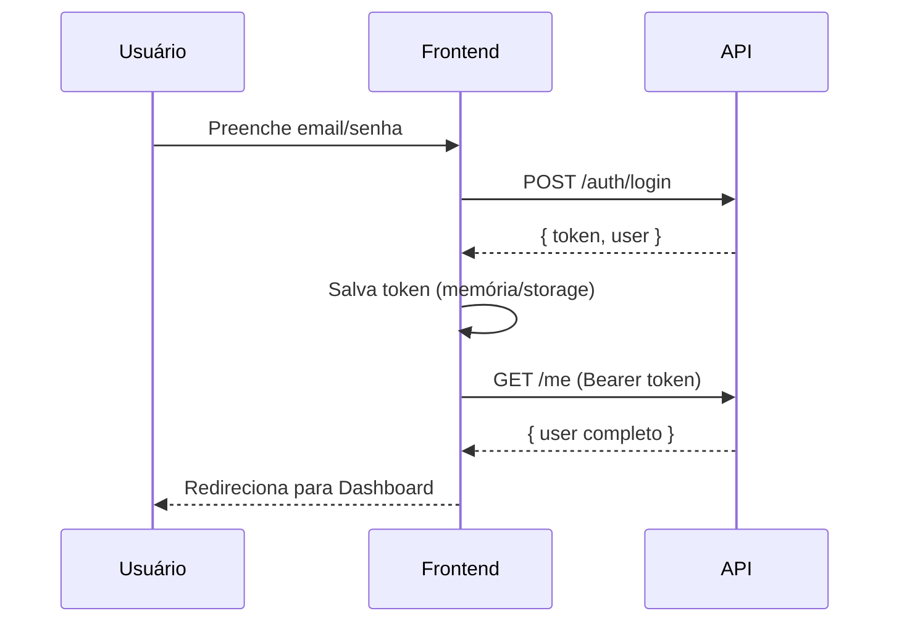

# 🔐 Guia de Autenticação - Frontend React

> Documentação completa para integração de autenticação segura com a API MaisCapinhas.

**Stack:** React 18 + TypeScript + TanStack Query + Zod + React Hook Form

---

## 📋 Índice

1. [Visão Geral](#visão-geral)
2. [Schemas Zod](#schemas-zod)
3. [Cliente HTTP Seguro](#cliente-http-seguro)
4. [Hooks de Autenticação](#hooks-de-autenticação)
5. [Componente de Login](#componente-de-login)
6. [Contexto de Autenticação](#contexto-de-autenticação)
7. [Proteção de Rotas](#proteção-de-rotas)
8. [Boas Práticas de Segurança](#boas-práticas-de-segurança)

---

## 🎯 Visão Geral

### Endpoints de Autenticação

| Endpoint | Método | Auth | Descrição |
|----------|--------|------|-----------|
| `/auth/login` | POST | ❌ | Obter token |
| `/auth/logout` | POST | ✅ | Revogar token atual |
| `/auth/logout-all` | POST | ✅ | Revogar todos tokens |
| `/me` | GET | ✅ | Dados do usuário logado |

### Fluxo de Autenticação



---

## 📐 Schemas Zod

```typescript
// src/lib/schemas/auth.ts
import { z } from 'zod';

// ============================================
// REQUEST SCHEMAS
// ============================================

export const loginSchema = z.object({
  email: z
    .string()
    .min(1, 'Email é obrigatório')
    .email('Email inválido'),
  password: z
    .string()
    .min(1, 'Senha é obrigatória')
    .min(6, 'Senha deve ter no mínimo 6 caracteres'),
  device_name: z.string().optional().default('web-app'),
});

export type LoginInput = z.infer<typeof loginSchema>;

// ============================================
// RESPONSE SCHEMAS
// ============================================

export const storeRoleSchema = z.object({
  id: z.number(),
  name: z.string(),
  role: z.enum(['admin', 'gerente', 'conferente', 'vendedor']),
});

export const userSchema = z.object({
  id: z.number(),
  name: z.string(),
  email: z.string().email(),
  phone: z.string().nullable().optional(),
  avatar_url: z.string().url().nullable().optional(),
  birth_date: z.string().nullable().optional(),
  active: z.boolean(),
  stores: z.array(storeRoleSchema).optional(),
});

export type User = z.infer<typeof userSchema>;
export type StoreRole = z.infer<typeof storeRoleSchema>;

export const loginResponseSchema = z.object({
  data: z.object({
    token: z.string(),
    token_type: z.literal('Bearer'),
    user: userSchema.pick({ id: true, name: true, email: true }),
  }),
  meta: z.object({
    request_id: z.string(),
    timestamp: z.string(),
  }),
});

export type LoginResponse = z.infer<typeof loginResponseSchema>;

export const meResponseSchema = z.object({
  data: z.object({
    user: userSchema,
  }),
  meta: z.object({
    request_id: z.string(),
    timestamp: z.string(),
  }),
});

export type MeResponse = z.infer<typeof meResponseSchema>;

// ============================================
// ERROR SCHEMAS
// ============================================

export const apiErrorSchema = z.object({
  message: z.string(),
  errors: z.record(z.array(z.string())).optional(),
});

export type ApiError = z.infer<typeof apiErrorSchema>;
```

---

## 🔒 Cliente HTTP Seguro

```typescript
// src/lib/api/client.ts
import { apiErrorSchema } from '@/lib/schemas/auth';

const API_BASE_URL = import.meta.env.VITE_API_URL || 'https://api.maiscapinhas.com.br/api/v1';

// ============================================
// TOKEN MANAGEMENT (em memória - mais seguro)
// ============================================

let accessToken: string | null = null;

export const tokenManager = {
  getToken: () => accessToken,
  
  setToken: (token: string) => {
    accessToken = token;
    // Opcional: persistir em sessionStorage para sobreviver a refresh
    // NUNCA use localStorage para tokens em produção!
    if (typeof window !== 'undefined') {
      sessionStorage.setItem('_auth_token', token);
    }
  },
  
  clearToken: () => {
    accessToken = null;
    if (typeof window !== 'undefined') {
      sessionStorage.removeItem('_auth_token');
    }
  },
  
  // Restaurar token do sessionStorage (para refresh da página)
  restoreToken: () => {
    if (typeof window !== 'undefined') {
      const stored = sessionStorage.getItem('_auth_token');
      if (stored) accessToken = stored;
    }
    return accessToken;
  },
};

// ============================================
// HTTP CLIENT
// ============================================

interface RequestOptions extends RequestInit {
  params?: Record<string, string | number | boolean | undefined>;
}

class ApiClient {
  private baseUrl: string;
  private onUnauthorized?: () => void;

  constructor(baseUrl: string) {
    this.baseUrl = baseUrl;
  }

  setUnauthorizedHandler(handler: () => void) {
    this.onUnauthorized = handler;
  }

  private async request<T>(
    endpoint: string,
    options: RequestOptions = {}
  ): Promise<T> {
    const { params, ...fetchOptions } = options;

    // Build URL with query params
    let url = `${this.baseUrl}${endpoint}`;
    if (params) {
      const searchParams = new URLSearchParams();
      Object.entries(params).forEach(([key, value]) => {
        if (value !== undefined) {
          searchParams.append(key, String(value));
        }
      });
      const queryString = searchParams.toString();
      if (queryString) url += `?${queryString}`;
    }

    // Build headers
    const headers: HeadersInit = {
      'Accept': 'application/json',
      'Content-Type': 'application/json',
      ...fetchOptions.headers,
    };

    // Add auth token
    const token = tokenManager.getToken();
    if (token) {
      (headers as Record<string, string>)['Authorization'] = `Bearer ${token}`;
    }

    // Make request
    const response = await fetch(url, {
      ...fetchOptions,
      headers,
    });

    // Handle response
    if (!response.ok) {
      const errorData = await response.json().catch(() => ({}));
      
      // Token expirado ou inválido
      if (response.status === 401) {
        tokenManager.clearToken();
        this.onUnauthorized?.();
      }

      // Parse error
      const parsed = apiErrorSchema.safeParse(errorData);
      const error = parsed.success ? parsed.data : { message: 'Erro desconhecido' };
      
      throw new ApiError(response.status, error.message, error.errors);
    }

    // Empty response (204, logout, etc)
    if (response.status === 204) {
      return {} as T;
    }

    return response.json();
  }

  get<T>(endpoint: string, options?: RequestOptions) {
    return this.request<T>(endpoint, { ...options, method: 'GET' });
  }

  post<T>(endpoint: string, body?: unknown, options?: RequestOptions) {
    return this.request<T>(endpoint, {
      ...options,
      method: 'POST',
      body: body ? JSON.stringify(body) : undefined,
    });
  }

  put<T>(endpoint: string, body?: unknown, options?: RequestOptions) {
    return this.request<T>(endpoint, {
      ...options,
      method: 'PUT',
      body: body ? JSON.stringify(body) : undefined,
    });
  }

  delete<T>(endpoint: string, options?: RequestOptions) {
    return this.request<T>(endpoint, { ...options, method: 'DELETE' });
  }
}

// ============================================
// CUSTOM ERROR CLASS
// ============================================

export class ApiError extends Error {
  constructor(
    public status: number,
    message: string,
    public errors?: Record<string, string[]>
  ) {
    super(message);
    this.name = 'ApiError';
  }

  getFieldError(field: string): string | undefined {
    return this.errors?.[field]?.[0];
  }
}

// ============================================
// EXPORT SINGLETON
// ============================================

export const apiClient = new ApiClient(API_BASE_URL);
```

---

## 🎣 Hooks de Autenticação

```typescript
// src/lib/hooks/useAuth.ts
import { useMutation, useQuery, useQueryClient } from '@tanstack/react-query';
import { useNavigate } from 'react-router-dom';
import { toast } from 'sonner';
import { apiClient, tokenManager, ApiError } from '@/lib/api/client';
import {
  LoginInput,
  LoginResponse,
  MeResponse,
  User,
  loginResponseSchema,
  meResponseSchema,
} from '@/lib/schemas/auth';

// ============================================
// QUERY KEYS
// ============================================

export const authKeys = {
  all: ['auth'] as const,
  user: () => [...authKeys.all, 'user'] as const,
};

// ============================================
// API FUNCTIONS
// ============================================

async function loginFn(credentials: LoginInput): Promise<LoginResponse> {
  const response = await apiClient.post<LoginResponse>('/auth/login', credentials);
  
  // Validar resposta com Zod
  const parsed = loginResponseSchema.safeParse(response);
  if (!parsed.success) {
    throw new Error('Resposta inválida do servidor');
  }
  
  return parsed.data;
}

async function logoutFn(): Promise<void> {
  await apiClient.post('/auth/logout');
}

async function logoutAllFn(): Promise<void> {
  await apiClient.post('/auth/logout-all');
}

async function getMeFn(): Promise<User> {
  const response = await apiClient.get<MeResponse>('/me');
  
  // Validar resposta
  const parsed = meResponseSchema.safeParse(response);
  if (!parsed.success) {
    throw new Error('Resposta inválida do servidor');
  }
  
  return parsed.data.data.user;
}

// ============================================
// HOOKS
// ============================================

/**
 * Hook para obter dados do usuário logado
 */
export function useUser() {
  return useQuery({
    queryKey: authKeys.user(),
    queryFn: getMeFn,
    enabled: !!tokenManager.getToken(),
    staleTime: 5 * 60 * 1000, // 5 minutos
    retry: (failureCount, error) => {
      // Não retry em 401 (não autorizado)
      if (error instanceof ApiError && error.status === 401) {
        return false;
      }
      return failureCount < 3;
    },
  });
}

/**
 * Hook para fazer login
 */
export function useLogin() {
  const queryClient = useQueryClient();
  const navigate = useNavigate();

  return useMutation({
    mutationFn: loginFn,
    onSuccess: (data) => {
      // Salvar token
      tokenManager.setToken(data.data.token);
      
      // Setar dados do usuário no cache
      queryClient.setQueryData(authKeys.user(), data.data.user);
      
      // Notificar sucesso
      toast.success(`Bem-vindo, ${data.data.user.name}!`);
      
      // Redirecionar
      navigate('/dashboard');
    },
    onError: (error: ApiError) => {
      const message = error.getFieldError('email') || error.message;
      toast.error(message);
    },
  });
}

/**
 * Hook para fazer logout
 */
export function useLogout() {
  const queryClient = useQueryClient();
  const navigate = useNavigate();

  return useMutation({
    mutationFn: logoutFn,
    onSuccess: () => {
      // Limpar token
      tokenManager.clearToken();
      
      // Limpar cache
      queryClient.clear();
      
      // Redirecionar
      navigate('/login');
      
      toast.success('Logout realizado com sucesso');
    },
    onError: () => {
      // Mesmo com erro, limpar estado local
      tokenManager.clearToken();
      queryClient.clear();
      navigate('/login');
    },
  });
}

/**
 * Hook para logout de todos os dispositivos
 */
export function useLogoutAll() {
  const queryClient = useQueryClient();
  const navigate = useNavigate();

  return useMutation({
    mutationFn: logoutAllFn,
    onSuccess: () => {
      tokenManager.clearToken();
      queryClient.clear();
      navigate('/login');
      toast.success('Desconectado de todos os dispositivos');
    },
    onError: (error: ApiError) => {
      toast.error(error.message);
    },
  });
}

/**
 * Hook para verificar se está autenticado
 */
export function useIsAuthenticated() {
  const { data: user, isLoading } = useUser();
  return {
    isAuthenticated: !!user,
    isLoading,
    user,
  };
}
```

---

## 🖼️ Componente de Login

```typescript
// src/components/auth/LoginForm.tsx
import { useForm } from 'react-hook-form';
import { zodResolver } from '@hookform/resolvers/zod';
import { Loader2, Mail, Lock, Eye, EyeOff } from 'lucide-react';
import { useState } from 'react';

import { Button } from '@/components/ui/button';
import { Input } from '@/components/ui/input';
import { Label } from '@/components/ui/label';
import {
  Card,
  CardContent,
  CardDescription,
  CardFooter,
  CardHeader,
  CardTitle,
} from '@/components/ui/card';

import { useLogin } from '@/lib/hooks/useAuth';
import { loginSchema, LoginInput } from '@/lib/schemas/auth';

export function LoginForm() {
  const [showPassword, setShowPassword] = useState(false);
  const login = useLogin();

  const form = useForm<LoginInput>({
    resolver: zodResolver(loginSchema),
    defaultValues: {
      email: '',
      password: '',
      device_name: 'web-app',
    },
  });

  const onSubmit = (data: LoginInput) => {
    login.mutate(data);
  };

  return (
    <Card className="w-full max-w-md mx-auto">
      <CardHeader className="space-y-1">
        <CardTitle className="text-2xl font-bold text-center">
          Entrar no Sistema
        </CardTitle>
        <CardDescription className="text-center">
          Digite suas credenciais para acessar
        </CardDescription>
      </CardHeader>

      <form onSubmit={form.handleSubmit(onSubmit)}>
        <CardContent className="space-y-4">
          {/* Email */}
          <div className="space-y-2">
            <Label htmlFor="email">Email</Label>
            <div className="relative">
              <Mail className="absolute left-3 top-3 h-4 w-4 text-muted-foreground" />
              <Input
                id="email"
                type="email"
                placeholder="seu@email.com"
                className="pl-10"
                autoComplete="email"
                disabled={login.isPending}
                {...form.register('email')}
              />
            </div>
            {form.formState.errors.email && (
              <p className="text-sm text-destructive">
                {form.formState.errors.email.message}
              </p>
            )}
          </div>

          {/* Password */}
          <div className="space-y-2">
            <Label htmlFor="password">Senha</Label>
            <div className="relative">
              <Lock className="absolute left-3 top-3 h-4 w-4 text-muted-foreground" />
              <Input
                id="password"
                type={showPassword ? 'text' : 'password'}
                placeholder="••••••••"
                className="pl-10 pr-10"
                autoComplete="current-password"
                disabled={login.isPending}
                {...form.register('password')}
              />
              <button
                type="button"
                className="absolute right-3 top-3 text-muted-foreground hover:text-foreground"
                onClick={() => setShowPassword(!showPassword)}
                tabIndex={-1}
              >
                {showPassword ? (
                  <EyeOff className="h-4 w-4" />
                ) : (
                  <Eye className="h-4 w-4" />
                )}
              </button>
            </div>
            {form.formState.errors.password && (
              <p className="text-sm text-destructive">
                {form.formState.errors.password.message}
              </p>
            )}
          </div>
        </CardContent>

        <CardFooter>
          <Button
            type="submit"
            className="w-full"
            disabled={login.isPending}
          >
            {login.isPending ? (
              <>
                <Loader2 className="mr-2 h-4 w-4 animate-spin" />
                Entrando...
              </>
            ) : (
              'Entrar'
            )}
          </Button>
        </CardFooter>
      </form>
    </Card>
  );
}
```

---

## 🌐 Contexto de Autenticação

```typescript
// src/contexts/AuthContext.tsx
import {
  createContext,
  useContext,
  useEffect,
  useState,
  type ReactNode,
} from 'react';
import { useQueryClient } from '@tanstack/react-query';
import { apiClient, tokenManager } from '@/lib/api/client';
import { useUser, authKeys } from '@/lib/hooks/useAuth';
import { User } from '@/lib/schemas/auth';

interface AuthContextType {
  user: User | null;
  isLoading: boolean;
  isAuthenticated: boolean;
  logout: () => void;
}

const AuthContext = createContext<AuthContextType | undefined>(undefined);

export function AuthProvider({ children }: { children: ReactNode }) {
  const queryClient = useQueryClient();
  const [isInitialized, setIsInitialized] = useState(false);

  // Restaurar token no mount
  useEffect(() => {
    tokenManager.restoreToken();
    setIsInitialized(true);

    // Configurar handler para 401
    apiClient.setUnauthorizedHandler(() => {
      tokenManager.clearToken();
      queryClient.setQueryData(authKeys.user(), null);
      window.location.href = '/login';
    });
  }, [queryClient]);

  const { data: user, isLoading: isLoadingUser } = useUser();

  const logout = () => {
    tokenManager.clearToken();
    queryClient.clear();
    window.location.href = '/login';
  };

  const isLoading = !isInitialized || isLoadingUser;

  return (
    <AuthContext.Provider
      value={{
        user: user ?? null,
        isLoading,
        isAuthenticated: !!user,
        logout,
      }}
    >
      {children}
    </AuthContext.Provider>
  );
}

export function useAuth() {
  const context = useContext(AuthContext);
  if (context === undefined) {
    throw new Error('useAuth must be used within an AuthProvider');
  }
  return context;
}
```

---

## 🛡️ Proteção de Rotas

```typescript
// src/components/auth/ProtectedRoute.tsx
import { Navigate, useLocation } from 'react-router-dom';
import { Loader2 } from 'lucide-react';
import { useAuth } from '@/contexts/AuthContext';
import { StoreRole } from '@/lib/schemas/auth';

interface ProtectedRouteProps {
  children: React.ReactNode;
  requiredRoles?: StoreRole['role'][];
}

export function ProtectedRoute({ children, requiredRoles }: ProtectedRouteProps) {
  const { user, isLoading, isAuthenticated } = useAuth();
  const location = useLocation();

  // Loading state
  if (isLoading) {
    return (
      <div className="min-h-screen flex items-center justify-center">
        <Loader2 className="h-8 w-8 animate-spin text-primary" />
      </div>
    );
  }

  // Não autenticado
  if (!isAuthenticated) {
    return <Navigate to="/login" state={{ from: location }} replace />;
  }

  // Verificar roles se necessário
  if (requiredRoles && user?.stores) {
    const userRoles = user.stores.map(s => s.role);
    const hasRequiredRole = requiredRoles.some(role => userRoles.includes(role));
    
    if (!hasRequiredRole) {
      return <Navigate to="/unauthorized" replace />;
    }
  }

  return <>{children}</>;
}

// src/components/auth/GuestRoute.tsx
export function GuestRoute({ children }: { children: React.ReactNode }) {
  const { isAuthenticated, isLoading } = useAuth();
  const location = useLocation();

  if (isLoading) {
    return (
      <div className="min-h-screen flex items-center justify-center">
        <Loader2 className="h-8 w-8 animate-spin text-primary" />
      </div>
    );
  }

  if (isAuthenticated) {
    const from = (location.state as any)?.from?.pathname || '/dashboard';
    return <Navigate to={from} replace />;
  }

  return <>{children}</>;
}
```

### Configuração de Rotas

```typescript
// src/App.tsx
import { BrowserRouter, Routes, Route } from 'react-router-dom';
import { QueryClient, QueryClientProvider } from '@tanstack/react-query';
import { Toaster } from 'sonner';

import { AuthProvider } from '@/contexts/AuthContext';
import { ProtectedRoute, GuestRoute } from '@/components/auth';

import LoginPage from '@/pages/LoginPage';
import DashboardPage from '@/pages/DashboardPage';
import AdminPage from '@/pages/AdminPage';

const queryClient = new QueryClient({
  defaultOptions: {
    queries: {
      refetchOnWindowFocus: false,
      retry: 1,
    },
  },
});

export default function App() {
  return (
    <QueryClientProvider client={queryClient}>
      <BrowserRouter>
        <AuthProvider>
          <Routes>
            {/* Rotas públicas */}
            <Route
              path="/login"
              element={
                <GuestRoute>
                  <LoginPage />
                </GuestRoute>
              }
            />

            {/* Rotas protegidas */}
            <Route
              path="/dashboard"
              element={
                <ProtectedRoute>
                  <DashboardPage />
                </ProtectedRoute>
              }
            />

            {/* Rotas com role específico */}
            <Route
              path="/admin/*"
              element={
                <ProtectedRoute requiredRoles={['admin']}>
                  <AdminPage />
                </ProtectedRoute>
              }
            />
          </Routes>
          <Toaster richColors position="top-right" />
        </AuthProvider>
      </BrowserRouter>
    </QueryClientProvider>
  );
}
```

---

## 🔐 Boas Práticas de Segurança

### 1. Armazenamento de Token

| Método | Segurança | Recomendação |
|--------|-----------|--------------|
| `localStorage` | ⚠️ Baixa | **NUNCA** - vulnerável a XSS |
| `sessionStorage` | ⚠️ Média | Aceitável com CSP rigoroso |
| **Memória (RAM)** | ✅ Alta | **RECOMENDADO** |
| HttpOnly Cookie | ✅ Alta | Requer configuração backend |

> [!IMPORTANT]
> O código acima armazena o token em **memória** com fallback para `sessionStorage`. Para produção, considere usar HttpOnly cookies com o modo SPA do Sanctum.

### 2. Proteção contra XSS

```typescript
// Nunca faça isso:
element.innerHTML = userInput; // ❌ Vulnerável

// Use React que escapa automaticamente:
<div>{userInput}</div> // ✅ Seguro
```

### 3. Content Security Policy (CSP)

Adicione no `index.html`:

```html
<meta http-equiv="Content-Security-Policy" content="
  default-src 'self';
  script-src 'self';
  style-src 'self' 'unsafe-inline' https://fonts.googleapis.com;
  font-src 'self' https://fonts.gstatic.com;
  img-src 'self' data: https:;
  connect-src 'self' https://api.maiscapinhas.com.br;
">
```

### 4. Rate Limiting no Frontend

```typescript
// src/lib/utils/rateLimiter.ts
const loginAttempts = new Map<string, { count: number; lastAttempt: number }>();

export function checkLoginRateLimit(email: string): boolean {
  const now = Date.now();
  const record = loginAttempts.get(email);
  
  // Reset after 15 minutes
  if (record && now - record.lastAttempt > 15 * 60 * 1000) {
    loginAttempts.delete(email);
    return true;
  }
  
  // Block after 5 attempts
  if (record && record.count >= 5) {
    return false;
  }
  
  // Update counter
  loginAttempts.set(email, {
    count: (record?.count || 0) + 1,
    lastAttempt: now,
  });
  
  return true;
}
```

### 5. Sanitização de Inputs

```typescript
// Sempre valide com Zod antes de enviar
const result = loginSchema.safeParse(formData);
if (!result.success) {
  // Handle validation errors
  return;
}
// result.data é seguro para enviar
```

### 6. Timeout de Sessão

```typescript
// src/lib/hooks/useSessionTimeout.ts
import { useEffect, useCallback } from 'react';
import { useLogout } from './useAuth';

const TIMEOUT_MS = 30 * 60 * 1000; // 30 minutos

export function useSessionTimeout() {
  const logout = useLogout();
  
  const resetTimer = useCallback(() => {
    // Reset on user activity
    window.sessionTimeout && clearTimeout(window.sessionTimeout);
    window.sessionTimeout = setTimeout(() => {
      logout.mutate();
    }, TIMEOUT_MS);
  }, [logout]);

  useEffect(() => {
    const events = ['mousedown', 'keydown', 'scroll', 'touchstart'];
    
    events.forEach(event => {
      window.addEventListener(event, resetTimer);
    });
    
    resetTimer(); // Start timer
    
    return () => {
      events.forEach(event => {
        window.removeEventListener(event, resetTimer);
      });
      window.sessionTimeout && clearTimeout(window.sessionTimeout);
    };
  }, [resetTimer]);
}
```

### 7. Refresh Token Pattern (Avançado)

Para apps que precisam de sessões longas:

```typescript
// Implementar no backend primeiro:
// POST /auth/refresh - retorna novo token

async function refreshToken() {
  const response = await fetch('/auth/refresh', {
    method: 'POST',
    credentials: 'include', // Para cookies
  });
  
  if (response.ok) {
    const data = await response.json();
    tokenManager.setToken(data.data.token);
    return true;
  }
  
  return false;
}

// Usar em interceptor
apiClient.onUnauthorized = async () => {
  const refreshed = await refreshToken();
  if (!refreshed) {
    // Redirect to login
  }
};
```

---

## 📁 Estrutura de Arquivos

```
src/
├── components/
│   └── auth/
│       ├── LoginForm.tsx
│       ├── ProtectedRoute.tsx
│       ├── GuestRoute.tsx
│       └── index.ts
├── contexts/
│   └── AuthContext.tsx
├── lib/
│   ├── api/
│   │   └── client.ts
│   ├── hooks/
│   │   ├── useAuth.ts
│   │   └── useSessionTimeout.ts
│   ├── schemas/
│   │   └── auth.ts
│   └── utils/
│       └── rateLimiter.ts
└── pages/
    └── LoginPage.tsx
```

---

## ✅ Checklist de Segurança

- [ ] Token armazenado em memória (não localStorage)
- [ ] HTTPS obrigatório
- [ ] CSP configurado
- [ ] Validação com Zod em todas requisições
- [ ] Rate limiting no login
- [ ] Timeout de sessão implementado
- [ ] Tratamento de erro 401 automático
- [ ] Rotas protegidas configuradas
- [ ] Logout limpa todo estado

---

**Última atualização:** 2026-01-08
