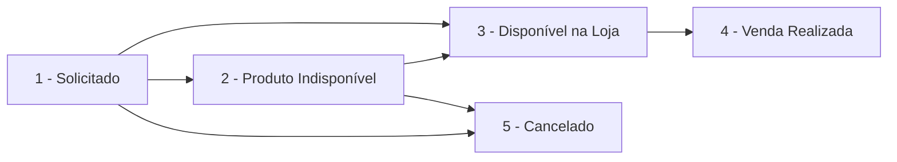
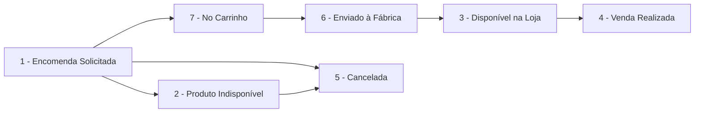

# 📦 Guia de Status de Pedidos - Frontend React

> Documentação completa dos status de Pedidos e Capas Personalizadas, incluindo permissões e fluxos.

**Stack:** React 18 + TypeScript + TanStack Query

---

## 📋 Índice

1. [Status de Pedidos (Pedido)](#status-de-pedidos)
2. [Status de Capas Personalizadas](#status-de-capas-personalizadas)
3. [Permissões por Tipo de Usuário](#permissões-por-tipo-de-usuário)
4. [Fluxo de Status](#fluxo-de-status)
5. [Schemas TypeScript](#schemas-typescript)
6. [Endpoints de Alteração](#endpoints-de-alteração)
7. [Notificações WhatsApp](#notificações-whatsapp)

---

## 📦 Status de Pedidos

Pedidos representam solicitações de clientes para produtos do catálogo ou encomendas.

### Tabela de Status

| Valor | Nome Constante | Label PT-BR | Cor | Descrição |
|:-----:|:---------------|:------------|:---:|:----------|
| `1` | `SOLICITADO` | Solicitado | 🔵 blue | Pedido recém-criado, aguardando processamento |
| `2` | `PRODUTO_INDISPONIVEL` | Produto Indisponível | 🔴 red | Produto não disponível no momento |
| `3` | `DISPONIVEL_LOJA` | Disponível na Loja | 🟡 yellow | Produto pronto para retirada pelo cliente |
| `4` | `VENDA_REALIZADA` | Venda Realizada | 🟢 green | **Final** - Cliente recebeu o produto |
| `5` | `CANCELADO` | Cancelado | ⚫ gray | **Final** - Pedido cancelado |

### Status Finais

Os status `4` (Venda Realizada) e `5` (Cancelado) são **status finais**. Uma vez que o pedido atinge esses status, não é recomendado alterar novamente.

```typescript
const isFinalStatus = (status: number) => [4, 5].includes(status);
```

---

## 🎨 Status de Capas Personalizadas

Capas Personalizadas são produtos feitos sob demanda com fotos enviadas pelos clientes.

### Tabela de Status

| Valor | Nome Constante | Label PT-BR | Cor | Ícone | Descrição |
|:-----:|:---------------|:------------|:---:|:-----:|:----------|
| `1` | `ENCOMENDA_SOLICITADA` | Encomenda Solicitada | 🔵 blue | clipboard-list | Pedido criado, aguardando foto ou processamento |
| `2` | `PRODUTO_INDISPONIVEL` | Produto Indisponível | 🔴 red | alert-circle | Modelo/material não disponível |
| `3` | `DISPONIVEL_LOJA` | Disponível na Loja | 🟡 yellow | store | Capa pronta para retirada |
| `4` | `VENDA_REALIZADA` | Venda Realizada | 🟢 green | check-circle | **Final** - Cliente recebeu |
| `5` | `CANCELADA` | Cancelada | ⚫ gray | x-circle | **Final** - Pedido cancelado |
| `6` | `ENVIADO_PRODUCAO` | Encomendado à Fábrica | 🟠 orange | send | Enviado para produção na fábrica |
| `7` | `NO_CARRINHO` | No Carrinho de Produção | ⚪ slate | shopping-cart | Aguardando envio para produção |

### Status Finais

Os status `4` (Venda Realizada) e `5` (Cancelada) são **status finais**.

### Fluxo de Produção

Os status `6` (Enviado à Fábrica) e `7` (No Carrinho) fazem parte do **fluxo de produção**.

```typescript
const isInProductionFlow = (status: number) => [6, 7].includes(status);
const canAddToCart = (status: number) => status === 1; // Apenas ENCOMENDA_SOLICITADA
```

---

## 🔒 Permissões por Tipo de Usuário

### Hierarquia de Acesso

```
┌─────────────────────────────────────────────────────────────┐
│                     SUPER ADMIN                              │
│  • Acesso total a todos os pedidos de todas as lojas        │
│  • Pode alterar status em lote (bulk)                       │
│  • Pode enviar capas para produção                          │
├─────────────────────────────────────────────────────────────┤
│                    GLOBAL ADMIN                              │
│  • Acesso total a todos os pedidos de todas as lojas        │
│  • Pode alterar status em lote (bulk)                       │
│  • Pode enviar capas para produção                          │
├─────────────────────────────────────────────────────────────┤
│                  USUÁRIO COMUM                               │
│  • Acessa apenas pedidos que criou                          │
│  • Pode alterar status individual dos seus pedidos          │
│  • NÃO pode alterar status em lote                          │
│  • NÃO pode enviar para produção                            │
└─────────────────────────────────────────────────────────────┘
```

### Tabela de Permissões por Ação

| Ação | Super Admin | Global Admin | Usuário Comum |
|------|:-----------:|:------------:|:-------------:|
| Ver todos os pedidos | ✅ | ✅ | ❌ |
| Ver seus próprios pedidos | ✅ | ✅ | ✅ |
| Criar pedido | ✅ | ✅ | ✅ |
| Alterar status individual | ✅ (qualquer) | ✅ (qualquer) | ✅ (próprios) |
| Alterar status em lote | ✅ | ✅ | ❌ |
| Enviar para produção | ✅ | ✅ | ❌ |
| Excluir pedido | ✅ (qualquer) | ✅ (qualquer) | ✅ (próprios) |
| Registrar pagamento | ✅ | ✅ | ✅ (próprios) |

### Verificação de Admin no Backend

```typescript
// Como o backend verifica se é admin:
const isAdmin = user.isSuperAdmin() || user.isGlobalAdmin();
```

---

## 🔄 Fluxo de Status

### Fluxo Típico de Pedido



### Fluxo Típico de Capa Personalizada



---

## 📐 Schemas TypeScript

```typescript
// src/lib/schemas/order-status.ts

// ============================================
// STATUS DE PEDIDOS
// ============================================

export const PedidoStatus = {
  SOLICITADO: 1,
  PRODUTO_INDISPONIVEL: 2,
  DISPONIVEL_LOJA: 3,
  VENDA_REALIZADA: 4,
  CANCELADO: 5,
} as const;

export type PedidoStatusValue = typeof PedidoStatus[keyof typeof PedidoStatus];

export const PEDIDO_STATUS_LABELS: Record<PedidoStatusValue, string> = {
  1: 'Solicitado',
  2: 'Produto Indisponível',
  3: 'Disponível na Loja',
  4: 'Venda Realizada',
  5: 'Cancelado',
};

export const PEDIDO_STATUS_COLORS: Record<PedidoStatusValue, string> = {
  1: 'blue',
  2: 'red',
  3: 'yellow',
  4: 'green',
  5: 'gray',
};

// ============================================
// STATUS DE CAPAS PERSONALIZADAS
// ============================================

export const CapaStatus = {
  ENCOMENDA_SOLICITADA: 1,
  PRODUTO_INDISPONIVEL: 2,
  DISPONIVEL_LOJA: 3,
  VENDA_REALIZADA: 4,
  CANCELADA: 5,
  ENVIADO_PRODUCAO: 6,
  NO_CARRINHO: 7,
} as const;

export type CapaStatusValue = typeof CapaStatus[keyof typeof CapaStatus];

export const CAPA_STATUS_LABELS: Record<CapaStatusValue, string> = {
  1: 'Encomenda Solicitada',
  2: 'Produto Indisponível',
  3: 'Disponível na Loja',
  4: 'Venda Realizada',
  5: 'Cancelada',
  6: 'Encomendado à Fábrica',
  7: 'No Carrinho de Produção',
};

export const CAPA_STATUS_COLORS: Record<CapaStatusValue, string> = {
  1: 'blue',
  2: 'red',
  3: 'yellow',
  4: 'green',
  5: 'gray',
  6: 'orange',
  7: 'slate',
};

export const CAPA_STATUS_ICONS: Record<CapaStatusValue, string> = {
  1: 'clipboard-list',
  2: 'alert-circle',
  3: 'store',
  4: 'check-circle',
  5: 'x-circle',
  6: 'send',
  7: 'shopping-cart',
};

// ============================================
// HELPER FUNCTIONS
// ============================================

export const isPedidoFinalStatus = (status: PedidoStatusValue): boolean => {
  return [PedidoStatus.VENDA_REALIZADA, PedidoStatus.CANCELADO].includes(status);
};

export const isCapaFinalStatus = (status: CapaStatusValue): boolean => {
  return [CapaStatus.VENDA_REALIZADA, CapaStatus.CANCELADA].includes(status);
};

export const isCapaInProductionFlow = (status: CapaStatusValue): boolean => {
  return [CapaStatus.NO_CARRINHO, CapaStatus.ENVIADO_PRODUCAO].includes(status);
};

export const canAddCapaToCart = (status: CapaStatusValue): boolean => {
  return status === CapaStatus.ENCOMENDA_SOLICITADA;
};
```

---

## 🔌 Endpoints de Alteração

### Alterar Status de Pedido

```http
PATCH /api/v1/pedidos/{id}/status
Authorization: Bearer {token}
Content-Type: application/json

{
  "status": 3,
  "reason": "Produto chegou na loja",
  "notify_whatsapp": true
}
```

**Resposta:**
```json
{
  "message": "Status atualizado com sucesso.",
  "data": { "id": 1, "status": 3 },
  "whatsapp_notification": {
    "sent": true,
    "phone": "****9999"
  }
}
```

### Alterar Status de Capa Personalizada

```http
PATCH /api/v1/capas-personalizadas/{id}/status
Authorization: Bearer {token}
Content-Type: application/json

{
  "status": 3,
  "notify_whatsapp": true
}
```

### Alteração em Lote (Apenas Admins)

```http
POST /api/v1/pedidos/bulk-status
Authorization: Bearer {token}
Content-Type: application/json

{
  "ids": [1, 2, 3],
  "status": 4
}
```

> ⚠️ **Importante:** Retorna erro `403` se o usuário não for Super Admin ou Global Admin.

---

## 📱 Notificações WhatsApp

### Quando é Possível Enviar

A notificação WhatsApp pode ser enviada **apenas quando o status é alterado para `3` (Disponível na Loja)**.

### Parâmetro

| Campo | Tipo | Obrigatório | Descrição |
|-------|------|:-----------:|-----------|
| `notify_whatsapp` | boolean | Não | Enviar notificação ao cliente |

### Resposta de Notificação

O campo `whatsapp_notification` é incluído na resposta apenas se `notify_whatsapp: true` foi enviado:

```typescript
interface WhatsAppNotificationResult {
  sent: boolean;           // Se foi enviado com sucesso
  phone: string | null;    // Telefone mascarado (****9999)
  error?: string;          // Mensagem de erro se falhou
}
```

### Possíveis Erros

- `"Cliente não possui telefone cadastrado."` - Cliente sem número de WhatsApp
- `"Instância WhatsApp não configurada."` - Loja sem integração ativa
- `"Falha ao enviar mensagem."` - Erro na API do WhatsApp

---

## 🎨 Componente de Badge de Status

```tsx
// src/components/StatusBadge.tsx
import { Badge } from '@/components/ui/badge';
import { 
  PEDIDO_STATUS_LABELS, 
  PEDIDO_STATUS_COLORS,
  CAPA_STATUS_LABELS,
  CAPA_STATUS_COLORS,
  CAPA_STATUS_ICONS,
  type PedidoStatusValue,
  type CapaStatusValue,
} from '@/lib/schemas/order-status';
import * as Icons from 'lucide-react';

interface PedidoStatusBadgeProps {
  status: PedidoStatusValue;
}

export function PedidoStatusBadge({ status }: PedidoStatusBadgeProps) {
  return (
    <Badge variant={PEDIDO_STATUS_COLORS[status] as any}>
      {PEDIDO_STATUS_LABELS[status]}
    </Badge>
  );
}

interface CapaStatusBadgeProps {
  status: CapaStatusValue;
  showIcon?: boolean;
}

export function CapaStatusBadge({ status, showIcon = true }: CapaStatusBadgeProps) {
  const iconName = CAPA_STATUS_ICONS[status];
  const IconComponent = Icons[iconName as keyof typeof Icons] as React.ComponentType<{ className?: string }>;
  
  return (
    <Badge variant={CAPA_STATUS_COLORS[status] as any}>
      {showIcon && IconComponent && <IconComponent className="w-3 h-3 mr-1" />}
      {CAPA_STATUS_LABELS[status]}
    </Badge>
  );
}
```

---

## 📊 Resumo Rápido

| Entidade | Total de Status | Status Finais | Permite WhatsApp |
|----------|:---------------:|:-------------:|:----------------:|
| Pedido | 5 | 4, 5 | Status 3 |
| Capa Personalizada | 7 | 4, 5 | Status 3 |

| Permissão | Quem Pode |
|-----------|-----------|
| Alterar status individual | Dono do pedido ou Admin |
| Alterar status em lote | Apenas Super Admin / Global Admin |
| Enviar para produção | Apenas Super Admin / Global Admin |
