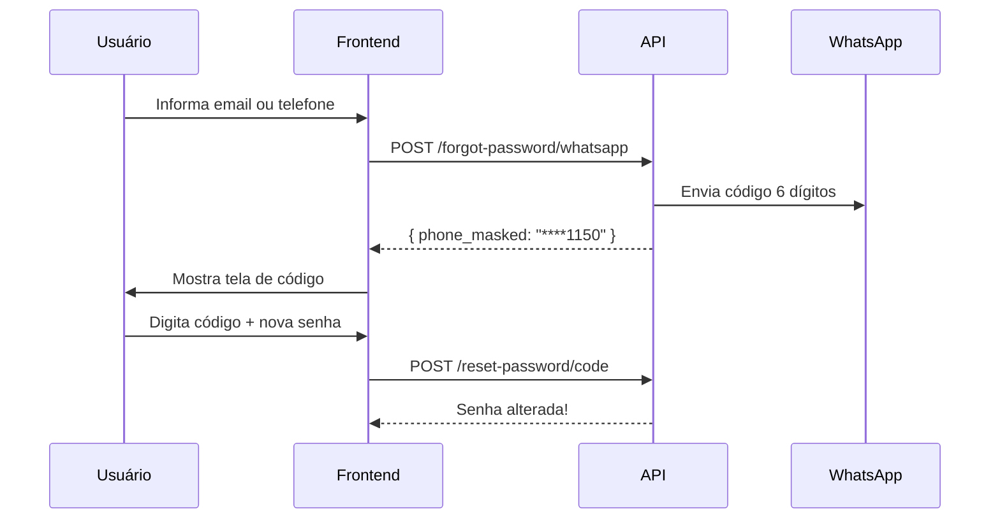

# 🔐 Frontend Guide: Recuperação de Senha via WhatsApp

Guia completo para implementação do fluxo de recuperação de senha via WhatsApp.

---

## 📋 Índice

1. [Visão Geral](#visão-geral)
2. [Endpoints](#endpoints)
3. [Fluxo de Implementação](#fluxo-de-implementação)
4. [Validações](#validações)
5. [Tratamento de Erros](#tratamento-de-erros)
6. [Exemplo de Implementação](#exemplo-de-implementação)
7. [UX/UI Sugestões](#uxui-sugestões)

---

## Visão Geral

O sistema oferece **duas opções** para recuperação de senha:

| Método | Endpoint | Descrição |
|--------|----------|-----------|
| **Email** | `POST /auth/forgot-password` | Envia link por email (60 min) |
| **WhatsApp** | `POST /auth/forgot-password/whatsapp` | Envia código 6 dígitos (15 min) |

### Fluxo WhatsApp (Recomendado)



---

## Endpoints

### 1. Solicitar Código via WhatsApp

```http
POST /api/v1/auth/forgot-password/whatsapp
Content-Type: application/json
```

#### Request Body

| Campo | Tipo | Obrigatório | Descrição |
|-------|------|-------------|-----------|
| `email` | string | Se `whatsapp` não informado | Email cadastrado |
| `whatsapp` | string | Se `email` não informado | Número WhatsApp |

**Exemplos:**

```json
// Por email
{ "email": "usuario@exemplo.com.br" }

// Por telefone
{ "whatsapp": "48999841150" }
```

#### Response Success (200)

```json
{
  "data": {
    "message": "Código enviado via WhatsApp.",
    "phone_masked": "****1150",
    "expires_in_minutes": 15
  },
  "meta": {
    "request_id": "uuid",
    "timestamp": "2026-01-13T20:00:00Z"
  }
}
```

#### Response Errors

| Status | Cenário | Response |
|--------|---------|----------|
| 422 | Usuário não encontrado | `{ "message": "Usuário não encontrado." }` |
| 422 | Sem WhatsApp cadastrado | `{ "message": "Usuário não possui WhatsApp cadastrado." }` |
| 502 | Falha no envio | `{ "message": "Falha ao enviar código via WhatsApp. Tente novamente." }` |

---

### 2. Redefinir Senha com Código

```http
POST /api/v1/auth/reset-password/code
Content-Type: application/json
```

#### Request Body

| Campo | Tipo | Validação | Exemplo |
|-------|------|-----------|---------|
| `code` | string | Exatamente 6 caracteres | `"123456"` |
| `email` | string | Email válido | `"usuario@exemplo.com.br"` |
| `password` | string | Mínimo 8 caracteres | `"NovaSenha123"` |
| `password_confirmation` | string | Deve ser igual a `password` | `"NovaSenha123"` |

**Exemplo:**

```json
{
  "code": "123456",
  "email": "usuario@exemplo.com.br",
  "password": "NovaSenha123",
  "password_confirmation": "NovaSenha123"
}
```

#### Response Success (200)

```json
{
  "data": {
    "message": "Senha alterada com sucesso."
  },
  "meta": {
    "timestamp": "2026-01-13T20:00:00Z"
  }
}
```

#### Response Errors

| Status | Cenário | Response |
|--------|---------|----------|
| 422 | Código inválido | `{ "message": "Código inválido ou expirado." }` |
| 422 | Código expirado | `{ "message": "Código expirado. Solicite um novo." }` |
| 422 | Usuário não encontrado | `{ "message": "Usuário não encontrado." }` |
| 422 | Senha fraca | `{ "message": "The password field must be at least 8 characters." }` |
| 422 | Senhas não conferem | `{ "message": "The password field confirmation does not match." }` |

---

## Fluxo de Implementação

### Tela 1: Escolha do Método

```
┌────────────────────────────────────────┐
│        Recuperar Senha                 │
├────────────────────────────────────────┤
│                                        │
│  [icone email] Receber por Email       │
│  ─────────────────────────────────     │
│                                        │
│  [icone whatsapp] Receber por WhatsApp │
│                                        │
└────────────────────────────────────────┘
```

### Tela 2: Informar Email/Telefone (WhatsApp)

```
┌────────────────────────────────────────┐
│        Recuperar via WhatsApp          │
├────────────────────────────────────────┤
│                                        │
│  Email ou WhatsApp:                    │
│  ┌────────────────────────────────┐    │
│  │ usuario@exemplo.com.br         │    │
│  └────────────────────────────────┘    │
│                                        │
│  ℹ️ Enviaremos um código de 6 dígitos  │
│     para o WhatsApp cadastrado.        │
│                                        │
│  ┌────────────────────────────────┐    │
│  │      ENVIAR CÓDIGO             │    │
│  └────────────────────────────────┘    │
│                                        │
└────────────────────────────────────────┘
```

### Tela 3: Inserir Código + Nova Senha

```
┌────────────────────────────────────────┐
│        Digite o Código                 │
├────────────────────────────────────────┤
│                                        │
│  Enviamos um código para ****1150      │
│                                        │
│  ┌──┐ ┌──┐ ┌──┐ ┌──┐ ┌──┐ ┌──┐        │
│  │ 1│ │ 2│ │ 3│ │ 4│ │ 5│ │ 6│        │
│  └──┘ └──┘ └──┘ └──┘ └──┘ └──┘        │
│                                        │
│  Nova Senha:                           │
│  ┌────────────────────────────────┐    │
│  │ ••••••••••                     │    │
│  └────────────────────────────────┘    │
│                                        │
│  Confirmar Senha:                      │
│  ┌────────────────────────────────┐    │
│  │ ••••••••••                     │    │
│  └────────────────────────────────┘    │
│                                        │
│  ⏱️ Código expira em 14:32             │
│                                        │
│  ┌────────────────────────────────┐    │
│  │      REDEFINIR SENHA           │    │
│  └────────────────────────────────┘    │
│                                        │
│  Não recebeu? Reenviar código          │
│                                        │
└────────────────────────────────────────┘
```

---

## Validações

### Frontend (antes de enviar)

```typescript
// Validação de código
const isValidCode = (code: string) => /^\d{6}$/.test(code);

// Validação de senha
const isValidPassword = (password: string) => password.length >= 8;

// Validação de confirmação
const passwordsMatch = (password: string, confirmation: string) => 
  password === confirmation;

// Validação de email
const isValidEmail = (email: string) => 
  /^[^\s@]+@[^\s@]+\.[^\s@]+$/.test(email);

// Validação de telefone (opcional)
const isValidPhone = (phone: string) => 
  /^\d{10,11}$/.test(phone.replace(/\D/g, ''));
```

### Backend (validações aplicadas)

| Campo | Regras |
|-------|--------|
| `email` | Obrigatório se `whatsapp` não informado, formato email válido |
| `whatsapp` | Obrigatório se `email` não informado, string |
| `code` | Obrigatório, exatamente 6 caracteres |
| `password` | Obrigatório, mínimo 8 caracteres |
| `password_confirmation` | Obrigatório, deve ser igual a `password` |

---

## Tratamento de Erros

### Tipos de Erro

```typescript
interface ApiError {
  message: string;
  errors?: Record<string, string[]>;
}

// Handler de erros
const handleError = (error: ApiError, statusCode: number) => {
  switch (statusCode) {
    case 422:
      // Erro de validação
      if (error.message.includes('não encontrado')) {
        return 'Email ou telefone não cadastrado.';
      }
      if (error.message.includes('WhatsApp')) {
        return 'Este usuário não possui WhatsApp cadastrado. Use a opção de email.';
      }
      if (error.message.includes('expirado')) {
        return 'Código expirado. Solicite um novo.';
      }
      return error.message;

    case 502:
      return 'Não foi possível enviar o código. Tente novamente em alguns segundos.';

    default:
      return 'Erro inesperado. Tente novamente.';
  }
};
```

---

## Exemplo de Implementação

### React + TanStack Query

```tsx
import { useMutation } from '@tanstack/react-query';
import { api } from '@/lib/api';

// Hook para solicitar código
export function useForgotPasswordWhatsApp() {
  return useMutation({
    mutationFn: async (data: { email?: string; whatsapp?: string }) => {
      const response = await api.post('/auth/forgot-password/whatsapp', data);
      return response.data;
    },
  });
}

// Hook para redefinir senha com código
export function useResetPasswordWithCode() {
  return useMutation({
    mutationFn: async (data: {
      code: string;
      email: string;
      password: string;
      password_confirmation: string;
    }) => {
      const response = await api.post('/auth/reset-password/code', data);
      return response.data;
    },
  });
}

// Componente de Recuperação
function PasswordRecovery() {
  const [step, setStep] = useState<'request' | 'verify'>('request');
  const [email, setEmail] = useState('');
  const [phoneMasked, setPhoneMasked] = useState('');

  const requestCode = useForgotPasswordWhatsApp();
  const resetPassword = useResetPasswordWithCode();

  const handleRequestCode = () => {
    requestCode.mutate(
      { email },
      {
        onSuccess: (data) => {
          setPhoneMasked(data.data.phone_masked);
          setStep('verify');
        },
        onError: (error) => {
          toast.error(handleError(error.response.data, error.response.status));
        },
      }
    );
  };

  // ... resto do componente
}
```

---

## UX/UI Sugestões

### ✅ Boas Práticas

1. **Timer visual** - Mostre contagem regressiva de 15 minutos
2. **Reenvio com cooldown** - Permita reenviar após 60 segundos
3. **Mask do telefone** - Use `****1150` retornado pela API
4. **Auto-focus nos inputs de código** - Melhora usabilidade mobile
5. **Indicador de força da senha** - Feedback visual

### ⚠️ Evitar

1. Não mostre o código completo em logs do console
2. Não armazene o código em localStorage
3. Não permita reenvio infinito (rate limit lado servidor)

### 📱 Mobile

- Inputs de código devem usar `inputMode="numeric"`
- Teclado numérico para código
- Auto-submit quando 6 dígitos digitados

---

## Rate Limiting

| Endpoint | Limite |
|----------|--------|
| `/forgot-password/whatsapp` | 3 tentativas por minuto por IP |
| `/reset-password/code` | 5 tentativas por minuto por IP |

---

## Mensagem Enviada ao Usuário

```
🔐 *MaisCapinhas ERP API - Recuperação de Senha*

Seu código de verificação é:

👉 *123456*

Este código expira em *15 minutos*.

Se você não solicitou este código, ignore esta mensagem.
```
