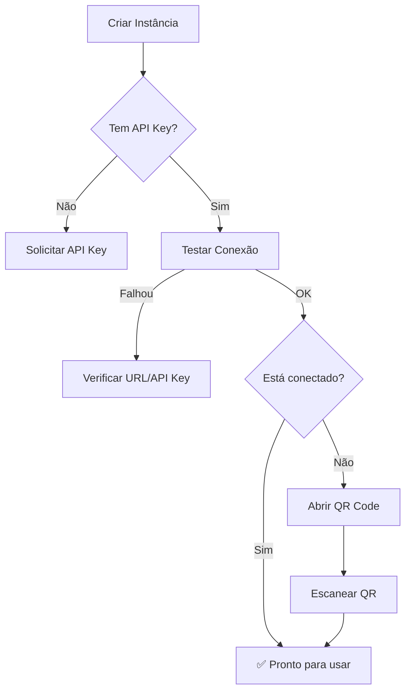

# WhatsApp Instances - Guia de Integração do Frontend

Documentação completa para implementar a tela de gerenciamento de instâncias WhatsApp no painel administrativo.

---

## Visão Geral

Esta funcionalidade permite que **Super Admins** gerenciem instâncias do WhatsApp conectadas via Evolution API. Cada instância representa um número de WhatsApp que pode enviar mensagens automatizadas.

### Escopos de Instância

| Escopo | Descrição | Uso |
|--------|-----------|-----|
| **Global** | `store_id = null`, `user_id = null` | Notificações gerais do sistema |
| **Por Loja** | `store_id` preenchido | Instância exclusiva de uma loja |
| **Por Usuário** | `user_id` preenchido | Instância pessoal de um usuário |

---

## Endpoints da API

### Base URL
```
/api/v1/admin/whatsapp/instances
```

### Autenticação
Todos os endpoints requerem:
- Header: `Authorization: Bearer {token}`
- Usuário deve ter `is_super_admin = true`

---

## 1. Listar Instâncias

```http
GET /api/v1/admin/whatsapp/instances
```

### Query Parameters

| Param | Tipo | Descrição | Exemplo |
|-------|------|-----------|---------|
| `search` | string | Busca por nome, URL ou telefone | `loja_01` |
| `scope` | string | Filtrar: `global`, `store`, `user` | `global` |
| `store_id` | integer | Filtrar por loja específica | `1` |
| `user_id` | integer | Filtrar por usuário específico | `5` |
| `status` | string | `connected`, `disconnected`, `unknown`, `connecting` | `connected` |
| `is_active` | boolean | Ativo/Inativo | `true` |
| `per_page` | integer | Itens por página (1-100) | `25` |

### Response

```json
{
  "data": [
    {
      "id": 1,
      "name": "global_notif",
      "scope": "global",
      "provider": "evolution",
      "base_url": "https://evolution.example.com",
      "phone_e164": "5548999999999",
      "status": "connected",
      "is_default": true,
      "is_active": true,
      "has_api_key": true,
      "has_token": false,
      "api_key_masked": "********1234",
      "token_masked": null,
      "last_state_checked_at": "2026-01-13T17:00:00Z",
      "store": null,
      "user": null
    }
  ],
  "meta": {
    "pagination": { "total": 1, "current_page": 1, "per_page": 25 }
  }
}
```

### Campos Importantes

| Campo | Descrição | Uso no Frontend |
|-------|-----------|-----------------|
| `scope` | Escopo da instância | Badge colorido (Global=azul, Store=verde, User=roxo) |
| `status` | Estado da conexão | Indicador visual (🟢 connected, 🔴 disconnected, 🟡 connecting, ⚪ unknown) |
| `is_default` | Se é a favorita no escopo | Ícone de estrela ⭐ |
| `is_active` | Se está ativa | Toggle on/off |
| `has_api_key` | Se tem API Key configurada | Ícone de chave 🔑 |
| `api_key_masked` | API Key mascarada | Exibir como `********1234` |

---

## 2. Criar Instância

```http
POST /api/v1/admin/whatsapp/instances
```

### Request Body

```json
{
  "name": "loja_tijucas",
  "base_url": "https://evolution.example.com",
  "api_key": "sua-api-key-aqui",
  "provider": "evolution",
  "store_id": 1,
  "is_default": true,
  "is_active": true,
  "notes": "Instância da loja Tijucas"
}
```

### Campos do Formulário

| Campo | Obrigatório | Tipo | Validação | Tooltip |
|-------|-------------|------|-----------|---------|
| `name` | ✅ | text | Letras, números, `_` e `-` | "Nome único da instância. Ex: loja_01, global_notif" |
| `base_url` | ✅ | url | URL válida | "URL do servidor Evolution API. Pergunte ao admin do servidor." |
| `api_key` | ⚠️ | password | Opcional na criação | "Chave de API do Evolution. Pode adicionar depois." |
| `provider` | ❌ | select | `evolution` (default) | "Provedor do WhatsApp. Por enquanto, só Evolution." |
| `store_id` | ❌ | select | Excluir se `user_id` | "Vincular a uma loja específica." |
| `user_id` | ❌ | select | Excluir se `store_id` | "Vincular a um usuário específico." |
| `is_default` | ❌ | toggle | boolean | "Marcar como instância favorita neste escopo." |
| `is_active` | ❌ | toggle | boolean (default true) | "Instâncias inativas não podem enviar mensagens." |
| `notes` | ❌ | textarea | max 1000 chars | "Anotações internas sobre esta instância." |

### Regra de Escopo

```javascript
// Lógica para desabilitar campos mutuamente exclusivos
if (store_id) {
  disableField('user_id');
  showBadge('Escopo: Loja');
} else if (user_id) {
  disableField('store_id');
  showBadge('Escopo: Usuário');
} else {
  showBadge('Escopo: Global');
}
```

---

## 3. Ver Detalhes

```http
GET /api/v1/admin/whatsapp/instances/{id}
```

---

## 4. Atualizar Instância

```http
PUT /api/v1/admin/whatsapp/instances/{id}
```

### Comportamento dos Secrets

> [!IMPORTANT]
> **API Key e Token só são atualizados se enviados no payload.**
> 
> - Campo vazio no form = manter valor atual
> - Para limpar, usar endpoint específico (DELETE secrets)

### UX Sugerida

```
┌─────────────────────────────────────────┐
│ API Key                                 │
│ ┌─────────────────────────────────────┐ │
│ │ ********1234                        │ │ ← Placeholder com masked value
│ └─────────────────────────────────────┘ │
│ 💡 Deixe vazio para manter a atual      │
│ 🗑️ [Limpar API Key]                     │ ← Botão para DELETE secret
└─────────────────────────────────────────┘
```

---

## 5. Excluir Instância

```http
DELETE /api/v1/admin/whatsapp/instances/{id}
```

> [!WARNING]
> Soft delete - a instância pode ser restaurada via banco de dados.

### Confirmação

```javascript
// Mostrar modal de confirmação
confirm({
  title: 'Excluir Instância',
  message: `Deseja excluir a instância "${instance.name}"?`,
  confirmText: 'Excluir',
  confirmColor: 'danger'
});
```

---

## 6. Definir como Favorita

```http
POST /api/v1/admin/whatsapp/instances/{id}/set-default
```

### Comportamento
- Marca a instância como `is_default = true`
- Remove a flag das outras instâncias **do mesmo escopo**
- Uma loja pode ter sua favorita, independente da global

### UX Sugerida
Ícone de estrela clicável na tabela:
- ⭐ (amarela) = é a favorita
- ☆ (vazia) = não é favorita → clique para definir

---

## 7. Limpar API Key

```http
DELETE /api/v1/admin/whatsapp/instances/{id}/secrets/api-key
```

### Response
```json
{
  "data": {
    "message": "API Key removida.",
    "has_api_key": false
  }
}
```

---

## 8. Limpar Token

```http
DELETE /api/v1/admin/whatsapp/instances/{id}/secrets/token
```

---

## 9. Verificar Estado da Conexão

```http
GET /api/v1/admin/whatsapp/instances/{id}/state
```

### Response
```json
{
  "data": {
    "status": "connected",
    "evolution_state": "open",
    "last_state": { "instance": { "state": "open" } },
    "last_state_checked_at": "2026-01-13T17:00:00Z"
  }
}
```

### Mapeamento de Status

| Evolution State | Status Interno | Cor | Ícone |
|-----------------|----------------|-----|-------|
| `open` | `connected` | 🟢 Verde | ✓ Conectado |
| `close` | `disconnected` | 🔴 Vermelho | ✗ Desconectado |
| `connecting` | `connecting` | 🟡 Amarelo | ⟳ Conectando |
| outro | `unknown` | ⚪ Cinza | ? Desconhecido |

### UX Sugerida
Botão "Verificar Status" que faz polling ou atualização manual:

```javascript
async function checkStatus(instanceId) {
  showLoading();
  const response = await api.get(`/instances/${instanceId}/state`);
  updateStatusBadge(response.data.status);
  showToast(`Status: ${response.data.status}`);
}
```

---

## 10. Conectar (Obter QR Code)

```http
GET /api/v1/admin/whatsapp/instances/{id}/connect
```

### Response
```json
{
  "data": {
    "type": "qr_text",
    "code": "2@y8eK+bjtEjUWy9/FOM...",
    "pairingCode": "WZYEH1YY",
    "expires_in": 60
  }
}
```

### Renderização do QR Code

```javascript
import QRCode from 'qrcode';

async function showQRCode(instanceId) {
  const response = await api.get(`/instances/${instanceId}/connect`);
  const { code, pairingCode, expires_in } = response.data;
  
  // Gerar QR Code
  const canvas = document.getElementById('qr-canvas');
  await QRCode.toCanvas(canvas, code, { width: 300 });
  
  // Mostrar código de pareamento alternativo
  showPairingCode(pairingCode);
  
  // Iniciar countdown
  startCountdown(expires_in);
  
  // Polling para verificar conexão
  startPolling(instanceId);
}

function startPolling(instanceId) {
  const interval = setInterval(async () => {
    const status = await api.get(`/instances/${instanceId}/state`);
    if (status.data.status === 'connected') {
      clearInterval(interval);
      showSuccess('WhatsApp conectado!');
      closeModal();
    }
  }, 3000); // A cada 3 segundos
}
```

### Layout do Modal de Conexão

```
┌─────────────────────────────────────────────────┐
│               Conectar WhatsApp                 │
├─────────────────────────────────────────────────┤
│                                                 │
│           ┌─────────────────────┐               │
│           │                     │               │
│           │     [QR CODE]       │               │
│           │                     │               │
│           └─────────────────────┘               │
│                                                 │
│      Escaneie com o WhatsApp no celular         │
│                                                 │
│  ─────────────── ou ───────────────             │
│                                                 │
│    Código de pareamento: WZYEH1YY               │
│    Digite no WhatsApp > Aparelhos conectados    │
│                                                 │
│           ⏱️ Expira em 58 segundos              │
│                                                 │
│         [🔄 Gerar novo QR Code]                 │
│                                                 │
└─────────────────────────────────────────────────┘
```

---

## 11. Testar Conexão

```http
POST /api/v1/admin/whatsapp/instances/{id}/test
```

### Response
```json
{
  "data": {
    "ok": true,
    "status": "connected",
    "evolution_state": "open"
  }
}
```

### UX Sugerida
Botão "Testar" que mostra toast com resultado:
- ✅ "Conexão OK - WhatsApp conectado"
- ⚠️ "Conexão OK - WhatsApp desconectado"
- ❌ "Falha ao conectar com o servidor"

---

## Sugestões de UX/UI

### Tela de Listagem

```
┌─────────────────────────────────────────────────────────────────────────┐
│  WhatsApp Instances                                     [+ Nova Instância] │
├─────────────────────────────────────────────────────────────────────────┤
│  🔍 Buscar...          [Escopo ▼] [Status ▼] [Ativo ▼]                  │
├─────────────────────────────────────────────────────────────────────────┤
│                                                                         │
│  ┌─────┬──────────────┬────────┬─────────────┬────────┬────────┬──────┐ │
│  │ ⭐  │ Nome         │ Escopo │ Status      │ Número │ Ativo  │ Ações │ │
│  ├─────┼──────────────┼────────┼─────────────┼────────┼────────┼──────┤ │
│  │ ⭐  │ global_notif │ Global │ 🟢 Conectado │ +55... │  ✓     │ •••  │ │
│  │ ☆  │ loja_tijucas │ Loja   │ 🔴 Desconect │ +55... │  ✓     │ •••  │ │
│  │ ☆  │ loja_itapema │ Loja   │ ⚪ Aguardando│   -    │  ✗     │ •••  │ │
│  └─────┴──────────────┴────────┴─────────────┴────────┴────────┴──────┘ │
│                                                                         │
│  Mostrando 3 de 3 instâncias                      [◀ 1 ▶]              │
└─────────────────────────────────────────────────────────────────────────┘
```

### Menu de Ações (•••)

```
┌──────────────────────────┐
│ 👁️  Ver detalhes         │
│ ✏️  Editar               │
│ ⭐  Definir como favorita│
│ ───────────────────────  │
│ 📱  Conectar WhatsApp    │
│ 🔄  Verificar status     │
│ 🧪  Testar conexão       │
│ ───────────────────────  │
│ 🗑️  Excluir              │
└──────────────────────────┘
```

### Badges de Escopo

```css
.badge-global { background: #3B82F6; } /* Azul */
.badge-store  { background: #10B981; } /* Verde */
.badge-user   { background: #8B5CF6; } /* Roxo */
```

### Status Indicators

```css
.status-connected    { color: #22C55E; } /* Verde */
.status-disconnected { color: #EF4444; } /* Vermelho */
.status-connecting   { color: #F59E0B; } /* Amarelo */
.status-unknown      { color: #9CA3AF; } /* Cinza */
```

---

## Tooltips Recomendados

| Elemento | Tooltip |
|----------|---------|
| Nome | "Identificador único da instância. Use letras, números, _ e -" |
| Base URL | "Endereço do servidor Evolution API" |
| API Key | "Chave de autenticação do Evolution. Nunca será exibida completa." |
| Escopo Global | "Disponível para todo o sistema" |
| Escopo Loja | "Exclusivo para uma loja específica" |
| Escopo Usuário | "Exclusivo para um usuário específico" |
| Favorita ⭐ | "Instância padrão usada quando não especificar outra" |
| Status Conectado | "WhatsApp online e pronto para enviar" |
| Status Desconectado | "Precisa reconectar via QR Code" |
| Botão Conectar | "Abre QR Code para parear o WhatsApp" |
| Botão Testar | "Verifica se a comunicação com o servidor está OK" |

---

## Tratamento de Erros

| Código | Mensagem | Ação Sugerida |
|--------|----------|---------------|
| 403 | "Apenas super admin..." | Redirecionar ou esconder menu |
| 422 | Validação | Mostrar erros nos campos |
| 422 | "Instância sem API Key" | Solicitar configuração da API Key |
| 502 | "Erro no provedor" | Mostrar detalhes técnicos em "Ver mais" |
| 504 | Timeout | "Servidor Evolution não respondeu. Tente novamente." |

---

## Fluxo de Primeira Configuração



---

## Exemplo de Implementação React

```tsx
// hooks/useWhatsAppInstances.ts
import { useQuery, useMutation, useQueryClient } from '@tanstack/react-query';
import { api } from '@/lib/api';

export function useWhatsAppInstances(filters?: InstanceFilters) {
  return useQuery({
    queryKey: ['whatsapp-instances', filters],
    queryFn: () => api.get('/admin/whatsapp/instances', { params: filters }),
  });
}

export function useConnectInstance() {
  const queryClient = useQueryClient();
  return useMutation({
    mutationFn: (id: number) => api.get(`/admin/whatsapp/instances/${id}/connect`),
    onSuccess: () => {
      queryClient.invalidateQueries(['whatsapp-instances']);
    },
  });
}
```

```tsx
// components/WhatsAppInstanceList.tsx
export function WhatsAppInstanceList() {
  const { data, isLoading } = useWhatsAppInstances();
  
  return (
    <Table>
      <TableHeader>
        <TableRow>
          <TableHead>Favorita</TableHead>
          <TableHead>Nome</TableHead>
          <TableHead>Escopo</TableHead>
          <TableHead>Status</TableHead>
          <TableHead>Ações</TableHead>
        </TableRow>
      </TableHeader>
      <TableBody>
        {data?.data.map((instance) => (
          <InstanceRow key={instance.id} instance={instance} />
        ))}
      </TableBody>
    </Table>
  );
}
```
