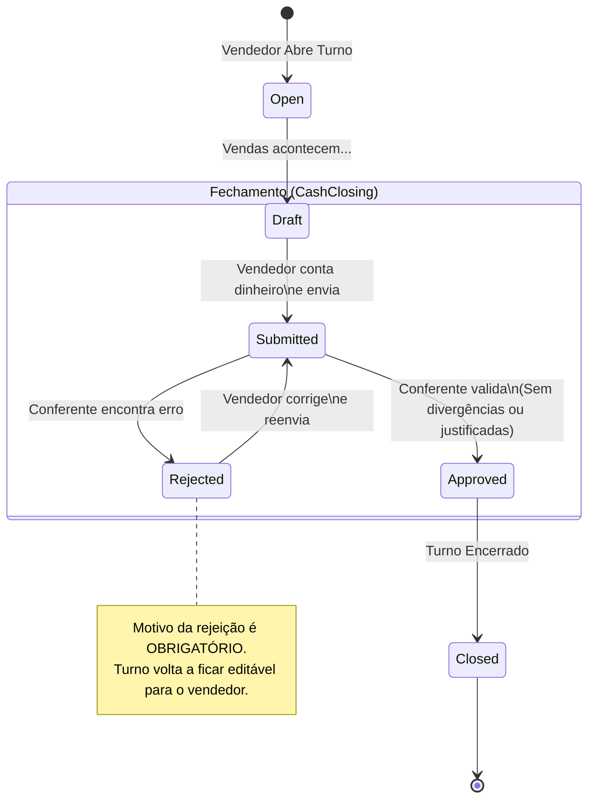

# Mais Capinhas ERP - API Documentation

   

## 1. Sobre o Projeto

**O que é**: O ERP Mais Capinhas é uma API back-end robusta desenvolvida para gerenciar operações de varejo multi-loja, com foco crítico em autenticação segura, gestão de vendas e, principalmente, no **fechamento de caixa com auditoria rigora**.

**Para quem é**: Redes de varejo que necessitam de controle granular sobre diferentes perfis de funcionários (vendedores, gerentes, conferentes) e múltiplas unidades físicas.

**Problema que resolve**: Elimina a inconsistência financeira entre o "sistema" e a "gaveta do caixa", forçando um fluxo de aprovação auditável onde divergências devem ser justificadas antes que um turno seja encerrado.

---

## 2. Status e Escopo

**Status Atual**: 🚀 **MVP (Em Desenvolvimento Avançado)**

### ✅ O que está pronto
- [x] **Autenticação Segura**: Login via Bearer Token (Device-based).
- [x] **RBAC Granular**: Sistema de permissões por loja (ex: Um usuário pode ser Gerente na Loja A e Vendedor na Loja B ao mesmo tempo).
- [x] **Gestão de Lojas**: Cadastro e vinculação de usuários.
- [x] **Gestão de Vendas**: Registro e consulta com filtros avançados.
- [x] **Módulo de Caixa (Core)**:
    - Abertura de Turnos (Manhã/Tarde/Noite).
    - Cálculo automático de divergências.
    - Fluxo de Submissão -> Aprovação/Rejeição.
- [x] **Dashboards**: Endpoints otimizados para KPIs de Vendedores, Conferentes e Admins.

### 🚧 Roadmap Curto
- [ ] Integração com sistema fiscal (NFC-e).
- [ ] Módulo de Estoque (Entradas/Saídas).
- [ ] Relatórios PDF exportáveis.
- [ ] Webhook para notificações em tempo real.

---

## 3. Tech Stack

- **Linguagem**: PHP 8.2+
- **Framework**: Laravel 12.x
- **Banco de Dados**: MySQL 8.0 / MariaDB
- **Autenticação**: Laravel Sanctum
- **Autorização**: Spatie Permissions (Customizada para multitenancy de loja)
- **Logs**: Spatie Activity Log (Auditoria de tabelas críticas)
- **Testes**: Pest PHP

---

## 4. Quick Start (Windows / Laragon)

Siga estes passos para rodar a API em menos de 5 minutos.

### Pré-requisitos
- PHP 8.2+
- Composer
- MySQL

### Passo a Passo

1. **Clone o repositório**
   ```bash
   git clone https://github.com/seu-org/maiscapinhas-erp-api.git
   cd maiscapinhas-erp-api
   ```

2. **Instale as dependências**
   ```bash
   composer install
   ```

3. **Configure o Ambiente**
   Copie o arquivo de exemplo:
   ```bash
   cp .env.example .env
   ```
   *No Windows (PowerShell):* `copy .env.example .env`

4. **Banco de Dados**
   Crie um banco de dados vazio (ex: `maiscapinhas_db`) no seu MySQL/HeidiSQL.
   Edite o `.env`:
   ```ini
   DB_CONNECTION=mysql
   DB_HOST=127.0.0.1
   DB_PORT=3306
   DB_DATABASE=maiscapinhas_db
   DB_USERNAME=root
   DB_PASSWORD=
   ```

5. **Gerar Chave e Migrar**
   ```bash
   php artisan key:generate
   php artisan migrate:fresh --seed
   ```
   *(Isso criará o banco e populará com dados de teste)*.

6. **Rodar o Servidor**
   ```bash
   php artisan serve
   ```
   A API estará rodando em: `http://localhost:8000`.

---

## 5. Configuração de Ambiente

### .env Essencial

```ini
APP_NAME="Mais Capinhas ERP"
APP_ENV=local
APP_DEBUG=true
APP_URL=http://localhost:8000

# Sanctum (Permite autenticação via cookie para SPA no mesmo domínio principal)
SANCTUM_STATEFUL_DOMAINS=localhost:3000,127.0.0.1:3000
SESSION_DOMAIN=.localhost

# CORS
CORS_ALLOWED_ORIGINS="http://localhost:3000,http://localhost:8000"
```

### Filas (Opcional no Dev)
Se for usar filas assíncronas:
```ini
QUEUE_CONNECTION=database
```

---

## 6. Autenticação

A API suporta dois modos de autenticação.

### 1. Token Bearer (Mobile / Postman / Server-to-Server)
Usado quando o cliente não compartilha sessão/cookies (apps nativos ou terceiros).

*   **Header Obrigatório**: `Authorization: Bearer <seu_token>`
*   **Obtenção**: Endpoint `/api/v1/auth/login` retorna o `token`.

### 2. Cookie SPA (Front-end Web)
Recomendado para o painel administrativo web (React/Vue) hospedado no mesmo domínio.

1.  Requisitar `GET /sanctum/csrf-cookie`.
2.  Fazer login em `/api/v1/auth/login`.
3.  O browser gerencia o cookie `XSRF-TOKEN` e `maiscapinhas_session`.
4.  **Importante**: Requests devem ter `credentials: include`.

---

## 7. Dados de Seed (Usuários de Teste)

Ao rodar `migrate:fresh --seed`, os seguintes usuários são criados (Senha padrão para todos: `password`):

| Perfil | Email | Permissões |
| :--- | :--- | :--- |
| **Admin Global** | `admin@maiscapinhas.com.br` | Acesso total a todas as lojas. |
| **Gerente** | `carlos.gerente@maiscapinhas.com.br` | Gerente em Tijucas e Itapema. |
| **Conferente** | `ana.conferente@maiscapinhas.com.br` | Conferente em Tijucas e Itapema (Aprova caixas). |
| **Vendedor** | `joao.vendedor@maiscapinhas.com.br` | Vendedor em Tijucas (Abre turnos). |
| **Vendedor** | `pedro.vendedor@maiscapinhas.com.br` | Vendedor em Bombinhas. |

**Lojas Criadas**:
1. Tijucas
2. Itapema
3. Bombinhas

---

## 8. RBAC e Multi-loja (Design Decisions)

Uma das decisões de arquitetura mais importantes foi **desacoplar o usuário da loja**. Um usuário não "pertence" a uma loja; ele **tem um papel** em uma loja.

**Tabela Pivot**: `store_users`
- `user_id`
- `store_id`
- `role` (admin, gerente, conferente, vendedor)

**Regras de Negócio**:
- **Escopo**: Quase todos os endpoints exigem `store_id`. O middleware ou Service valida: "Este usuário tem acesso a ESTA loja?".
- **Roles Específicas**:
    - `vendedor`: Pode vender e abrir turnos, mas NÃO aprovar.
    - `conferente`: Pode visualizar todos os caixas e aprovar/rejeitar, mas NÃO edita valores.
    - `gerente`: Poderes de conferente + relatórios gerenciais.

> [!NOTE]
> Um usuário pode ser Gerente na Loja A e apenas Vendedor na Loja B. O sistema respeita o contexto da loja informada na requisição.

---

## 9. Fluxos e Diagramas

### Fluxo de Fechamento de Caixa

Este é o coração financeiro do ERP.



---

## 10. Documentação de Endpoints

### Endpoints Principais

| Método | Endpoint | Descrição |
| :--- | :--- | :--- |
| `GET` | `/health` | Checagem de saúde da API. |
| `POST` | `/auth/login` | Login e obtenção de token. |
| `GET` | `/me` | Dados do usuário e suas lojas. |
| `GET` | `/stores` | Lojas disponíveis para o usuário. |
| `GET` | `/sales` | Listagem de vendas (filtros avançados). |
| `POST` | `/cash/shifts` | Abertura de turno de caixa. |
| `POST` | `/cash/closings/{id}/submit` | Submissão de fechamento. |
| `POST` | `/cash/closings/{id}/approve` | Aprovação de fechamento (Gerente). |

### Detalhamento Crítico

#### 1. Abertura de Turno
**POST** `/api/v1/cash/shifts`

Valida se já não existe um turno aberto para aquele usuário naquela loja.

**Body**:
```json
{
  "store_id": 1,
  "date": "2024-03-10",
  "shift_code": "T" // M=Manhã, T=Tarde, N=Noite
}
```

#### 2. Visualizar Fechamento (Com Divergências)
**GET** `/api/v1/cash/closings/{shift_id}`

O sistema calcula `diff_value` em tempo real na criação do draft.

**Response (Parcial)**:
```json
{
  "data": {
    "status": "draft",
    "lines": [
      {
        "label": "Dinheiro em Espécie",
        "system_value": 500.00,
        "real_value": 480.00,
        "diff_value": -20.00, // Falta R$20
        "justification_text": null // Precisa preencher para submeter!
      }
    ]
  }
}
```

---

## 11. Formato de Resposta e Erros

Todas as respostas seguem o padrão JSON Envelope.

### Sucesso
```json
{
  "data": { ... },
  "meta": { "timestamp": "...", "page": 1 }
}
```

### Erros Comuns

*   **401 Unauthenticated**: Token inválido.
*   **403 Forbidden**: "You do not have permission to approve closings in this store."
*   **422 Validation Error**:
    ```json
    {
      "message": "Validation failed.",
      "errors": {
         "real_value": ["O valor real deve ser numérico."]
      }
    }
    ```
*   **409 Conflict**: Tentar aprovar um caixa que não está em estado `submitted`.

---

## 12. Filas e Scheduler

Para ambientes de produção, certifique-se de rodar os workers.

```bash
# Processar filas (envio de emails, logs pesados)
php artisan queue:work

# Scheduler (limpeza de tokens, relatórios diários)
php artisan schedule:work
```

---

## 13. Testes

O projeto utiliza Pest PHP para testes automatizados.

```bash
# Rodar todos os testes
php artisan test

# Rodar apenas testes de Arquitetura
php artisan test --filter=Arch
```

Cobertura atual foca em:
1.  Fluxos de Login.
2.  Cálculo de divergências de caixa.
3.  Proteção de rotas (Store Policy).

---

## 14. Observabilidade e Manutenção

### Comandos Úteis
*   `php artisan route:list`: Ver todas as rotas registradas.
*   `php artisan model:show User`: Ver detalhes do Model User.
*   `tail -f storage/logs/laravel.log`: Acompanhar logs de erro em tempo real.

### Troubleshooting
*   **Erro 500 no Login?**: Verifique se as chaves do Sanctum foram geradas ou se o `.env` está correto.
*   **CORS Error?**: Verifique se `SANCTUM_STATEFUL_DOMAINS` bate com a porta do seu front-end.

---

## 15. Segurança

> [!IMPORTANT]
> **Nunca commite o arquivo `.env`**. Ele contém senhas de banco e chaves de criptografia.

*   **Rate Limiting**: Configurado por padrão em 60 requests/minuto por IP nas rotas de API.
*   **Auditoria**: Toda alteração de status em `CashClosings` gera um registro na tabela `audit_logs` (quem aprovou, quando, de qual IP).

---

## 16. Licença

Este projeto é proprietário e desenvolvido exclusivamente para uso interno da rede **Mais Capinhas**. Todos os direitos reservados.
