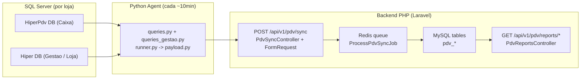

# Analise de Cobertura Cruzada (Agent Python x SQL Server x Backend PHP) - PDV Sync

Data: 2026-02-13  
Escopo: verificar, com base em **codigo-fonte**, se o webhook de 10 minutos cobre os detalhes de vendas das lojas (Caixa + Loja) e o que o PHP **ja persiste** vs. o que **a API ainda nao expoe**.

---

## 1) Fontes de verdade (arquivos analisados)

### Agent (Python)
- `c:\Users\Usuario\Desktop\maiscapinhas\chupacabra\pdv-sync-agent\src\queries.py`
- `c:\Users\Usuario\Desktop\maiscapinhas\chupacabra\pdv-sync-agent\src\queries_gestao.py`
- `c:\Users\Usuario\Desktop\maiscapinhas\chupacabra\pdv-sync-agent\src\runner.py`
- `c:\Users\Usuario\Desktop\maiscapinhas\chupacabra\pdv-sync-agent\src\payload.py`

### Backend (PHP/Laravel)
- `routes/api_v1.php`
- `app/Http/Requests/Pdv/PdvSyncIngestRequest.php`
- `app/Http/Controllers/Api/V1/PdvSyncController.php`
- `app/Support/Pdv/PdvStoreResolver.php`
- `app/Support/Pdv/PdvUserResolver.php`
- `app/Jobs/ProcessPdvSyncJob.php`
- `app/Http/Controllers/Api/V1/PdvReportsController.php`

---

## 2) Pipeline (fim-a-fim)



Resumo do estado atual:
- O webhook **transporta** detalhes granulares (itens/pagamentos) dentro de `vendas[]`.
- O job **persiste** esses detalhes em tabelas normalizadas (`pdv_venda_itens`, `pdv_venda_pagamentos`).
- Os endpoints de relatorio (`/pdv/reports/*`) expõem **agregados** (lista de vendas com contadores/somas), nao o extrato linha-a-linha.

---

## 3) O que o Agent coleta do SQL Server (e o que entra no JSON)

### 3.1 HIPER_CAIXA (HiperPdv / Caixa)

Fatos confirmados em `src/queries.py`:
- Loja: `get_store_info()` seleciona `ponto_venda.cnpj` (campo existe e vai no payload).
- Turnos: queries trazem `login_operador` e `login_responsavel`.
- Itens de venda: `get_sale_items()` traz `uv.login AS login_vendedor`.
- Pagamentos: `get_sale_payments()` traz valor/troco/parcela por finalizador.
- Resumos:
  - `get_sales_by_vendor()` traz `u.login AS vendedor_login`.
  - `get_payments_by_method()` traz `meio_pagamento` por finalizador.
- Snapshots:
  - `get_turno_snapshot()` inclui `login_operador` e `login_responsavel`.
  - `get_vendas_snapshot()` inclui `login_vendedor`.

Resultado no payload (em `src/payload.py` / `src/runner.py`):
- `store.cnpj` populado (quando existe no `ponto_venda`).
- `turnos[].operador.login` e `turnos[].responsavel.login` populados (quando existe no `usuario.login`).
- `vendas[].itens[].vendedor.login` populado no canal `HIPER_CAIXA`.
- `resumo.by_vendor[].login` populado no canal `HIPER_CAIXA`.
- `snapshot_vendas[].vendedor.login` populado no canal `HIPER_CAIXA`.

### 3.2 HIPER_LOJA (Hiper Gestao / Loja)

Fatos confirmados em `src/queries_gestao.py`:
- `get_loja_sale_items()` **NAO seleciona** `uv.login`.
  - traz apenas `it.id_usuario_vendedor` + `uv.nome AS nome_vendedor`.
- `get_loja_sales_by_vendor()` **NAO seleciona** login do vendedor.
- `get_loja_vendas_snapshot()` **NAO seleciona** login do vendedor.
- Troco:
  - `get_loja_sale_payments()` usa `operacao_pdv.ValorTroco` e atribui troco apenas para `rn=1` (ROW_NUMBER).

Implicacao pratica:
- Para o canal `HIPER_LOJA`, os campos abaixo tendem a vir `null`:
  - `vendas[].itens[].vendedor.login`
  - `resumo.by_vendor[].login`
  - `snapshot_vendas[].vendedor.login`
- Logo, o backend consegue fazer binding de vendedor por `login` no `HIPER_CAIXA` com alta confianca,
  mas no `HIPER_LOJA` frequentemente cai no fallback por `id_usuario` (quando implementado).

Recomendacao (Agent):
- incluir `uv.login AS login_vendedor` em:
  - `get_loja_sale_items`
  - `get_loja_sales_by_vendor`
  - `get_loja_vendas_snapshot`

---

## 4) O que o Backend valida no ingress (webhook)

Endpoint:
- `POST /api/v1/pdv/sync` (ver `routes/api_v1.php`)

Validacao (Laravel FormRequest):
- `app/Http/Requests/Pdv/PdvSyncIngestRequest.php`
  - obrigatorios: `schema_version`, `store.id_ponto_venda`, `window.from`, `window.to`, `integrity.sync_id`
  - aceitos (opcionais): `store.cnpj`, `*.login`, `turnos.*.duracao_minutos` como `null` (turno aberto)

Validacao adicional (controller):
- `app/Http/Controllers/Api/V1/PdvSyncController.php`
  - idempotencia: se `sync_id` ja existe, retorna `200 duplicate`
  - `X-PDV-Schema-Version` (se presente) deve ser suportado e deve bater com `schema_version`
  - JSON Schema pode ser aplicado por `PdvJsonSchemaValidator`, mas depende de `pdv.json_schema_validation_enabled`

Store binding no ingress (risk flags):
- `PdvStoreResolver` tenta resolver `store_id` ja na ingestao.
- Se nao resolver, o sync entra com risk flag `store_mapping_missing` e `store_id=NULL`.

---

## 5) O que o Backend persiste (normalizacao)

### 5.1 Tabelas principais (granular)

Job:
- `app/Jobs/ProcessPdvSyncJob.php`

Persistencia (resumo):
- `pdv_syncs` / `pdv_sync_payloads`:
  - guarda metadados + payload bruto (auditoria / reprocessamento)
- `pdv_vendas`:
  - 1 linha por venda (`store_pdv_id`, `canal`, `id_operacao`)
- `pdv_venda_itens`:
  - 1 linha por item (via `line_id` ou `row_hash` fallback)
  - persiste `vendedor_pdv_id`, `vendedor_nome`, `vendedor_login` e resolve `vendedor_user_id` quando houver mapping
- `pdv_venda_pagamentos`:
  - 1 linha por pagamento (via `line_id` ou `row_hash`)
  - persiste `meio_pagamento`, `valor`, `troco`, `parcelas`
- `pdv_turnos` + `pdv_turno_pagamentos`:
  - persiste totais de sistema/declarado/falta por finalizador
  - mapeia `operador_user_id` quando existir mapping e coluna
  - persiste `operador_login` e `responsavel_login` (se as colunas existirem)
- `pdv_vendas_resumo`:
  - snapshot das ultimas vendas (por `[store_pdv_id, canal, id_operacao]`)

Observacao importante:
- `resumo.by_vendor` e `resumo.by_payment` do payload nao viram uma tabela de "resumo" propria.
  Eles sao usados para observar usuarios (auto-registro em `pdv_usuarios`) e para validacoes/diagnostico.

### 5.2 Master data (catalogos)

O job observa dados do payload e popula/atualiza:
- `pdv_lojas` (nao deve ser usado como identidade canonica quando `id_ponto_venda` colide)
- `pdv_usuarios` (nome/login por `id_usuario_hiper`)
- `pdv_meios_pagamento` (id_finalizador + categoria inferida)

---

## 6) O que a API de relatorios expoe hoje (e o que NAO expoe)

Endpoints (protegidos por `auth:sanctum`):
- `GET /api/v1/pdv/reports/turnos`
  - expoe: turno + totais + pagamentos por tipo/finalizador
  - NAO expoe: `operador.login` / `responsavel.login`
- `GET /api/v1/pdv/reports/vendas`
  - expoe: lista de vendas + agregados (itens_count, itens_total, pagamentos_count, pagamentos_total)
  - filtros: por periodo, canal, id_turno, vendedor_id (pdv), id_finalizador, meio_pagamento
  - NAO expoe: lista de itens e lista de pagamentos por venda
- `GET /api/v1/pdv/reports/ranking-vendedores`
  - agrega por vendedor a partir de `pdv_venda_itens` + `pdv_vendas`
  - retorna `vendedor_id` (pdv) + nome + totais
  - NAO expoe: `login` nem `user_id` (interno)
- `GET /api/v1/pdv/reports/ranking-vendedor-loja`
  - agrega por vendedor x loja (com paginacao)

Conclusao objetiva:
- Os dados granulares **existem no MySQL**, mas os endpoints atuais priorizam agregados e ranking.
- Para telas de "extrato detalhado" (itens/pagamentos por cupom), falta endpoint especifico.

---

## 7) Cobertura das 12 lojas (como provar)

Premissa:
- Se cada loja tem o agente rodando e postando com sucesso, o backend recebe e persiste.

Query recomendada (MySQL) para confirmar cobertura por loja interna:

```sql
SELECT
  store_id,
  MAX(received_at) AS ultimo_sync,
  TIMESTAMPDIFF(MINUTE, MAX(received_at), NOW()) AS minutos_sem_sync,
  COUNT(*) AS total_24h
FROM pdv_syncs
WHERE store_id IS NOT NULL
  AND received_at >= NOW() - INTERVAL 24 HOUR
GROUP BY store_id
ORDER BY ultimo_sync DESC;
```

Leitura do resultado:
- `minutos_sem_sync > 30` sugere loja offline/agent parado/erro de webhook.
- `store_id IS NULL` sugere que o sync chegou, mas nao foi vinculado (mapping faltando ou pre-fix).

Recomendacao operacional:
- considerar um alerta quando `minutos_sem_sync > 30` para qualquer `store_id` esperado (1..12).

---

## 8) Gaps reais (prioridade)

### P0/P1 - Backend (este repo)
1. Endpoint de extrato detalhado por venda:
   - sugestao: `GET /api/v1/pdv/reports/vendas/detalhe?store_id|store_pdv_id+store_alias&canal&id_operacao`
   - retorno: venda + `itens[]` + `pagamentos[]`
2. Opcional: incluir `operador_login` / `responsavel_login` em `/pdv/reports/turnos` (debug/ops)
3. Backfill/rebind:
   - rotina para reprocessar syncs antigos com `store_id=NULL` (agora que temos CNPJ/mappings)
   - rotina para completar `vendedor_user_id` quando `vendedor_login` existe e mapping existe

### P0/P1 - Agent (fora deste repo, mas bloqueia qualidade no canal Loja)
4. Incluir `login_vendedor` no canal `HIPER_LOJA` (queries_gestao):
   - `get_loja_sale_items`
   - `get_loja_sales_by_vendor`
   - `get_loja_vendas_snapshot`

---

## 9) Conclusao

O stack hoje ja garante:
- transporte e persistencia de **dados granulares** (itens/pagamentos) para vendas do PDV
- binding de loja por `cnpj` e binding de usuario por `login` (quando o payload traz login)
- filtros inteligentes no endpoint de vendas (por vendedor e por meio de pagamento), mas sobre agregados

O que ainda falta para "cobertura completa na API":
- endpoints para expor o extrato detalhado (itens/pagamentos) por venda
- completar o contrato do agente para `HIPER_LOJA` incluir `login` do vendedor

