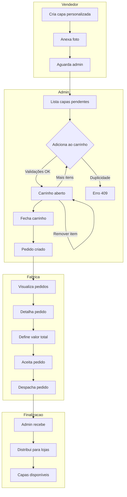
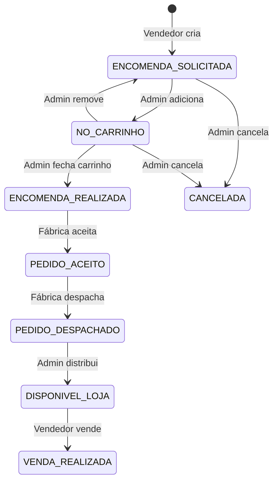
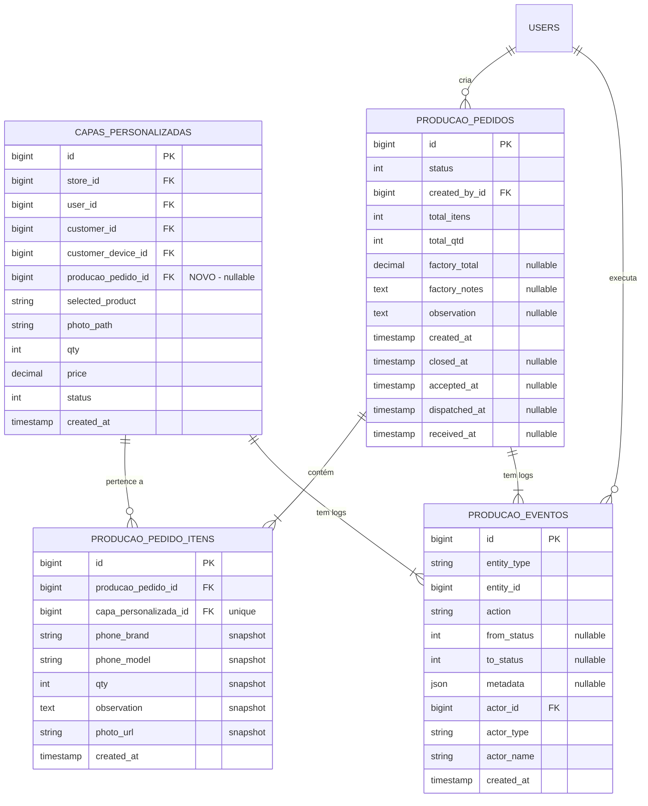

# Sistema de Pedidos para Fábrica - Especificação Final

> **Versão**: 1.0  
> **Data**: 2026-01-12  
> **Status**: Proposta Consolidada (Backend + Frontend)

Este documento consolida as propostas do backend e frontend para o sistema de gerenciamento de pedidos de capas personalizadas para a fábrica.

---

## Índice

1. [Resumo Executivo](#resumo-executivo)
2. [Stack e Decisões Técnicas](#stack-e-decisões-técnicas)
3. [Fluxo Visual](#fluxo-visual)
4. [Modelagem de Dados](#modelagem-de-dados)
5. [Status e Transições](#status-e-transições)
6. [APIs RESTful](#apis-restful)
7. [Sistema de Logs e Timeline](#sistema-de-logs-e-timeline)
8. [Regras de Negócio](#regras-de-negócio)
9. [Autenticação da Fábrica](#autenticação-da-fábrica)
10. [Frontend - Estrutura](#frontend---estrutura)
11. [Validações e Erros](#validações-e-erros)
12. [Checklist de Implementação](#checklist-de-implementação)

---

## Resumo Executivo

### Objetivo
Criar um fluxo de produção para capas personalizadas onde:
- **Admin** agrupa pedidos em um "carrinho de produção"
- **Admin** fecha o carrinho e envia para a fábrica
- **Fábrica** aceita, define valor total e despacha
- **Sistema** registra timeline completa de cada ação

### Decisões Consolidadas

| Questão | Decisão |
|---------|---------|
| Portal da fábrica | **Mesmo frontend**, rota protegida por role |
| Usuários de fábrica | **1 usuário inicial**, mas estrutura pronta para mais |
| Valor da fábrica | **Total do pedido** (não por item) |
| Carrinho | **Tabela separada** (`producao_pedidos` com status `carrinho_aberto`) |
| Logs | **Tabela dedicada** com auditoria completa |

---

## Stack e Decisões Técnicas

### Backend (Laravel)
- **Framework**: Laravel 10+ com PHP 8.2+
- **Auth**: Sanctum (mesmo guard, role `fabrica`)
- **Database**: MySQL/PostgreSQL
- **Padrão**: Service Layer + Form Requests + Resources

### Frontend (React)
- **Framework**: React + Vite + TypeScript
- **State**: TanStack Query (React Query)
- **HTTP**: Axios
- **UI**: Tailwind + shadcn/ui
- **Forms**: Zod + React Hook Form

### Boas Práticas Adotadas

| Área | Prática |
|------|---------|
| **Auditoria** | Log de TODA ação com actor, timestamp, metadata |
| **Snapshots** | Dados do item salvos no momento do agrupamento |
| **Soft Delete** | Nunca deletar, apenas soft delete |
| **Transações** | Operações críticas em DB transaction |
| **Idempotência** | Verificar duplicidade antes de adicionar |

---

## Fluxo Visual

### Fluxo Completo



### Fluxo de Status



---

## Modelagem de Dados

### Diagrama ER



### Migration: `producao_pedidos`

```php
Schema::create('producao_pedidos', function (Blueprint $table) {
    $table->id();
    
    // Status: 1=carrinho_aberto, 2=encomenda_realizada, 3=pedido_aceito, 4=pedido_despachado, 5=recebido, 6=cancelado
    $table->tinyInteger('status')->default(1);
    
    // Totais (calculados ao fechar)
    $table->unsignedInteger('total_itens')->default(0);
    $table->unsignedInteger('total_qtd')->default(0);
    
    // Dados da fábrica
    $table->decimal('factory_total', 10, 2)->nullable();
    $table->text('factory_notes')->nullable();
    
    // Observação do admin
    $table->text('observation')->nullable();
    
    // Timestamps por etapa
    $table->timestamp('closed_at')->nullable();      // Carrinho fechado
    $table->timestamp('accepted_at')->nullable();    // Fábrica aceitou
    $table->timestamp('dispatched_at')->nullable();  // Fábrica despachou
    $table->timestamp('received_at')->nullable();    // Admin recebeu
    
    // Audit
    $table->foreignId('created_by_id')->constrained('users')->cascadeOnDelete();
    
    $table->timestamps();
    $table->softDeletes();
    
    // Indexes
    $table->index(['status', 'created_at']);
    $table->index('created_by_id');
});
```

### Migration: `producao_pedido_itens`

```php
Schema::create('producao_pedido_itens', function (Blueprint $table) {
    $table->id();
    $table->foreignId('producao_pedido_id')->constrained('producao_pedidos')->cascadeOnDelete();
    $table->foreignId('capa_personalizada_id')->constrained('capas_personalizadas')->cascadeOnDelete();
    
    // Snapshot dos dados no momento do agrupamento
    $table->string('phone_brand')->nullable();
    $table->string('phone_model')->nullable();
    $table->unsignedInteger('qty')->default(1);
    $table->text('observation')->nullable();
    $table->string('photo_url')->nullable();
    
    $table->timestamps();
    
    // Cada capa só pode estar em 1 pedido de produção
    $table->unique('capa_personalizada_id');
    
    $table->index('producao_pedido_id');
});
```

### Migration: `producao_eventos`

```php
Schema::create('producao_eventos', function (Blueprint $table) {
    $table->id();
    
    // Entidade afetada (polimórfico simplificado)
    $table->string('entity_type', 50);  // 'producao_pedido', 'capa_personalizada'
    $table->unsignedBigInteger('entity_id');
    
    // Ação executada
    $table->string('action', 50);
    
    // Status antes/depois (se aplicável)
    $table->tinyInteger('from_status')->nullable();
    $table->tinyInteger('to_status')->nullable();
    
    // Dados extras (valor, observação, código rastreio, etc)
    $table->json('metadata')->nullable();
    
    // Quem executou
    $table->unsignedBigInteger('actor_id');
    $table->string('actor_type', 20);   // 'admin', 'vendedor', 'fabrica'
    $table->string('actor_name', 100);
    
    $table->timestamp('created_at');
    
    // Indexes
    $table->index(['entity_type', 'entity_id', 'created_at']);
    $table->index(['actor_id', 'actor_type']);
});
```

### Migration: Alterar `capas_personalizadas`

```php
Schema::table('capas_personalizadas', function (Blueprint $table) {
    // Adicionar referência ao pedido de produção
    $table->foreignId('producao_pedido_id')
        ->nullable()
        ->after('sended_to_production_at')
        ->constrained('producao_pedidos')
        ->nullOnDelete();
    
    $table->index('producao_pedido_id');
});
```

---

## Status e Transições

### Enum: `ProducaoPedidoStatus`

```php
<?php

declare(strict_types=1);

namespace App\Enums;

enum ProducaoPedidoStatus: int
{
    case CARRINHO_ABERTO = 1;
    case ENCOMENDA_REALIZADA = 2;
    case PEDIDO_ACEITO = 3;
    case PEDIDO_DESPACHADO = 4;
    case RECEBIDO = 5;
    case CANCELADO = 6;

    public function label(): string
    {
        return match ($this) {
            self::CARRINHO_ABERTO => 'Carrinho Aberto',
            self::ENCOMENDA_REALIZADA => 'Encomenda Realizada',
            self::PEDIDO_ACEITO => 'Pedido Aceito',
            self::PEDIDO_DESPACHADO => 'Pedido Despachado',
            self::RECEBIDO => 'Recebido',
            self::CANCELADO => 'Cancelado',
        };
    }

    public function color(): string
    {
        return match ($this) {
            self::CARRINHO_ABERTO => 'slate',
            self::ENCOMENDA_REALIZADA => 'orange',
            self::PEDIDO_ACEITO => 'teal',
            self::PEDIDO_DESPACHADO => 'indigo',
            self::RECEBIDO => 'green',
            self::CANCELADO => 'red',
        };
    }

    public function icon(): string
    {
        return match ($this) {
            self::CARRINHO_ABERTO => 'shopping-cart',
            self::ENCOMENDA_REALIZADA => 'send',
            self::PEDIDO_ACEITO => 'check-circle',
            self::PEDIDO_DESPACHADO => 'truck',
            self::RECEBIDO => 'package-check',
            self::CANCELADO => 'x-circle',
        };
    }

    public function isVisibleToFactory(): bool
    {
        return !in_array($this, [self::CARRINHO_ABERTO, self::CANCELADO]);
    }
}
```

### Atualização: `CapaPersonalizadaStatus`

```php
enum CapaPersonalizadaStatus: int
{
    case ENCOMENDA_SOLICITADA = 1;
    case PRODUTO_INDISPONIVEL = 2;
    case DISPONIVEL_LOJA = 3;
    case VENDA_REALIZADA = 4;
    case CANCELADA = 5;
    case ENVIADO_PRODUCAO = 6;        // Renomear para "Encomendado à Fábrica"
    case NO_CARRINHO = 7;             // NOVO: Adicionado ao carrinho

    public function label(): string
    {
        return match ($this) {
            self::ENCOMENDA_SOLICITADA => 'Encomenda Solicitada',
            self::PRODUTO_INDISPONIVEL => 'Produto Indisponível',
            self::DISPONIVEL_LOJA => 'Disponível na Loja',
            self::VENDA_REALIZADA => 'Venda Realizada',
            self::CANCELADA => 'Cancelada',
            self::ENVIADO_PRODUCAO => 'Encomendado à Fábrica',
            self::NO_CARRINHO => 'No Carrinho de Produção',
        };
    }
}
```

### Transições Permitidas

| De | Para | Quem | Ação |
|----|------|------|------|
| `ENCOMENDA_SOLICITADA` | `NO_CARRINHO` | Admin | Adiciona ao carrinho |
| `NO_CARRINHO` | `ENCOMENDA_SOLICITADA` | Admin | Remove do carrinho |
| `NO_CARRINHO` | `ENVIADO_PRODUCAO` | Sistema | Fecha carrinho |
| `ENVIADO_PRODUCAO` | `DISPONIVEL_LOJA` | Admin | Distribui para loja |
| `*` | `CANCELADA` | Admin | Cancela pedido |

---

## APIs RESTful

### Carrinho de Produção (Admin)

#### `GET /api/v1/producao/carrinho`
Retorna o carrinho aberto do admin (cria se não existir).

**Response:**
```json
{
  "data": {
    "id": 1,
    "status": "carrinho_aberto",
    "status_label": "Carrinho Aberto",
    "total_itens": 3,
    "total_qtd": 7,
    "created_at": "2026-01-12T10:00:00Z",
    "items": [
      {
        "id": 1,
        "capa_id": 15,
        "selected_product": "Capa Personalizada iPhone 15",
        "phone_brand": "Apple",
        "phone_model": "iPhone 15 Pro",
        "qty": 2,
        "observation": "Foto do cachorro centralizada",
        "photo_url": "https://...",
        "customer": {
          "id": 10,
          "name": "João Silva"
        },
        "added_at": "2026-01-12T10:30:00Z"
      }
    ]
  }
}
```

---

#### `POST /api/v1/producao/carrinho/itens`
Adiciona capas ao carrinho.

**Request:**
```json
{
  "capa_ids": [15, 16, 17]
}
```

**Response (sucesso parcial):**
```json
{
  "message": "2 itens adicionados, 1 bloqueado.",
  "data": {
    "added": [15, 16],
    "blocked": [
      {
        "id": 17,
        "reason": "ALREADY_IN_CART",
        "message": "Esta capa já está no carrinho"
      }
    ]
  }
}
```

**Códigos de Bloqueio:**
| Código | Descrição |
|--------|-----------|
| `ALREADY_IN_CART` | Já está no carrinho aberto |
| `ALREADY_SENT` | Já foi enviada para fábrica anteriormente |
| `INVALID_STATUS` | Status não é "Encomenda Solicitada" |
| `NO_PHOTO` | Capa não possui foto |
| `CANCELLED` | Capa está cancelada |

---

#### `DELETE /api/v1/producao/carrinho/itens/{item_id}`
Remove item do carrinho.

**Response:**
```json
{
  "message": "Item removido do carrinho."
}
```

---

#### `POST /api/v1/producao/carrinho/fechar`
Fecha o carrinho e cria o pedido de produção.

**Request:**
```json
{
  "observation": "Pedido urgente - entregar até dia 20"
}
```

**Response:**
```json
{
  "message": "Pedido de produção criado com sucesso.",
  "data": {
    "id": 1001,
    "status": "encomenda_realizada",
    "status_label": "Encomenda Realizada",
    "total_itens": 3,
    "total_qtd": 7,
    "created_at": "2026-01-12T10:00:00Z",
    "closed_at": "2026-01-12T15:30:00Z"
  }
}
```

**Erros:**
- `422` se carrinho estiver vazio

---

### Pedidos de Produção (Admin + Fábrica)

#### `GET /api/v1/producao/pedidos`
Lista pedidos de produção.

**Query Params:**
| Param | Tipo | Default | Descrição |
|-------|------|---------|-----------|
| `status` | int | - | Filtro por status (2,3,4,5) |
| `initial_date` | date | - | Data inicial criação |
| `final_date` | date | - | Data final criação |
| `page` | int | 1 | Página |
| `per_page` | int | 15 | Itens por página |

> [!NOTE]
> **Fábrica**: Só vê pedidos com `isVisibleToFactory() = true`  
> **Admin**: Vê todos os pedidos (incluindo carrinho aberto)

**Response:**
```json
{
  "data": [
    {
      "id": 1001,
      "status": 2,
      "status_label": "Encomenda Realizada",
      "status_color": "orange",
      "total_itens": 12,
      "total_qtd": 18,
      "factory_total": null,
      "observation": "Pedido urgente",
      "created_at": "2026-01-12T10:00:00Z",
      "closed_at": "2026-01-12T15:30:00Z",
      "created_by": {
        "id": 5,
        "name": "Admin Silva"
      }
    }
  ],
  "meta": {
    "current_page": 1,
    "last_page": 5,
    "per_page": 15,
    "total": 73
  }
}
```

---

#### `GET /api/v1/producao/pedidos/{id}`
Detalha pedido com itens e timeline.

**Response:**
```json
{
  "data": {
    "id": 1001,
    "status": 3,
    "status_label": "Pedido Aceito",
    "status_color": "teal",
    "total_itens": 12,
    "total_qtd": 18,
    "factory_total": 450.00,
    "factory_notes": "Prazo de 5 dias úteis",
    "observation": "Pedido urgente",
    "created_at": "2026-01-12T10:00:00Z",
    "closed_at": "2026-01-12T15:30:00Z",
    "accepted_at": "2026-01-12T17:00:00Z",
    "dispatched_at": null,
    "received_at": null,
    "created_by": {
      "id": 5,
      "name": "Admin Silva"
    },
    "items": [
      {
        "id": 1,
        "capa_id": 15,
        "phone_brand": "Apple",
        "phone_model": "iPhone 15 Pro",
        "qty": 2,
        "observation": "Foto do cachorro centralizada",
        "photo_url": "https://...",
        "photo_download_url": "https://.../download"
      }
    ],
    "timeline": [
      {
        "id": 1,
        "action": "carrinho_criado",
        "action_label": "Carrinho Criado",
        "action_icon": "shopping-cart",
        "from_status": null,
        "to_status": 1,
        "to_status_label": "Carrinho Aberto",
        "actor_name": "Admin Silva",
        "actor_type": "admin",
        "created_at": "2026-01-12T10:00:00Z",
        "created_at_human": "há 5 horas"
      },
      {
        "id": 2,
        "action": "item_adicionado",
        "action_label": "Item Adicionado",
        "action_icon": "plus",
        "metadata": {
          "capa_id": 15,
          "phone_model": "iPhone 15 Pro"
        },
        "actor_name": "Admin Silva",
        "actor_type": "admin",
        "created_at": "2026-01-12T10:30:00Z"
      },
      {
        "id": 3,
        "action": "carrinho_fechado",
        "action_label": "Carrinho Fechado",
        "action_icon": "check",
        "from_status": 1,
        "to_status": 2,
        "to_status_label": "Encomenda Realizada",
        "actor_name": "Admin Silva",
        "actor_type": "admin",
        "created_at": "2026-01-12T15:30:00Z"
      },
      {
        "id": 4,
        "action": "pedido_aceito",
        "action_label": "Pedido Aceito pela Fábrica",
        "action_icon": "check-circle",
        "from_status": 2,
        "to_status": 3,
        "to_status_label": "Pedido Aceito",
        "metadata": {
          "factory_total": 450.00
        },
        "actor_name": "Fábrica ABC",
        "actor_type": "fabrica",
        "created_at": "2026-01-12T17:00:00Z"
      }
    ],
    "can_accept": false,
    "can_dispatch": true,
    "can_receive": false
  }
}
```

---

#### `PATCH /api/v1/producao/pedidos/{id}/aceitar`
Fábrica aceita o pedido e define valor.

**Request:**
```json
{
  "factory_total": 450.00,
  "factory_notes": "Prazo de 5 dias úteis"
}
```

**Response:**
```json
{
  "message": "Pedido aceito com sucesso.",
  "data": { ... }
}
```

---

#### `PATCH /api/v1/producao/pedidos/{id}/despachar`
Fábrica despacha o pedido.

**Request:**
```json
{
  "tracking_code": "BR123456789",
  "factory_notes": "Enviado via Sedex"
}
```

---

#### `PATCH /api/v1/producao/pedidos/{id}/receber`
Admin confirma recebimento.

**Request:**
```json
{
  "observation": "Todos os itens conferidos"
}
```

**Side Effects:**
- Atualiza todas as capas do pedido para `DISPONIVEL_LOJA`
- Registra evento na timeline

---

#### `GET /api/v1/producao/pedidos/{id}/timeline`
Timeline dedicada do pedido.

**Response:**
```json
{
  "data": [
    {
      "id": 1,
      "action": "carrinho_criado",
      "action_label": "Carrinho Criado",
      ...
    }
  ]
}
```

---

#### `GET /api/v1/producao/pedidos/{order_id}/itens/{item_id}/foto`
Download da foto (fábrica).

**Response:** Imagem binária ou redirect para URL assinada.

---

### Capas Personalizadas (Ajustes)

#### `GET /api/v1/capas-personalizadas/{id}/timeline`
Timeline da capa individual.

**Response:**
```json
{
  "data": [
    {
      "action": "capa_criada",
      "action_label": "Capa Criada",
      "actor_name": "Vendedor João",
      "created_at": "2026-01-10T14:00:00Z"
    },
    {
      "action": "foto_enviada",
      "action_label": "Foto Enviada",
      "actor_name": "Cliente (público)",
      "created_at": "2026-01-10T14:30:00Z"
    },
    {
      "action": "adicionada_carrinho",
      "action_label": "Adicionada ao Carrinho",
      "metadata": { "producao_pedido_id": 1001 },
      "actor_name": "Admin Silva",
      "created_at": "2026-01-12T10:30:00Z"
    }
  ]
}
```

---

## Sistema de Logs e Timeline

### Ações Registradas

| Ação | Contexto | Actor | Metadata |
|------|----------|-------|----------|
| `capa_criada` | Capa | Vendedor | - |
| `foto_enviada` | Capa | Vendedor/Cliente | `{ size, mime }` |
| `pagamento_registrado` | Capa | Admin | `{ valor, received_by }` |
| `carrinho_criado` | Pedido | Admin | - |
| `item_adicionado` | Pedido | Admin | `{ capa_id, phone_model }` |
| `item_removido` | Pedido | Admin | `{ capa_id }` |
| `carrinho_fechado` | Pedido | Admin | `{ total_itens, total_qtd }` |
| `pedido_aceito` | Pedido | Fábrica | `{ factory_total }` |
| `pedido_despachado` | Pedido | Fábrica | `{ tracking_code }` |
| `pedido_recebido` | Pedido | Admin | `{ observation }` |
| `itens_distribuidos` | Pedido | Admin | `{ capas_ids }` |

### Service de Logs

```php
class ProducaoEventoService
{
    public function log(
        string $entityType,
        int $entityId,
        string $action,
        ?int $fromStatus = null,
        ?int $toStatus = null,
        ?array $metadata = null
    ): ProducaoEvento {
        $user = auth()->user();

        return ProducaoEvento::create([
            'entity_type' => $entityType,
            'entity_id' => $entityId,
            'action' => $action,
            'from_status' => $fromStatus,
            'to_status' => $toStatus,
            'metadata' => $metadata,
            'actor_id' => $user->id,
            'actor_type' => $this->getActorType($user),
            'actor_name' => $user->name,
            'created_at' => now(),
        ]);
    }

    private function getActorType(User $user): string
    {
        if ($user->hasRole('fabrica')) return 'fabrica';
        if ($user->hasRole('admin') || $user->hasRole('super_admin')) return 'admin';
        return 'vendedor';
    }
}
```

---

## Regras de Negócio

### 1. Adicionar ao Carrinho

```php
public function addToCart(array $capaIds): array
{
    $results = ['added' => [], 'blocked' => []];

    foreach ($capaIds as $id) {
        $capa = CapaPersonalizada::find($id);

        // Validação: Status
        if ($capa->status !== CapaPersonalizadaStatus::ENCOMENDA_SOLICITADA) {
            $results['blocked'][] = [
                'id' => $id,
                'reason' => 'INVALID_STATUS',
                'message' => 'Status deve ser "Encomenda Solicitada"',
            ];
            continue;
        }

        // Validação: Foto obrigatória
        if (!$capa->photo_path) {
            $results['blocked'][] = [
                'id' => $id,
                'reason' => 'NO_PHOTO',
                'message' => 'Capa não possui foto',
            ];
            continue;
        }

        // Validação: Já está no carrinho
        if ($capa->producao_pedido_id) {
            $results['blocked'][] = [
                'id' => $id,
                'reason' => 'ALREADY_IN_CART',
                'message' => 'Capa já está no carrinho ou foi enviada',
            ];
            continue;
        }

        // Validação: Já foi enviada (histórico)
        if ($this->wasEverSent($capa)) {
            $results['blocked'][] = [
                'id' => $id,
                'reason' => 'ALREADY_SENT',
                'message' => 'Capa já foi enviada para fábrica anteriormente',
            ];
            continue;
        }

        // Adicionar ao carrinho
        $carrinho = $this->getOrCreateOpenCart();
        $this->addItemToCart($carrinho, $capa);
        $results['added'][] = $id;
    }

    return $results;
}
```

### 2. Fechar Carrinho

```php
public function closeCart(string $observation = null): ProducaoPedido
{
    return DB::transaction(function () use ($observation) {
        $carrinho = $this->getOpenCart();

        if (!$carrinho || $carrinho->itens->isEmpty()) {
            throw ValidationException::withMessages([
                'carrinho' => ['Carrinho está vazio.'],
            ]);
        }

        // Calcular totais
        $totalItens = $carrinho->itens->count();
        $totalQtd = $carrinho->itens->sum('qty');

        // Atualizar pedido
        $carrinho->update([
            'status' => ProducaoPedidoStatus::ENCOMENDA_REALIZADA,
            'total_itens' => $totalItens,
            'total_qtd' => $totalQtd,
            'observation' => $observation,
            'closed_at' => now(),
        ]);

        // Atualizar status das capas
        foreach ($carrinho->itens as $item) {
            $item->capaPersonalizada->update([
                'status' => CapaPersonalizadaStatus::ENVIADO_PRODUCAO,
                'sended_to_production_at' => now(),
            ]);

            // Log na capa
            $this->eventService->log(
                'capa_personalizada',
                $item->capa_personalizada_id,
                'enviada_fabrica',
                CapaPersonalizadaStatus::NO_CARRINHO->value,
                CapaPersonalizadaStatus::ENVIADO_PRODUCAO->value,
                ['producao_pedido_id' => $carrinho->id]
            );
        }

        // Log no pedido
        $this->eventService->log(
            'producao_pedido',
            $carrinho->id,
            'carrinho_fechado',
            ProducaoPedidoStatus::CARRINHO_ABERTO->value,
            ProducaoPedidoStatus::ENCOMENDA_REALIZADA->value,
            ['total_itens' => $totalItens, 'total_qtd' => $totalQtd]
        );

        return $carrinho->fresh(['itens']);
    });
}
```

---

## Autenticação da Fábrica

### Estratégia: Role no Mesmo Sistema

Como teremos **apenas 1 usuário de fábrica** inicialmente, a abordagem mais simples é:

1. Criar usuário na tabela `users` com role `fabrica`
2. Usar middleware para verificar role
3. Rotas específicas com prefixo `/api/v1/fabrica/*`

```php
// Middleware: EnsureIsFabrica
public function handle(Request $request, Closure $next)
{
    if (!$request->user() || !$request->user()->hasRole('fabrica')) {
        abort(403, 'Acesso negado. Apenas fábrica.');
    }
    return $next($request);
}

// Routes
Route::prefix('fabrica')
    ->middleware(['auth:sanctum', 'role:fabrica'])
    ->group(function () {
        Route::get('/pedidos', [FabricaPedidoController::class, 'index']);
        Route::get('/pedidos/{pedido}', [FabricaPedidoController::class, 'show']);
        Route::patch('/pedidos/{pedido}/aceitar', [FabricaPedidoController::class, 'aceitar']);
        Route::patch('/pedidos/{pedido}/despachar', [FabricaPedidoController::class, 'despachar']);
    });
```

### Políticas de Acesso

| Recurso | Admin | Vendedor | Fábrica |
|---------|-------|----------|---------|
| Carrinho (CRUD) | ✅ | ❌ | ❌ |
| Pedidos (listar) | ✅ todos | ❌ | ✅ apenas visíveis |
| Pedidos (detalhe) | ✅ | ❌ | ✅ |
| Aceitar/Despachar | ❌ | ❌ | ✅ |
| Receber | ✅ | ❌ | ❌ |
| Timeline | ✅ | ✅ próprios | ✅ próprios |

---

## Frontend - Estrutura

### Arquivos a Criar

```
src/
├── pages/
│   ├── producao/
│   │   ├── ProducaoCarrinho.tsx      # Carrinho aberto
│   │   ├── ProducaoPedidos.tsx       # Lista de pedidos (admin)
│   │   └── ProducaoPedidoDetail.tsx  # Detalhe + timeline
│   └── fabrica/
│       ├── FabricaPedidos.tsx        # Lista (fábrica)
│       └── FabricaPedidoDetail.tsx   # Detalhe + ações
├── components/
│   └── producao/
│       ├── CartItem.tsx
│       ├── CartSummary.tsx
│       ├── PedidoTimeline.tsx
│       ├── PedidoStatusBadge.tsx
│       └── ItemPhotoModal.tsx
├── services/
│   └── producao.service.ts
├── hooks/
│   ├── use-producao-carrinho.ts
│   ├── use-producao-pedidos.ts
│   └── use-fabrica-pedidos.ts
└── types/
    └── producao.types.ts
```

### Types

```typescript
// producao.types.ts

export type ProducaoPedidoStatus = 1 | 2 | 3 | 4 | 5 | 6;

export const PRODUCAO_STATUS = {
  CARRINHO_ABERTO: 1,
  ENCOMENDA_REALIZADA: 2,
  PEDIDO_ACEITO: 3,
  PEDIDO_DESPACHADO: 4,
  RECEBIDO: 5,
  CANCELADO: 6,
} as const;

export const PRODUCAO_STATUS_LABELS: Record<number, string> = {
  1: 'Carrinho Aberto',
  2: 'Encomenda Realizada',
  3: 'Pedido Aceito',
  4: 'Pedido Despachado',
  5: 'Recebido',
  6: 'Cancelado',
};

export interface ProducaoPedido {
  id: number;
  status: ProducaoPedidoStatus;
  status_label: string;
  status_color: string;
  total_itens: number;
  total_qtd: number;
  factory_total: number | null;
  factory_notes: string | null;
  observation: string | null;
  created_at: string;
  closed_at: string | null;
  accepted_at: string | null;
  dispatched_at: string | null;
  received_at: string | null;
  items?: ProducaoPedidoItem[];
  timeline?: ProducaoEvento[];
  can_accept?: boolean;
  can_dispatch?: boolean;
  can_receive?: boolean;
}

export interface ProducaoPedidoItem {
  id: number;
  capa_id: number;
  phone_brand: string | null;
  phone_model: string | null;
  qty: number;
  observation: string | null;
  photo_url: string | null;
  photo_download_url?: string;
}

export interface ProducaoEvento {
  id: number;
  action: string;
  action_label: string;
  action_icon: string;
  from_status: number | null;
  from_status_label: string | null;
  to_status: number | null;
  to_status_label: string | null;
  metadata: Record<string, unknown> | null;
  actor_name: string;
  actor_type: 'admin' | 'vendedor' | 'fabrica';
  created_at: string;
  created_at_human: string;
}
```

---

## Validações e Erros

### Códigos HTTP

| Código | Situação | Exemplo |
|--------|----------|---------|
| `200` | Sucesso | Pedido listado |
| `201` | Criado | Carrinho criado |
| `204` | Sem conteúdo | Item removido |
| `400` | Bad Request | Parâmetro inválido |
| `403` | Proibido | Fábrica tentando ver carrinho |
| `404` | Não encontrado | Pedido não existe |
| `409` | Conflito | Capa já no carrinho |
| `422` | Validação | Carrinho vazio ao fechar |

### Estrutura de Erro 409 (Conflito)

```json
{
  "message": "Algumas capas não podem ser adicionadas.",
  "errors": {
    "blocked": [
      {
        "id": 15,
        "reason": "ALREADY_IN_CART",
        "message": "Esta capa já está no carrinho"
      },
      {
        "id": 16,
        "reason": "ALREADY_SENT",
        "message": "Capa já foi enviada para fábrica"
      }
    ]
  }
}
```

---

## Checklist de Implementação

### Fase 1: Infraestrutura (2 dias)

- [ ] Migration `producao_pedidos`
- [ ] Migration `producao_pedido_itens`
- [ ] Migration `producao_eventos`
- [ ] Migration alterar `capas_personalizadas`
- [ ] Enum `ProducaoPedidoStatus`
- [ ] Model `ProducaoPedido`
- [ ] Model `ProducaoPedidoItem`
- [ ] Model `ProducaoEvento`

### Fase 2: Carrinho (2-3 dias)

- [ ] Service `ProducaoCarrinhoService`
- [ ] Service `ProducaoEventoService`
- [ ] Controller `ProducaoCarrinhoController`
- [ ] Requests (validação)
- [ ] Resources (formatação)
- [ ] Rotas
- [ ] Testes unitários

### Fase 3: Pedidos Admin (2 dias)

- [ ] Service `ProducaoPedidoService`
- [ ] Controller `ProducaoPedidoController`
- [ ] Endpoint timeline
- [ ] Ação de receber

### Fase 4: Portal Fábrica (2 dias)

- [ ] Role `fabrica` no seeder
- [ ] Middleware de acesso
- [ ] Controller `FabricaPedidoController`
- [ ] Ações aceitar/despachar

### Fase 5: Frontend (4-5 dias)

- [ ] Types e services
- [ ] Hooks React Query
- [ ] Página carrinho
- [ ] Página lista pedidos (admin)
- [ ] Página detalhe pedido (admin)
- [ ] Página lista pedidos (fábrica)
- [ ] Página detalhe pedido (fábrica)
- [ ] Componente Timeline

### Fase 6: Testes e QA (2 dias)

- [ ] Testes de integração backend
- [ ] Testes E2E frontend
- [ ] Testes manuais fluxo completo
- [ ] Ajustes finais

---

## Próximos Passos

1. ✅ Consolidar propostas (este documento)
2. ⬜ Validar com stakeholders
3. ⬜ Criar migrations
4. ⬜ Implementar backend (carrinho → pedidos → fábrica)
5. ⬜ Implementar frontend
6. ⬜ Testes e deploy

> [!IMPORTANT]
> **Este documento é a especificação final.** Qualquer alteração deve ser documentada aqui antes de implementar.
