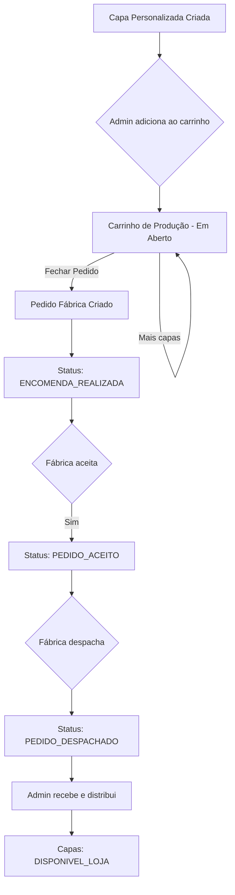
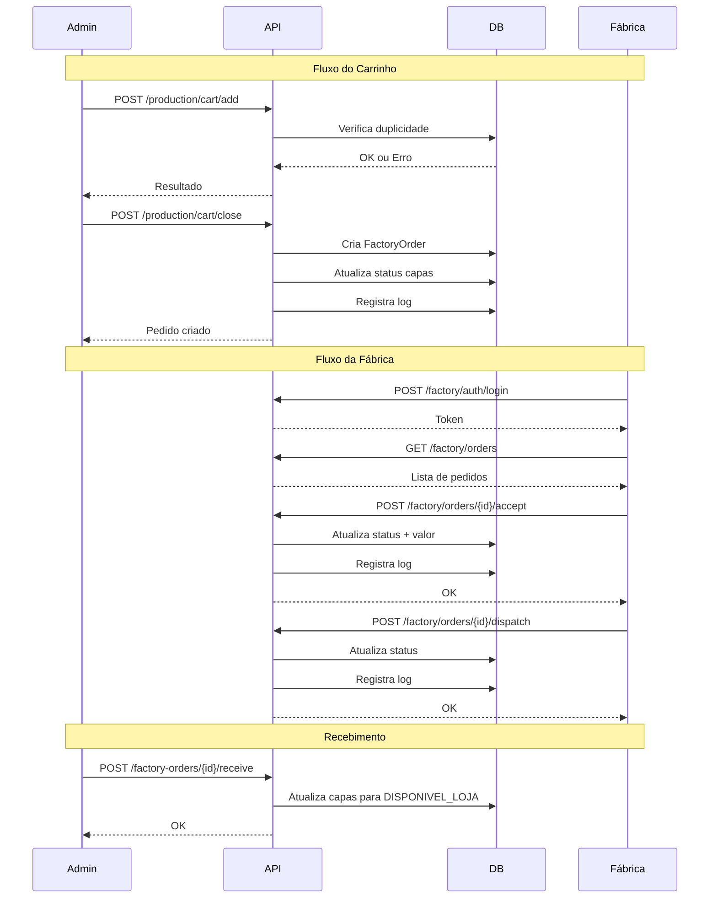

# Sistema de Pedidos para Fábrica - Proposta de Implementação

Este documento detalha como implementar o sistema de gerenciamento de pedidos de capinhas personalizadas para a fábrica, incluindo carrinho, status, timeline de logs e portal da fábrica.

---

## Índice

1. [Visão Geral do Fluxo](#visão-geral-do-fluxo)
2. [Novos Status Propostos](#novos-status-propostos)
3. [Modelagem de Dados](#modelagem-de-dados)
4. [Arquitetura Backend (Laravel)](#arquitetura-backend-laravel)
5. [APIs Propostas](#apis-propostas)
6. [Portal da Fábrica](#portal-da-fábrica)
7. [Timeline de Logs](#timeline-de-logs)
8. [Regras de Negócio](#regras-de-negócio)
9. [Verificações e Validações](#verificações-e-validações)
10. [Plano de Implementação](#plano-de-implementação)

---

## Visão Geral do Fluxo



---

## Novos Status Propostos

### Atualização do Enum `CapaPersonalizadaStatus`

Adicionar 3 novos status ao fluxo de fábrica:

| Valor | ENUM | Label | Cor | Descrição |
|-------|------|-------|-----|-----------|
| 7 | `ENCOMENDA_REALIZADA` | Encomenda Realizada | `orange` | Carrinho fechado e enviado para fábrica |
| 8 | `PEDIDO_ACEITO` | Pedido Aceito pela Fábrica | `teal` | Fábrica aceitou produzir |
| 9 | `PEDIDO_DESPACHADO` | Pedido Despachado | `indigo` | Fábrica enviou os produtos |

### Enum Atualizado

```php
enum CapaPersonalizadaStatus: int
{
    case ENCOMENDA_SOLICITADA = 1;
    case PRODUTO_INDISPONIVEL = 2;
    case DISPONIVEL_LOJA = 3;
    case VENDA_REALIZADA = 4;
    case CANCELADA = 5;
    case ENVIADO_PRODUCAO = 6;
    case ENCOMENDA_REALIZADA = 7;    // NOVO: Carrinho fechado
    case PEDIDO_ACEITO = 8;           // NOVO: Fábrica aceitou
    case PEDIDO_DESPACHADO = 9;       // NOVO: Fábrica despachou
}
```

> [!NOTE]
> O status `ENVIADO_PRODUCAO (6)` agora representa "No Carrinho" (antes de fechar o pedido).

---

## Modelagem de Dados

### Novas Tabelas

#### 1. `factory_orders` - Pedidos para Fábrica

```php
Schema::create('factory_orders', function (Blueprint $table) {
    $table->id();
    $table->dateTime('order_date');                   // Data do pedido
    $table->unsignedInteger('total_items');           // Total de itens
    $table->text('observation')->nullable();          // Observação geral
    $table->decimal('factory_price', 10, 2)->nullable(); // Valor definido pela fábrica
    
    // Status: 1=encomenda_realizada, 2=aceito, 3=despachado
    $table->tinyInteger('status')->default(1);
    
    // Foreign Keys
    $table->foreignId('created_by_id')->constrained('users')->cascadeOnDelete();
    $table->foreignId('accepted_by_id')->nullable()->constrained('factory_users')->nullOnDelete();
    
    $table->timestamps();
    $table->softDeletes();
    
    // Indexes
    $table->index(['status', 'created_at']);
});
```

#### 2. `factory_order_items` - Itens do Pedido

```php
Schema::create('factory_order_items', function (Blueprint $table) {
    $table->id();
    $table->foreignId('factory_order_id')->constrained('factory_orders')->cascadeOnDelete();
    $table->foreignId('capa_personalizada_id')->constrained('capas_personalizadas')->cascadeOnDelete();
    
    // Snapshot dos dados no momento do agrupamento
    $table->string('phone_brand')->nullable();
    $table->string('phone_model')->nullable();
    $table->unsignedInteger('qty')->default(1);
    $table->text('observation')->nullable();
    $table->string('photo_url')->nullable();
    
    $table->timestamps();
    
    // Unique constraint: cada capa só pode estar em 1 pedido
    $table->unique('capa_personalizada_id');
});
```

#### 3. `factory_users` - Usuários da Fábrica

```php
Schema::create('factory_users', function (Blueprint $table) {
    $table->id();
    $table->string('name');
    $table->string('email')->unique();
    $table->string('password');
    $table->string('company_name')->nullable();
    $table->string('phone')->nullable();
    $table->boolean('is_active')->default(true);
    $table->rememberToken();
    $table->timestamps();
    $table->softDeletes();
});
```

#### 4. `factory_order_logs` - Timeline de Ações

```php
Schema::create('factory_order_logs', function (Blueprint $table) {
    $table->id();
    $table->foreignId('factory_order_id')->constrained('factory_orders')->cascadeOnDelete();
    
    $table->string('action');           // 'created', 'accepted', 'dispatched', 'price_set', 'item_added', 'item_removed'
    $table->tinyInteger('old_status')->nullable();
    $table->tinyInteger('new_status')->nullable();
    $table->json('metadata')->nullable(); // Dados extras (valor, observação, etc)
    
    // Quem fez a ação (pode ser admin ou fábrica)
    $table->string('actor_type');       // 'admin' ou 'factory'
    $table->unsignedBigInteger('actor_id');
    $table->string('actor_name');
    
    $table->timestamp('created_at');
    
    // Index
    $table->index(['factory_order_id', 'created_at']);
});
```

#### 5. `production_cart` - Carrinho em Aberto (opcional - pode usar status da capa)

```php
// ALTERNATIVA: Usar apenas o status ENVIADO_PRODUCAO (6) como "no carrinho"
// Pros: Mais simples, sem tabela extra
// Contras: Menos controle sobre o carrinho

// OU criar tabela dedicada:
Schema::create('production_cart_items', function (Blueprint $table) {
    $table->id();
    $table->foreignId('capa_personalizada_id')->unique()->constrained()->cascadeOnDelete();
    $table->foreignId('added_by_id')->constrained('users')->cascadeOnDelete();
    $table->timestamp('added_at');
});
```

---

## Arquitetura Backend (Laravel)

### Novos Arquivos a Criar

```
app/
├── Enums/
│   └── FactoryOrderStatus.php          # Enum de status do pedido fábrica
├── Models/
│   ├── FactoryOrder.php                # Model do pedido
│   ├── FactoryOrderItem.php            # Model do item
│   ├── FactoryOrderLog.php             # Model do log/timeline
│   └── FactoryUser.php                 # Model do usuário da fábrica
├── Http/
│   ├── Controllers/
│   │   ├── Api/V1/
│   │   │   ├── ProductionCartController.php    # CRUD carrinho
│   │   │   └── FactoryOrderController.php      # CRUD pedidos fábrica
│   │   └── Factory/
│   │       ├── AuthController.php              # Login da fábrica
│   │       └── OrderController.php             # Visualização pela fábrica
│   ├── Requests/
│   │   ├── Factory/
│   │   │   ├── LoginRequest.php
│   │   │   ├── AcceptOrderRequest.php
│   │   │   └── DispatchOrderRequest.php
│   │   └── ProductionCart/
│   │       ├── AddToCartRequest.php
│   │       ├── RemoveFromCartRequest.php
│   │       └── CloseCartRequest.php
│   └── Resources/
│       ├── FactoryOrderResource.php
│       ├── FactoryOrderItemResource.php
│       └── FactoryOrderLogResource.php
├── Services/
│   ├── ProductionCartService.php       # Lógica do carrinho
│   └── FactoryOrderService.php         # Lógica dos pedidos
└── Guards/
    └── FactoryGuard.php                # Autenticação separada
```

### Enum `FactoryOrderStatus`

```php
<?php

declare(strict_types=1);

namespace App\Enums;

enum FactoryOrderStatus: int
{
    case ENCOMENDA_REALIZADA = 1;
    case PEDIDO_ACEITO = 2;
    case PEDIDO_DESPACHADO = 3;

    public function label(): string
    {
        return match ($this) {
            self::ENCOMENDA_REALIZADA => 'Encomenda Realizada',
            self::PEDIDO_ACEITO => 'Pedido Aceito',
            self::PEDIDO_DESPACHADO => 'Pedido Despachado',
        };
    }

    public function color(): string
    {
        return match ($this) {
            self::ENCOMENDA_REALIZADA => 'orange',
            self::PEDIDO_ACEITO => 'teal',
            self::PEDIDO_DESPACHADO => 'indigo',
        };
    }
}
```

---

## APIs Propostas

### Admin - Gerenciamento do Carrinho

#### Listar Carrinho Atual
```http
GET /api/v1/production/cart
```

**Response:**
```json
{
  "data": {
    "items": [
      {
        "id": 1,
        "capa": {
          "id": 15,
          "selected_product": "Capa iPhone 15",
          "photo_url": "...",
          "customer": { "name": "João" },
          "phone_model": "iPhone 15 Pro",
          "qty": 2,
          "obs": "Foto do cachorro"
        },
        "added_at": "2026-01-12T10:30:00Z",
        "added_by": { "id": 5, "name": "Admin" }
      }
    ],
    "total_items": 5,
    "total_qty": 12
  }
}
```

#### Adicionar ao Carrinho
```http
POST /api/v1/production/cart/add
```

**Body:**
```json
{
  "capa_ids": [15, 16, 17]
}
```

**Validações:**
- Capa deve ter status `ENCOMENDA_SOLICITADA (1)`
- Capa NÃO pode já estar no carrinho
- Capa NÃO pode já ter sido enviada para fábrica anteriormente

**Response (erro se já existe):**
```json
{
  "message": "Algumas capas não podem ser adicionadas.",
  "errors": {
    "already_in_cart": [15],
    "already_sent": [16],
    "invalid_status": [17]
  }
}
```

#### Remover do Carrinho
```http
DELETE /api/v1/production/cart/remove
```

**Body:**
```json
{
  "capa_ids": [15, 16]
}
```

#### Fechar Carrinho (Criar Pedido)
```http
POST /api/v1/production/cart/close
```

**Body:**
```json
{
  "observation": "Pedido urgente - entregar até dia 20"
}
```

**Response:**
```json
{
  "message": "Pedido criado com sucesso.",
  "data": {
    "id": 1,
    "order_date": "2026-01-12T15:00:00Z",
    "total_items": 5,
    "status": "encomenda_realizada",
    "status_label": "Encomenda Realizada"
  }
}
```

---

### Admin - Gerenciamento de Pedidos Fábrica

#### Listar Pedidos para Fábrica
```http
GET /api/v1/factory-orders
```

**Query Params:**
| Param | Tipo | Descrição |
|-------|------|-----------|
| `status` | number | 1=realizada, 2=aceito, 3=despachado |
| `initial_date` | YYYY-MM-DD | Data inicial |
| `final_date` | YYYY-MM-DD | Data final |
| `page`, `per_page` | number | Paginação |

#### Ver Detalhes do Pedido
```http
GET /api/v1/factory-orders/{id}
```

**Response:**
```json
{
  "data": {
    "id": 1,
    "order_date": "2026-01-12T15:00:00Z",
    "total_items": 5,
    "observation": "Pedido urgente",
    "factory_price": 450.00,
    "status": 2,
    "status_label": "Pedido Aceito",
    "status_color": "teal",
    "items": [
      {
        "id": 1,
        "capa_id": 15,
        "phone_brand": "Apple",
        "phone_model": "iPhone 15 Pro",
        "qty": 2,
        "observation": "Foto do cachorro",
        "photo_url": "https://..."
      }
    ],
    "timeline": [
      {
        "action": "created",
        "action_label": "Pedido Criado",
        "old_status": null,
        "new_status": 1,
        "actor": "Admin Silva",
        "actor_type": "admin",
        "created_at": "2026-01-12T15:00:00Z"
      },
      {
        "action": "accepted",
        "action_label": "Pedido Aceito pela Fábrica",
        "old_status": 1,
        "new_status": 2,
        "actor": "Fábrica ABC",
        "actor_type": "factory",
        "metadata": { "factory_price": 450.00 },
        "created_at": "2026-01-12T16:30:00Z"
      }
    ],
    "created_by": { "id": 5, "name": "Admin Silva" },
    "created_at": "2026-01-12T15:00:00Z"
  }
}
```

---

### Portal da Fábrica (Autenticação Separada)

#### Login da Fábrica
```http
POST /api/factory/auth/login
```

**Body:**
```json
{
  "email": "fabrica@exemplo.com",
  "password": "senha123"
}
```

**Response:**
```json
{
  "token": "factory_token_...",
  "user": {
    "id": 1,
    "name": "Fábrica ABC",
    "company_name": "ABC Capas LTDA",
    "email": "fabrica@exemplo.com"
  }
}
```

#### Listar Pedidos (Fábrica)
```http
GET /api/factory/orders
Authorization: Bearer {factory_token}
```

**Query Params:**
| Param | Descrição |
|-------|-----------|
| `status` | Filtro por status |
| `initial_date` | Data inicial |
| `final_date` | Data final |

#### Ver Detalhes do Pedido (Fábrica)
```http
GET /api/factory/orders/{id}
Authorization: Bearer {factory_token}
```

**Response:**
```json
{
  "data": {
    "id": 1,
    "order_date": "2026-01-12T15:00:00Z",
    "total_items": 5,
    "observation": "Pedido urgente",
    "status": 1,
    "status_label": "Encomenda Realizada",
    "items": [
      {
        "phone_brand": "Apple",
        "phone_model": "iPhone 15 Pro",
        "qty": 2,
        "observation": "Foto do cachorro",
        "photo_download_url": "https://.../download?token=..."
      }
    ],
    "can_accept": true,
    "can_dispatch": false
  }
}
```

#### Aceitar Pedido (Fábrica)
```http
POST /api/factory/orders/{id}/accept
Authorization: Bearer {factory_token}
```

**Body:**
```json
{
  "factory_price": 450.00,
  "observation": "Prazo de 5 dias úteis"
}
```

#### Despachar Pedido (Fábrica)
```http
POST /api/factory/orders/{id}/dispatch
Authorization: Bearer {factory_token}
```

**Body:**
```json
{
  "tracking_code": "BR123456789",
  "observation": "Enviado via Sedex"
}
```

#### Download da Foto
```http
GET /api/factory/orders/{order_id}/items/{item_id}/photo
Authorization: Bearer {factory_token}
```

Retorna a imagem diretamente ou redirect para URL assinada.

---

## Portal da Fábrica

### Autenticação

- **Guard separado**: `factory` usando Sanctum com abilities específicas
- **Tabela separada**: `factory_users` (não usar a tabela `users` do ERP)
- **Token com prefixo**: Tokens da fábrica começam com `factory_` para diferenciação

### Configuração Sanctum

```php
// config/auth.php
'guards' => [
    'factory' => [
        'driver' => 'sanctum',
        'provider' => 'factory_users',
    ],
],

'providers' => [
    'factory_users' => [
        'driver' => 'eloquent',
        'model' => App\Models\FactoryUser::class,
    ],
],
```

### Rotas

```php
// routes/api_v1.php

// Factory public routes
Route::prefix('factory')->name('factory.')->group(function () {
    Route::post('/auth/login', [Factory\AuthController::class, 'login'])->name('login');
});

// Factory protected routes
Route::prefix('factory')->middleware('auth:factory')->name('factory.')->group(function () {
    Route::post('/auth/logout', [Factory\AuthController::class, 'logout'])->name('logout');
    Route::get('/me', [Factory\AuthController::class, 'me'])->name('me');
    
    Route::prefix('orders')->name('orders.')->group(function () {
        Route::get('/', [Factory\OrderController::class, 'index'])->name('index');
        Route::get('/{order}', [Factory\OrderController::class, 'show'])->name('show');
        Route::post('/{order}/accept', [Factory\OrderController::class, 'accept'])->name('accept');
        Route::post('/{order}/dispatch', [Factory\OrderController::class, 'dispatch'])->name('dispatch');
        Route::get('/{order}/items/{item}/photo', [Factory\OrderController::class, 'downloadPhoto'])->name('photo');
    });
});
```

---

## Timeline de Logs

### Ações Registradas

| Ação | Descrição | Actor |
|------|-----------|-------|
| `cart_item_added` | Item adicionado ao carrinho | Admin |
| `cart_item_removed` | Item removido do carrinho | Admin |
| `order_created` | Carrinho fechado, pedido criado | Admin |
| `order_accepted` | Fábrica aceitou o pedido | Fábrica |
| `price_set` | Fábrica definiu o valor | Fábrica |
| `order_dispatched` | Fábrica despachou | Fábrica |
| `order_received` | Admin confirmou recebimento | Admin |
| `items_distributed` | Capas distribuídas para lojas | Admin |

### Resource de Timeline

```php
class FactoryOrderLogResource extends JsonResource
{
    public function toArray($request): array
    {
        return [
            'id' => $this->id,
            'action' => $this->action,
            'action_label' => $this->getActionLabel(),
            'action_icon' => $this->getActionIcon(),
            'old_status' => $this->old_status,
            'old_status_label' => $this->old_status ? FactoryOrderStatus::from($this->old_status)->label() : null,
            'new_status' => $this->new_status,
            'new_status_label' => $this->new_status ? FactoryOrderStatus::from($this->new_status)->label() : null,
            'metadata' => $this->metadata,
            'actor_type' => $this->actor_type,
            'actor_name' => $this->actor_name,
            'created_at' => $this->created_at->toIso8601String(),
            'created_at_human' => $this->created_at->diffForHumans(),
        ];
    }
    
    protected function getActionLabel(): string
    {
        return match ($this->action) {
            'cart_item_added' => 'Item adicionado ao carrinho',
            'cart_item_removed' => 'Item removido do carrinho',
            'order_created' => 'Pedido criado',
            'order_accepted' => 'Pedido aceito pela fábrica',
            'price_set' => 'Valor definido pela fábrica',
            'order_dispatched' => 'Pedido despachado',
            'order_received' => 'Pedido recebido',
            'items_distributed' => 'Itens distribuídos para loja',
            default => $this->action,
        };
    }
}
```

---

## Regras de Negócio

### Carrinho de Produção

1. **Adicionar ao carrinho:**
   - Apenas capas com status `ENCOMENDA_SOLICITADA (1)` podem ser adicionadas
   - Sistema verifica se capa já está em algum carrinho aberto
   - Sistema verifica se capa já foi enviada anteriormente (histórico)
   - Se capa já foi enviada, notifica admin e bloqueia

2. **Notificação de duplicidade:**
   ```php
   // No ProductionCartService
   public function addToCart(array $capaIds): array
   {
       $results = ['added' => [], 'blocked' => []];
       
       foreach ($capaIds as $id) {
           $capa = CapaPersonalizada::find($id);
           
           if ($capa->wasEverSentToFactory()) {
               $results['blocked'][] = [
                   'id' => $id,
                   'reason' => 'already_sent',
                   'sent_at' => $capa->getLastFactoryOrderDate(),
               ];
               continue;
           }
           
           if ($capa->isInOpenCart()) {
               $results['blocked'][] = [
                   'id' => $id,
                   'reason' => 'in_cart',
               ];
               continue;
           }
           
           // Adicionar...
           $results['added'][] = $id;
       }
       
       return $results;
   }
   ```

3. **Fechar carrinho:**
   - Agrupa todos os itens em um `FactoryOrder`
   - Cria snapshot dos dados (marca, modelo, foto)
   - Atualiza status das capas para `ENCOMENDA_REALIZADA (7)`
   - Registra log de criação

### Fluxo da Fábrica

1. **Aceitar pedido:**
   - Fábrica informa o valor total
   - Status muda para `PEDIDO_ACEITO (8)`
   - Registra log com valor

2. **Despachar pedido:**
   - Fábrica pode informar código de rastreio
   - Status muda para `PEDIDO_DESPACHADO (9)`
   - Registra log

### Recebimento pelo Admin

1. **Confirmar recebimento:**
   - Admin marca pedido como recebido
   - Capas mudam para status `DISPONIVEL_LOJA (3)`
   - Registra log de distribuição

---

## Verificações e Validações

### Ao Adicionar ao Carrinho

```php
class AddToCartRequest extends FormRequest
{
    public function rules(): array
    {
        return [
            'capa_ids' => ['required', 'array', 'min:1'],
            'capa_ids.*' => ['required', 'integer', 'exists:capas_personalizadas,id'],
        ];
    }
    
    public function withValidator($validator)
    {
        $validator->after(function ($validator) {
            foreach ($this->capa_ids as $id) {
                $capa = CapaPersonalizada::find($id);
                
                if ($capa->status !== CapaPersonalizadaStatus::ENCOMENDA_SOLICITADA) {
                    $validator->errors()->add(
                        "capa_ids.{$id}",
                        "Capa #{$id} não está com status 'Encomenda Solicitada'."
                    );
                }
            }
        });
    }
}
```

---

## Plano de Implementação

### Fase 1: Infraestrutura (1-2 dias)

- [ ] Migrations para novas tabelas
- [ ] Models e Enums
- [ ] Guards e configuração de auth

### Fase 2: Carrinho de Produção (2-3 dias)

- [ ] Service `ProductionCartService`
- [ ] Controller e Requests
- [ ] Validações de duplicidade
- [ ] Testes unitários

### Fase 3: Pedidos para Fábrica (2-3 dias)

- [ ] Service `FactoryOrderService`
- [ ] Controller admin
- [ ] Resources e formatação
- [ ] Timeline de logs

### Fase 4: Portal da Fábrica (2-3 dias)

- [ ] Autenticação separada
- [ ] Controller da fábrica
- [ ] Download de fotos
- [ ] Ações de aceitar/despachar

### Fase 5: Integração Frontend (3-4 dias)

- [ ] Tela do carrinho
- [ ] Tela de pedidos fábrica
- [ ] Portal da fábrica (frontend separado?)
- [ ] Timeline visual

### Fase 6: Testes e Ajustes (2 dias)

- [ ] Testes de integração
- [ ] Testes manuais
- [ ] Ajustes finais

---

## Diagrama de Sequência



---

## Considerações Finais

### Alternativas de Implementação

1. **Carrinho como tabela vs status:**
   - **Tabela separada**: Mais controle, queries mais simples
   - **Usar status existente**: Menos código, mas menos flexível

2. **Portal da fábrica:**
   - **Mesmo frontend**: Adicionar rota protegida
   - **Frontend separado**: Mais isolamento, deploy independente

3. **Autenticação da fábrica:**
   - **Guard separado**: Recomendado - isolamento total
   - **Usar users existente**: Mais simples, menos seguro

### Próximos Passos

1. Validar este design com a equipe
2. Definir prioridades (MVP vs completo)
3. Iniciar implementação das migrations
4. Criar testes antes do código (TDD)

> [!IMPORTANT]
> **Questões para Definir:**
> 1. O portal da fábrica será um frontend separado ou parte do ERP?
> 2. Quantos usuários de fábrica teremos? (impacta na gestão)
> 3. Precisamos de notificações (email/push) quando pedido é criado/aceito?
> 4. O valor da fábrica é por item ou por pedido?
