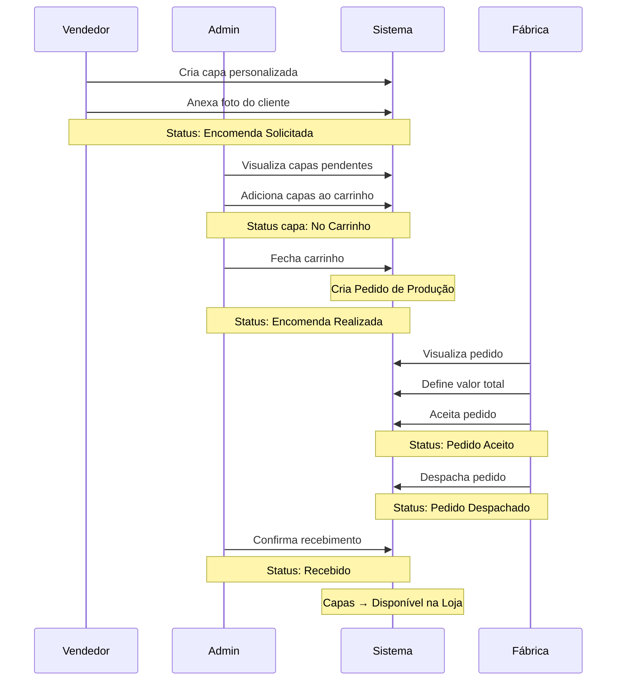

# Sistema de Produção para Fábrica - Guia Completo Frontend

> **Versão**: 1.0  
> **Data**: 2026-01-12  
> **Autor**: Backend Team

Este documento fornece uma visão completa para o time de frontend sobre a feature de Sistema de Produção, incluindo descrição da feature, design de telas, lógica de consumo, schemas detalhados e diretrizes de UX/UI.

---

## Índice

1. [Descrição da Feature](#descrição-da-feature)
2. [Fluxo do Usuário](#fluxo-do-usuário)
3. [Arquitetura de Telas](#arquitetura-de-telas)
4. [Telas do Administrativo](#telas-do-administrativo)
5. [Tela do Fabricante](#tela-do-fabricante)
6. [Componentes Reutilizáveis](#componentes-reutilizáveis)
7. [API - Schemas Detalhados](#api---schemas-detalhados)
8. [Hooks e State Management](#hooks-e-state-management)
9. [Diretrizes de UX/UI](#diretrizes-de-uxui)
10. [Tratamento de Erros](#tratamento-de-erros)

---

## Descrição da Feature

### O que é?
O Sistema de Produção permite que o **administrador** agrupe pedidos de capas personalizadas em um "carrinho de produção" e envie para a **fábrica** produzir. A fábrica, através de um portal dedicado, pode aceitar os pedidos, definir o valor total e despachar.

### Problema que resolve
- **Antes**: Pedidos de capas personalizadas eram enviados manualmente para a fábrica (WhatsApp, email)
- **Depois**: Fluxo automatizado com rastreabilidade, timeline de eventos e portal dedicado

### Atores
| Ator | Ações |
|------|-------|
| **Vendedor** | Cria capas personalizadas com foto do cliente |
| **Admin** | Agrupa capas no carrinho, fecha pedido, recebe da fábrica |
| **Fábrica** | Visualiza pedidos, aceita, define valor, despacha |

---

## Fluxo do Usuário

### Fluxo Principal



### Estados do Pedido

```
┌──────────────────┐      ┌───────────────────┐      ┌──────────────┐
│ CARRINHO_ABERTO  │ ──▶  │ ENCOMENDA_REALIZADA│ ──▶  │ PEDIDO_ACEITO│
│   (Admin)        │      │    (Admin)         │      │   (Fábrica)  │
└──────────────────┘      └───────────────────┘      └──────────────┘
                                                            │
                          ┌──────────────┐      ┌───────────▼──────┐
                          │   RECEBIDO   │ ◀──  │ PEDIDO_DESPACHADO│
                          │   (Admin)    │      │    (Fábrica)     │
                          └──────────────┘      └──────────────────┘
```

---

## Arquitetura de Telas

### Estrutura de Rotas

```
/producao
├── /carrinho          → Carrinho de produção (Admin)
├── /pedidos           → Lista de pedidos (Admin)
└── /pedidos/:id       → Detalhe do pedido (Admin)

/fabrica
├── /pedidos           → Lista de pedidos (Fábrica)
└── /pedidos/:id       → Detalhe do pedido (Fábrica)
```

### Estrutura de Arquivos

```
src/
├── pages/
│   ├── producao/
│   │   ├── ProducaoCarrinho.tsx
│   │   ├── ProducaoPedidos.tsx
│   │   └── ProducaoPedidoDetail.tsx
│   └── fabrica/
│       ├── FabricaPedidos.tsx
│       └── FabricaPedidoDetail.tsx
├── components/
│   └── producao/
│       ├── CartItemCard.tsx
│       ├── CartSummary.tsx
│       ├── PedidoTimeline.tsx
│       ├── PedidoStatusBadge.tsx
│       ├── PedidoItemList.tsx
│       └── AddToCartButton.tsx
├── hooks/
│   ├── use-producao-carrinho.ts
│   ├── use-producao-pedidos.ts
│   └── use-fabrica-pedidos.ts
├── services/
│   └── producao.service.ts
└── types/
    └── producao.types.ts
```

---

## Telas do Administrativo

### 1. Lista de Capas Personalizadas (Atualização)

> **Rota**: `/capas-personalizadas`  
> **Alteração**: Adicionar botão para enviar ao carrinho

#### Layout

```
┌─────────────────────────────────────────────────────────────────────────┐
│ Capas Personalizadas                                    [+ Nova Capa]   │
├─────────────────────────────────────────────────────────────────────────┤
│ [Filtros: Status ▼] [Loja ▼] [Data ▼] [Buscar...]                      │
├─────────────────────────────────────────────────────────────────────────┤
│ ☑ Selecionar todos                    [🛒 Adicionar ao Carrinho (3)]   │
├─────────────────────────────────────────────────────────────────────────┤
│ │ ☑ │ #15 │ 📷 │ iPhone 15 Pro │ João Silva │ Encomenda Solicitada    │ │
│ │ ☑ │ #16 │ 📷 │ Galaxy S24    │ Maria L.   │ Encomenda Solicitada    │ │
│ │ ☐ │ #17 │ 📷 │ iPhone 14     │ Pedro C.   │ Encomendado à Fábrica ⚠│ │
│ │ ☑ │ #18 │ 📷 │ Motorola Edge │ Ana P.     │ Encomenda Solicitada    │ │
└─────────────────────────────────────────────────────────────────────────┘
```

#### Comportamento

1. **Checkbox de seleção**: Apenas capas com status `ENCOMENDA_SOLICITADA` (1) podem ser selecionadas
2. **Botão "Adicionar ao Carrinho"**: Aparece quando há ao menos 1 item selecionado
3. **Ícone de aviso** (⚠): Mostrar em capas que já estão no carrinho ou já foram enviadas
4. **Feedback**: Mostrar toast com resultado (X adicionados, Y bloqueados)

#### UX

- Desabilitar checkbox se status != `ENCOMENDA_SOLICITADA`
- Desabilitar checkbox se não tiver foto
- Tooltip explicando por que está desabilitado
- Após adicionar, atualizar lista (status muda para `NO_CARRINHO`)

---

### 2. Carrinho de Produção

> **Rota**: `/producao/carrinho`  
> **Permissão**: Admin/Super Admin

#### Layout

```
┌─────────────────────────────────────────────────────────────────────────┐
│ 🛒 Carrinho de Produção                                                 │
├─────────────────────────────────────────────────────────────────────────┤
│                                                                         │
│  ┌──────────────────────────────────────────────────────────────────┐  │
│  │ Item 1                                                    [🗑️]    │  │
│  │ ┌────────┐                                                        │  │
│  │ │  📷    │  Capa Personalizada iPhone 15 Pro                     │  │
│  │ │  foto  │  Cliente: João Silva                                  │  │
│  │ │        │  Qtd: 2                                               │  │
│  │ └────────┘  Obs: Foto do cachorro centralizada                   │  │
│  └──────────────────────────────────────────────────────────────────┘  │
│                                                                         │
│  ┌──────────────────────────────────────────────────────────────────┐  │
│  │ Item 2                                                    [🗑️]    │  │
│  │ ┌────────┐                                                        │  │
│  │ │  📷    │  Capa Personalizada Galaxy S24                        │  │
│  │ │  foto  │  Cliente: Maria Lima                                  │  │
│  │ │        │  Qtd: 1                                               │  │
│  │ └────────┘  Obs: -                                               │  │
│  └──────────────────────────────────────────────────────────────────┘  │
│                                                                         │
├─────────────────────────────────────────────────────────────────────────┤
│                                           Total de Itens: 2             │
│                                           Total de Capas: 3             │
│                                                                         │
│  Observação para a fábrica:                                             │
│  ┌──────────────────────────────────────────────────────────────────┐  │
│  │ Pedido urgente - entregar até dia 20                             │  │
│  └──────────────────────────────────────────────────────────────────┘  │
│                                                                         │
│  [Cancelar Carrinho]                          [Fechar e Enviar 📤]     │
└─────────────────────────────────────────────────────────────────────────┘
```

#### Comportamento

1. **Carrinho Vazio**: Mostrar estado vazio com call-to-action para adicionar capas
2. **Remover Item**: Confirmar antes de remover, atualizar lista
3. **Observação**: Campo opcional, máximo 2000 caracteres
4. **Fechar e Enviar**: 
   - Confirmar ação em modal
   - Criar pedido de produção
   - Redirecionar para detalhe do pedido

#### Skeleton

```tsx
// Estado vazio
<div className="text-center py-12">
  <ShoppingCart className="w-16 h-16 mx-auto text-muted-foreground" />
  <h3 className="mt-4 text-lg font-medium">Carrinho vazio</h3>
  <p className="text-muted-foreground">
    Adicione capas personalizadas ao carrinho para enviar à fábrica.
  </p>
  <Button asChild className="mt-4">
    <Link to="/capas-personalizadas">Ver Capas Pendentes</Link>
  </Button>
</div>
```

---

### 3. Lista de Pedidos de Produção

> **Rota**: `/producao/pedidos`  
> **Permissão**: Admin/Super Admin

#### Layout

```
┌─────────────────────────────────────────────────────────────────────────┐
│ Pedidos de Produção                                                     │
├─────────────────────────────────────────────────────────────────────────┤
│ [Status ▼] [Data Início 📅] [Data Fim 📅]                              │
├─────────────────────────────────────────────────────────────────────────┤
│ ┌─────────────────────────────────────────────────────────────────────┐ │
│ │ #1001                                                               │ │
│ │ ┌──────────────────┐  12 itens • 18 capas                          │ │
│ │ │ PEDIDO ACEITO    │  Criado: 12/01/2026 15:30                     │ │
│ │ │      🟢          │  Aceito: 12/01/2026 17:00                     │ │
│ │ └──────────────────┘  Valor: R$ 450,00                             │ │
│ │                                                            [Ver →] │ │
│ └─────────────────────────────────────────────────────────────────────┘ │
│                                                                         │
│ ┌─────────────────────────────────────────────────────────────────────┐ │
│ │ #1002                                                               │ │
│ │ ┌──────────────────┐  5 itens • 7 capas                            │ │
│ │ │ ENCOMENDA        │  Criado: 12/01/2026 10:00                     │ │
│ │ │ REALIZADA 🟠     │  Aguardando fábrica...                        │ │
│ │ └──────────────────┘                                               │ │
│ │                                                            [Ver →] │ │
│ └─────────────────────────────────────────────────────────────────────┘ │
├─────────────────────────────────────────────────────────────────────────┤
│                              [1] [2] [3] ... [10]                       │
└─────────────────────────────────────────────────────────────────────────┘
```

#### Filtros

| Filtro | Tipo | Descrição |
|--------|------|-----------|
| `status` | Select | 1-6 (todos os status) |
| `initial_date` | Date | Data de criação inicial |
| `final_date` | Date | Data de criação final |

---

### 4. Detalhe do Pedido (Admin)

> **Rota**: `/producao/pedidos/:id`  
> **Permissão**: Admin/Super Admin

#### Layout

```
┌─────────────────────────────────────────────────────────────────────────┐
│ ← Voltar                               Pedido #1001                     │
├─────────────────────────────────────────────────────────────────────────┤
│                                                                         │
│  ┌─────────────────────────────────────────────────────────────────┐   │
│  │ Status: PEDIDO ACEITO                              [Cancelar ❌] │   │
│  │                                                                  │   │
│  │ ┌──────────────┐ ┌──────────────┐ ┌──────────────┐              │   │
│  │ │ Total Itens  │ │ Total Capas  │ │ Valor Fábrica│              │   │
│  │ │     12       │ │      18      │ │  R$ 450,00   │              │   │
│  │ └──────────────┘ └──────────────┘ └──────────────┘              │   │
│  │                                                                  │   │
│  │ Observação: Pedido urgente - entregar até dia 20                │   │
│  │ Notas da Fábrica: Prazo de 5 dias úteis                         │   │
│  └─────────────────────────────────────────────────────────────────┘   │
│                                                                         │
│  ┌───────────────────────────────────┬─────────────────────────────┐   │
│  │ Itens do Pedido                   │ Timeline                    │   │
│  ├───────────────────────────────────┼─────────────────────────────┤   │
│  │ ┌────────┐ iPhone 15 Pro          │ ● Pedido Aceito            │   │
│  │ │  📷    │ João Silva             │   Fábrica ABC              │   │
│  │ │        │ Qtd: 2                 │   12/01 17:00              │   │
│  │ └────────┘ [Ver foto]             │                            │   │
│  │                                   │ ● Carrinho Fechado         │   │
│  │ ┌────────┐ Galaxy S24             │   Admin Silva              │   │
│  │ │  📷    │ Maria Lima             │   12/01 15:30              │   │
│  │ │        │ Qtd: 1                 │                            │   │
│  │ └────────┘ [Ver foto]             │ ● Item Adicionado          │   │
│  │                                   │   Admin Silva              │   │
│  │ ... mais 10 itens                 │   12/01 15:25              │   │
│  └───────────────────────────────────┴─────────────────────────────┘   │
│                                                                         │
│  ┌─────────────────────────────────────────────────────────────────┐   │
│  │ Ações:                                                          │   │
│  │                                                                  │   │
│  │ [Cancelar Pedido]              [Marcar como Recebido ✅]        │   │
│  │ (apenas se status < despachado) (apenas se status = despachado) │   │
│  └─────────────────────────────────────────────────────────────────┘   │
└─────────────────────────────────────────────────────────────────────────┘
```

#### Ações Condicionais

| Status | Ações Disponíveis |
|--------|-------------------|
| `CARRINHO_ABERTO` | (não deveria aparecer aqui) |
| `ENCOMENDA_REALIZADA` | Cancelar |
| `PEDIDO_ACEITO` | Cancelar |
| `PEDIDO_DESPACHADO` | Marcar como Recebido |
| `RECEBIDO` | Nenhuma |
| `CANCELADO` | Nenhuma |

---

## Tela do Fabricante

> **Importante**: O fabricante acessa com login separado (role: `fabrica`)

### 5. Lista de Pedidos (Fábrica)

> **Rota**: `/fabrica/pedidos`  
> **Permissão**: Role `fabrica`

#### Layout

```
┌─────────────────────────────────────────────────────────────────────────┐
│ 🏭 Portal da Fábrica                                    [Logout 🚪]    │
├─────────────────────────────────────────────────────────────────────────┤
│                                                                         │
│ Pedidos                                                                 │
│ [Status ▼] [Data ▼]                                                    │
│                                                                         │
├─────────────────────────────────────────────────────────────────────────┤
│ ┌─────────────────────────────────────────────────────────────────────┐ │
│ │ NOVO PEDIDO! 🔔                                                     │ │
│ │ Pedido #1002                                                        │ │
│ │ ┌──────────────────┐  5 itens • 7 capas                            │ │
│ │ │ ENCOMENDA        │  Data: 12/01/2026 10:00                       │ │
│ │ │ REALIZADA 🟠     │                                               │ │
│ │ └──────────────────┘                                               │ │
│ │                                           [Ver Detalhes e Aceitar] │ │
│ └─────────────────────────────────────────────────────────────────────┘ │
│                                                                         │
│ ┌─────────────────────────────────────────────────────────────────────┐ │
│ │ Pedido #1001                                                        │ │
│ │ ┌──────────────────┐  12 itens • 18 capas                          │ │
│ │ │ PEDIDO ACEITO    │  Data: 12/01/2026 15:30                       │ │
│ │ │      🟢          │  Valor: R$ 450,00                             │ │
│ │ └──────────────────┘                                               │ │
│ │                                              [Ver Detalhes]        │ │
│ └─────────────────────────────────────────────────────────────────────┘ │
└─────────────────────────────────────────────────────────────────────────┘
```

#### UX

- Destacar pedidos novos (`ENCOMENDA_REALIZADA`) com badge "NOVO!"
- Ordenar por status (novos primeiro) e depois por data
- Mostrar claramente o que precisa de ação

---

### 6. Detalhe do Pedido (Fábrica)

> **Rota**: `/fabrica/pedidos/:id`  
> **Permissão**: Role `fabrica`

#### Layout - Estado: ENCOMENDA_REALIZADA (Aguardando aceite)

```
┌─────────────────────────────────────────────────────────────────────────┐
│ ← Voltar                               Pedido #1002                     │
├─────────────────────────────────────────────────────────────────────────┤
│                                                                         │
│  ┌─────────────────────────────────────────────────────────────────┐   │
│  │ ⏳ AGUARDANDO ACEITE                                            │   │
│  │                                                                  │   │
│  │ Data do Pedido: 12/01/2026 10:00                                │   │
│  │ Total de Itens: 5                                               │   │
│  │ Total de Capas: 7                                               │   │
│  │                                                                  │   │
│  │ Observação do Cliente:                                          │   │
│  │ "Pedido urgente - entregar até dia 20"                          │   │
│  └─────────────────────────────────────────────────────────────────┘   │
│                                                                         │
│  Itens do Pedido                                                        │
│  ┌─────────────────────────────────────────────────────────────────┐   │
│  │ # │ Modelo          │ Qtd │ Observação              │ Foto      │   │
│  ├───┼─────────────────┼─────┼─────────────────────────┼───────────┤   │
│  │ 1 │ iPhone 15 Pro   │  2  │ Foto do cachorro        │ [📥 Baixar]│   │
│  │ 2 │ Galaxy S24      │  1  │ -                       │ [📥 Baixar]│   │
│  │ 3 │ iPhone 14       │  1  │ Centralizar logo        │ [📥 Baixar]│   │
│  │ 4 │ Motorola Edge   │  2  │ -                       │ [📥 Baixar]│   │
│  │ 5 │ Xiaomi 13       │  1  │ Foto família            │ [📥 Baixar]│   │
│  └─────────────────────────────────────────────────────────────────┘   │
│                                                                         │
│  ┌─────────────────────────────────────────────────────────────────┐   │
│  │ Aceitar Pedido                                                   │   │
│  │                                                                  │   │
│  │ Valor Total do Pedido: *                                        │   │
│  │ ┌──────────────────────────────────────────────┐                │   │
│  │ │ R$ 350,00                                    │                │   │
│  │ └──────────────────────────────────────────────┘                │   │
│  │                                                                  │   │
│  │ Observação (opcional):                                          │   │
│  │ ┌──────────────────────────────────────────────────────────────┐│   │
│  │ │ Prazo de entrega: 5 dias úteis                               ││   │
│  │ └──────────────────────────────────────────────────────────────┘│   │
│  │                                                                  │   │
│  │                                    [Aceitar Pedido ✅]          │   │
│  └─────────────────────────────────────────────────────────────────┘   │
└─────────────────────────────────────────────────────────────────────────┘
```

#### Layout - Estado: PEDIDO_ACEITO (Aguardando despacho)

```
┌─────────────────────────────────────────────────────────────────────────┐
│ ← Voltar                               Pedido #1001                     │
├─────────────────────────────────────────────────────────────────────────┤
│                                                                         │
│  ┌─────────────────────────────────────────────────────────────────┐   │
│  │ ✅ PEDIDO ACEITO                                                 │   │
│  │                                                                  │   │
│  │ Data do Pedido: 12/01/2026 15:30                                │   │
│  │ Data do Aceite: 12/01/2026 17:00                                │   │
│  │ Valor Definido: R$ 450,00                                       │   │
│  │ Total de Capas: 18                                              │   │
│  └─────────────────────────────────────────────────────────────────┘   │
│                                                                         │
│  [Lista de Itens...]                                                    │
│                                                                         │
│  ┌─────────────────────────────────────────────────────────────────┐   │
│  │ Despachar Pedido                                                 │   │
│  │                                                                  │   │
│  │ Código de Rastreio (opcional):                                  │   │
│  │ ┌──────────────────────────────────────────────┐                │   │
│  │ │ BR123456789                                  │                │   │
│  │ └──────────────────────────────────────────────┘                │   │
│  │                                                                  │   │
│  │ Observação (opcional):                                          │   │
│  │ ┌──────────────────────────────────────────────────────────────┐│   │
│  │ │ Enviado via Sedex                                            ││   │
│  │ └──────────────────────────────────────────────────────────────┘│   │
│  │                                                                  │   │
│  │                                    [Despachar Pedido 🚚]        │   │
│  └─────────────────────────────────────────────────────────────────┘   │
└─────────────────────────────────────────────────────────────────────────┘
```

#### Layout - Estado: PEDIDO_DESPACHADO

```
┌─────────────────────────────────────────────────────────────────────────┐
│  ┌─────────────────────────────────────────────────────────────────┐   │
│  │ 🚚 PEDIDO DESPACHADO                                             │   │
│  │                                                                  │   │
│  │ Data do Despacho: 13/01/2026 09:00                              │   │
│  │ Código de Rastreio: BR123456789                                 │   │
│  │ Valor: R$ 450,00                                                │   │
│  │                                                                  │   │
│  │ ⏳ Aguardando confirmação de recebimento pelo cliente...        │   │
│  └─────────────────────────────────────────────────────────────────┘   │
└─────────────────────────────────────────────────────────────────────────┘
```

---

## Componentes Reutilizáveis

### PedidoStatusBadge

```tsx
interface PedidoStatusBadgeProps {
  status: number;
  label: string;
  color: string;
}

const colorMap = {
  slate: 'bg-slate-100 text-slate-800',
  orange: 'bg-orange-100 text-orange-800',
  teal: 'bg-teal-100 text-teal-800',
  indigo: 'bg-indigo-100 text-indigo-800',
  green: 'bg-green-100 text-green-800',
  red: 'bg-red-100 text-red-800',
};

export function PedidoStatusBadge({ status, label, color }: PedidoStatusBadgeProps) {
  return (
    <span className={`px-3 py-1 rounded-full text-sm font-medium ${colorMap[color]}`}>
      {label}
    </span>
  );
}
```

### PedidoTimeline

```tsx
interface TimelineEvent {
  id: number;
  action_label: string;
  action_icon: string;
  actor_name: string;
  actor_type: 'admin' | 'fabrica' | 'vendedor';
  created_at: string;
  created_at_human: string;
  metadata?: Record<string, unknown>;
}

export function PedidoTimeline({ events }: { events: TimelineEvent[] }) {
  return (
    <div className="space-y-4">
      {events.map((event, index) => (
        <div key={event.id} className="flex gap-4">
          <div className="flex flex-col items-center">
            <div className="w-8 h-8 rounded-full bg-primary flex items-center justify-center">
              <Icon name={event.action_icon} className="w-4 h-4 text-white" />
            </div>
            {index < events.length - 1 && (
              <div className="w-0.5 h-full bg-border mt-2" />
            )}
          </div>
          <div className="flex-1 pb-4">
            <p className="font-medium">{event.action_label}</p>
            <p className="text-sm text-muted-foreground">
              {event.actor_name} • {event.created_at_human}
            </p>
            {event.metadata?.factory_total && (
              <p className="text-sm">
                Valor: {formatCurrency(event.metadata.factory_total)}
              </p>
            )}
          </div>
        </div>
      ))}
    </div>
  );
}
```

### AddToCartButton

```tsx
export function AddToCartButton({ 
  selectedIds, 
  onSuccess 
}: { 
  selectedIds: number[];
  onSuccess: () => void;
}) {
  const addToCart = useAddToCart();

  const handleClick = async () => {
    const result = await addToCart.mutateAsync(selectedIds);
    
    if (result.data.added_count > 0) {
      toast.success(`${result.data.added_count} item(ns) adicionado(s)`);
    }
    
    if (result.data.blocked_count > 0) {
      result.data.blocked.forEach(item => {
        toast.warning(`Capa #${item.id}: ${item.message}`);
      });
    }
    
    onSuccess();
  };

  return (
    <Button 
      onClick={handleClick} 
      disabled={selectedIds.length === 0 || addToCart.isPending}
    >
      <ShoppingCart className="w-4 h-4 mr-2" />
      Adicionar ao Carrinho ({selectedIds.length})
    </Button>
  );
}
```

---

## API - Schemas Detalhados

### GET `/api/v1/producao/carrinho`

**Response (200):**
```json
{
  "data": {
    "id": 1,
    "status": 1,
    "status_label": "Carrinho Aberto",
    "status_color": "slate",
    "status_icon": "shopping-cart",
    "total_itens": 2,
    "total_qtd": 3,
    "factory_total": null,
    "factory_notes": null,
    "observation": null,
    "created_at": "2026-01-12T10:00:00Z",
    "closed_at": null,
    "accepted_at": null,
    "dispatched_at": null,
    "received_at": null,
    "created_by": {
      "id": 5,
      "name": "Admin Silva"
    },
    "items": [
      {
        "id": 1,
        "capa_id": 15,
        "phone_brand": "Apple",
        "phone_model": "iPhone 15 Pro",
        "qty": 2,
        "observation": "Foto do cachorro centralizada",
        "photo_url": "https://api.example.com/storage/capas/abc123.jpg",
        "customer": {
          "id": 10,
          "name": "João Silva"
        },
        "selected_product": "Capa Personalizada iPhone 15",
        "added_at": "2026-01-12T10:30:00Z"
      }
    ],
    "can_accept": false,
    "can_dispatch": false,
    "can_receive": false,
    "can_cancel": true,
    "is_carrinho_aberto": true
  }
}
```

---

### POST `/api/v1/producao/carrinho/itens`

**Request:**
```json
{
  "capa_ids": [15, 16, 17]
}
```

**Response (200) - Sucesso parcial:**
```json
{
  "message": "2 item(ns) adicionado(s), 1 bloqueado(s)",
  "data": {
    "added": [15, 16],
    "blocked": [
      {
        "id": 17,
        "reason": "NO_PHOTO",
        "message": "Capa não possui foto"
      }
    ],
    "added_count": 2,
    "blocked_count": 1
  }
}
```

**Response (409) - Todos bloqueados:**
```json
{
  "message": "0 item(ns) adicionado(s), 3 bloqueado(s)",
  "data": {
    "added": [],
    "blocked": [
      { "id": 15, "reason": "ALREADY_IN_CART", "message": "Capa já está no carrinho" },
      { "id": 16, "reason": "ALREADY_SENT", "message": "Capa já foi enviada para fábrica" },
      { "id": 17, "reason": "INVALID_STATUS", "message": "Status deve ser \"Encomenda Solicitada\"" }
    ],
    "added_count": 0,
    "blocked_count": 3
  }
}
```

---

### POST `/api/v1/producao/carrinho/fechar`

**Request:**
```json
{
  "observation": "Pedido urgente - entregar até dia 20"
}
```

**Response (201):**
```json
{
  "message": "Pedido de produção criado com sucesso.",
  "data": {
    "id": 1001,
    "status": 2,
    "status_label": "Encomenda Realizada",
    "total_itens": 2,
    "total_qtd": 3,
    "closed_at": "2026-01-12T15:30:00Z",
    "items": [...],
    "timeline": [...]
  }
}
```

**Response (422) - Carrinho vazio:**
```json
{
  "message": "The given data was invalid.",
  "errors": {
    "carrinho": ["Carrinho está vazio."]
  }
}
```

---

### GET `/api/v1/producao/pedidos`

**Query Params:**
| Param | Tipo | Descrição |
|-------|------|-----------|
| `status` | int | 1-6 |
| `initial_date` | string | YYYY-MM-DD |
| `final_date` | string | YYYY-MM-DD |
| `page` | int | Página |
| `per_page` | int | Itens (max 100) |

**Response (200):**
```json
{
  "data": [
    {
      "id": 1001,
      "status": 2,
      "status_label": "Encomenda Realizada",
      "status_color": "orange",
      "total_itens": 12,
      "total_qty": 18,
      "factory_total": null,
      "created_at": "2026-01-12T15:30:00Z",
      "closed_at": "2026-01-12T15:30:00Z",
      "created_by": { "id": 5, "name": "Admin Silva" }
    }
  ],
  "links": { "first": "...", "last": "...", "prev": null, "next": "..." },
  "meta": {
    "current_page": 1,
    "from": 1,
    "last_page": 5,
    "per_page": 15,
    "to": 15,
    "total": 73
  }
}
```

---

### PATCH `/api/v1/fabrica/pedidos/{id}/aceitar`

**Request:**
```json
{
  "factory_total": 450.00,
  "factory_notes": "Prazo de 5 dias úteis"
}
```

**Response (200):**
```json
{
  "message": "Pedido aceito com sucesso.",
  "data": {
    "id": 1001,
    "status": 3,
    "status_label": "Pedido Aceito",
    "factory_total": 450.00,
    "factory_notes": "Prazo de 5 dias úteis",
    "accepted_at": "2026-01-12T17:00:00Z",
    "timeline": [
      {
        "id": 5,
        "action": "pedido_aceito",
        "action_label": "Pedido Aceito pela Fábrica",
        "metadata": { "factory_total": 450.00 },
        "actor_name": "Fábrica ABC",
        "created_at": "2026-01-12T17:00:00Z"
      }
    ]
  }
}
```

---

### PATCH `/api/v1/fabrica/pedidos/{id}/despachar`

**Request:**
```json
{
  "tracking_code": "BR123456789",
  "factory_notes": "Enviado via Sedex"
}
```

**Response (200):**
```json
{
  "message": "Pedido despachado com sucesso.",
  "data": {
    "id": 1001,
    "status": 4,
    "status_label": "Pedido Despachado",
    "dispatched_at": "2026-01-13T09:00:00Z"
  }
}
```

---

## Hooks e State Management

### producao.service.ts

```typescript
import { api } from '@/lib/axios';
import { ProducaoPedido } from '@/types/producao.types';

export const producaoService = {
  // Carrinho
  getCarrinho: () => 
    api.get<{ data: ProducaoPedido }>('/producao/carrinho'),

  addToCart: (capaIds: number[]) =>
    api.post('/producao/carrinho/itens', { capa_ids: capaIds }),

  removeFromCart: (itemId: number) =>
    api.delete(`/producao/carrinho/itens/${itemId}`),

  closeCart: (observation?: string) =>
    api.post('/producao/carrinho/fechar', { observation }),

  cancelCart: () =>
    api.delete('/producao/carrinho'),

  // Pedidos
  getPedidos: (params: Record<string, any>) =>
    api.get('/producao/pedidos', { params }),

  getPedidoById: (id: number) =>
    api.get<{ data: ProducaoPedido }>(`/producao/pedidos/${id}`),

  receivePedido: (id: number, observation?: string) =>
    api.patch(`/producao/pedidos/${id}/receber`, { observation }),

  cancelPedido: (id: number, reason?: string) =>
    api.delete(`/producao/pedidos/${id}`, { data: { reason } }),
};

export const fabricaService = {
  getPedidos: (params: Record<string, any>) =>
    api.get('/fabrica/pedidos', { params }),

  getPedidoById: (id: number) =>
    api.get<{ data: ProducaoPedido }>(`/fabrica/pedidos/${id}`),

  acceptPedido: (id: number, factoryTotal: number, notes?: string) =>
    api.patch(`/fabrica/pedidos/${id}/aceitar`, { 
      factory_total: factoryTotal, 
      factory_notes: notes 
    }),

  dispatchPedido: (id: number, trackingCode?: string, notes?: string) =>
    api.patch(`/fabrica/pedidos/${id}/despachar`, { 
      tracking_code: trackingCode, 
      factory_notes: notes 
    }),
};
```

### use-producao-carrinho.ts

```typescript
import { useQuery, useMutation, useQueryClient } from '@tanstack/react-query';
import { producaoService } from '@/services/producao.service';

export function useCarrinho() {
  return useQuery({
    queryKey: ['producao', 'carrinho'],
    queryFn: () => producaoService.getCarrinho().then(r => r.data.data),
  });
}

export function useAddToCart() {
  const queryClient = useQueryClient();

  return useMutation({
    mutationFn: producaoService.addToCart,
    onSuccess: () => {
      queryClient.invalidateQueries({ queryKey: ['producao', 'carrinho'] });
      queryClient.invalidateQueries({ queryKey: ['capas-personalizadas'] });
    },
  });
}

export function useRemoveFromCart() {
  const queryClient = useQueryClient();

  return useMutation({
    mutationFn: producaoService.removeFromCart,
    onSuccess: () => {
      queryClient.invalidateQueries({ queryKey: ['producao', 'carrinho'] });
    },
  });
}

export function useCloseCart() {
  const queryClient = useQueryClient();

  return useMutation({
    mutationFn: producaoService.closeCart,
    onSuccess: () => {
      queryClient.invalidateQueries({ queryKey: ['producao'] });
    },
  });
}
```

---

## Diretrizes de UX/UI

### Cores dos Status

| Status | Cor Tailwind | Uso |
|--------|--------------|-----|
| Carrinho Aberto | `slate` | Badge, ícone |
| Encomenda Realizada | `orange` | Badge, destaque "novo" |
| Pedido Aceito | `teal` | Badge, confirmação |
| Pedido Despachado | `indigo` | Badge, em trânsito |
| Recebido | `green` | Badge, sucesso |
| Cancelado | `red` | Badge, erro |

### Feedback ao Usuário

1. **Toast de Sucesso**: Ações completadas
2. **Toast de Warning**: Itens bloqueados (parcial)
3. **Toast de Error**: Falha na operação
4. **Modal de Confirmação**: Ações destrutivas (cancelar, fechar carrinho)

### Loading States

```tsx
// Skeleton para lista de pedidos
<div className="space-y-4">
  {[1, 2, 3].map(i => (
    <div key={i} className="p-4 border rounded-lg animate-pulse">
      <div className="h-4 bg-muted rounded w-1/4 mb-2" />
      <div className="h-3 bg-muted rounded w-1/2" />
    </div>
  ))}
</div>
```

### Responsividade

- **Desktop**: Layout em 2 colunas (itens + timeline)
- **Tablet**: Tabs para alternar entre itens e timeline
- **Mobile**: Stack vertical, timeline collapsível

---

## Tratamento de Erros

### Códigos HTTP

| Código | Tratamento |
|--------|------------|
| `200/201` | Sucesso, atualizar UI |
| `400` | Toast erro genérico |
| `401` | Redirecionar para login |
| `403` | Toast "Sem permissão" |
| `404` | Redirecionar para lista |
| `409` | Mostrar itens bloqueados |
| `422` | Mostrar erros por campo |
| `500` | Toast "Erro interno" |

### Exemplo de Tratamento

```typescript
try {
  const result = await addToCart.mutateAsync(selectedIds);
  // ... tratar sucesso
} catch (error) {
  if (error.response?.status === 409) {
    // Conflito - alguns itens bloqueados
    const blocked = error.response.data.data.blocked;
    blocked.forEach(item => {
      toast.warning(`Capa #${item.id}: ${item.message}`);
    });
  } else if (error.response?.status === 422) {
    // Validação
    const errors = error.response.data.errors;
    Object.values(errors).flat().forEach(msg => toast.error(msg));
  } else {
    toast.error('Erro ao adicionar ao carrinho');
  }
}
```

---

## Checklist de Implementação Frontend

- [ ] Tipos TypeScript (`producao.types.ts`)
- [ ] Service de API (`producao.service.ts`)
- [ ] Hooks React Query
- [ ] Componentes reutilizáveis
- [ ] Página: Carrinho de Produção
- [ ] Página: Lista de Pedidos (Admin)
- [ ] Página: Detalhe do Pedido (Admin)
- [ ] Página: Lista de Pedidos (Fábrica)
- [ ] Página: Detalhe do Pedido (Fábrica)
- [ ] Botão "Adicionar ao Carrinho" na lista de capas
- [ ] Tratamento de erros
- [ ] Loading states
- [ ] Empty states
- [ ] Responsividade
- [ ] Testes E2E
