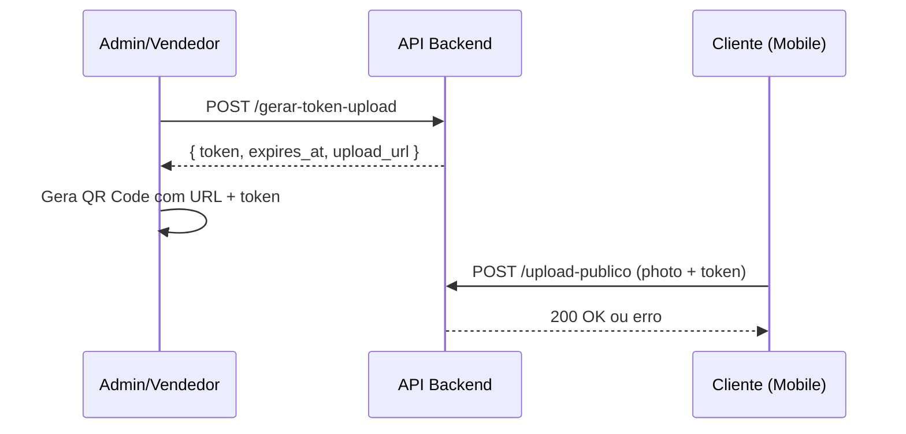

# API de Upload Público de Fotos - Capas Personalizadas

Documentação para integração frontend do sistema de upload de fotos via QR code.

---

## Fluxo de Uso



---

## Endpoints

### 1. Gerar Token de Upload (Autenticado)

Gera um token temporário de 5 minutos para permitir upload público.

```
POST /api/v1/capas-personalizadas/{id}/gerar-token-upload
```

#### Headers
```http
Authorization: Bearer {jwt_token}
Accept: application/json
```

#### Response 200 - Sucesso
```json
{
    "message": "Token gerado com sucesso.",
    "data": {
        "token": "zN8kL2xM9pQ4wR7vT5bY1cD3eF6gH0jK8mN2pQ4rT6vX8yZ0aB2cD4eF6gH8jK",
        "expires_at": "2026-01-12T17:15:00-03:00",
        "upload_url": "https://api.maiscapinhas.com.br/api/v1/capas-personalizadas/123/upload-publico"
    }
}
```

#### Response 403 - Sem permissão
```json
{
    "message": "Você não tem permissão para acessar esta capa personalizada."
}
```

#### Response 404 - Capa não encontrada
```json
{
    "message": "Capa personalizada não encontrada."
}
```

---

### 2. Upload Público (Sem autenticação)

Endpoint público para o cliente enviar a foto. **NÃO requer autenticação**.

```
POST /api/v1/capas-personalizadas/{id}/upload-publico
```

#### Headers
```http
Content-Type: multipart/form-data
```

#### Body (form-data)

| Campo | Tipo | Obrigatório | Descrição |
|-------|------|-------------|-----------|
| `photo` | file | ✅ Sim | Imagem (jpg, jpeg, png, webp). Máx 10MB |
| `token` | string | ✅ Sim | Token gerado pelo endpoint anterior |

#### Response 200 - Upload realizado
```json
{
    "message": "Foto enviada com sucesso.",
    "data": {
        "photo_path": "capas-personalizadas/abc123xyz.jpg",
        "photo_url": "https://api.maiscapinhas.com.br/storage/capas-personalizadas/abc123xyz.jpg",
        "size": 1048576,
        "mime": "image/jpeg"
    }
}
```

#### Response 401 - Token inválido/expirado
```json
{
    "message": "Token inválido ou expirado."
}
```

#### Response 404 - Capa não encontrada
```json
{
    "message": "Capa personalizada não encontrada."
}
```

#### Response 409 - Já possui foto
```json
{
    "message": "Esta capa já possui uma foto."
}
```

#### Response 422 - Validação falhou
```json
{
    "message": "The photo field is required.",
    "errors": {
        "photo": ["A foto é obrigatória."],
        "token": ["O token é obrigatório."]
    }
}
```

---

## Exemplo de Implementação Frontend

### Página de Upload (`/upload/{id}`)

```tsx
// pages/upload/[id].tsx
import { useState } from 'react';
import { useParams, useSearchParams } from 'next/navigation';

export default function UploadPage() {
    const params = useParams();
    const searchParams = useSearchParams();
    
    const capaId = params.id;
    const token = searchParams.get('token');
    
    const [file, setFile] = useState<File | null>(null);
    const [loading, setLoading] = useState(false);
    const [success, setSuccess] = useState(false);
    const [error, setError] = useState<string | null>(null);

    async function handleUpload() {
        if (!file || !token) return;
        
        setLoading(true);
        setError(null);
        
        const formData = new FormData();
        formData.append('photo', file);
        formData.append('token', token);
        
        try {
            const response = await fetch(
                `${process.env.NEXT_PUBLIC_API_URL}/api/v1/capas-personalizadas/${capaId}/upload-publico`,
                { method: 'POST', body: formData }
            );
            
            const data = await response.json();
            
            if (!response.ok) {
                throw new Error(data.message || 'Erro ao enviar foto');
            }
            
            setSuccess(true);
        } catch (err) {
            setError(err instanceof Error ? err.message : 'Erro desconhecido');
        } finally {
            setLoading(false);
        }
    }

    if (!token) {
        return <div>Link inválido. Token não encontrado.</div>;
    }

    if (success) {
        return <div>✅ Foto enviada com sucesso! Você pode fechar esta página.</div>;
    }

    return (
        <div>
            <h1>Enviar Foto</h1>
            <input 
                type="file" 
                accept="image/jpeg,image/png,image/webp"
                onChange={(e) => setFile(e.target.files?.[0] || null)}
            />
            {error && <p style={{ color: 'red' }}>{error}</p>}
            <button onClick={handleUpload} disabled={!file || loading}>
                {loading ? 'Enviando...' : 'Enviar Foto'}
            </button>
        </div>
    );
}
```

### Gerando QR Code (Admin)

```tsx
// components/QRCodeUpload.tsx
import QRCode from 'qrcode.react';

interface Props {
    capaId: number;
    token: string;
    expiresAt: string;
}

export function QRCodeUpload({ capaId, token, expiresAt }: Props) {
    const uploadUrl = `https://app.maiscapinhas.com.br/upload/${capaId}?token=${token}`;
    
    return (
        <div>
            <QRCode value={uploadUrl} size={200} />
            <p>Escaneie para enviar a foto</p>
            <p className="text-sm text-gray-500">
                Expira em: {new Date(expiresAt).toLocaleTimeString()}
            </p>
        </div>
    );
}
```

---

## TypeScript Types

```typescript
// types/capas.ts

interface GerarTokenResponse {
    message: string;
    data: {
        token: string;
        expires_at: string;  // ISO 8601
        upload_url: string;
    };
}

interface UploadPublicoResponse {
    message: string;
    data: {
        photo_path: string;
        photo_url: string;
        size: number;
        mime: string;
    };
}

interface ErrorResponse {
    message: string;
    errors?: Record<string, string[]>;
}
```

---

## Considerações

| Item | Valor |
|------|-------|
| Token expira em | 5 minutos |
| Tamanho máximo da foto | 10MB |
| Formatos aceitos | jpg, jpeg, png, webp |
| Token uso único | ✅ Sim (limpo após upload) |

> **⚠️ Importante**: O token é invalidado após o upload bem-sucedido. Se o cliente precisar tentar novamente, um novo token deve ser gerado.
