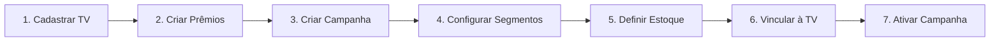

# Documentação Frontend: Módulo Admin "Roleta nas TVs" (Wheel)

> **Acesso**: Super Admin apenas  
> **Base URL**: `/api/v1/admin/wheel`  
> **Autenticação**: Bearer Token (Sanctum)  
> **Middleware**: `auth:sanctum` + `permission:wheel.admin`

---

## 📋 Índice

1. [Visão Geral](#visão-geral)
2. [Fluxo de Configuração](#fluxo-de-configuração)
3. [Telas do Módulo](#telas-do-módulo)
4. [Endpoints da API](#endpoints-da-api)
5. [TypeScript Types](#typescript-types)
6. [React Query Hooks](#react-query-hooks)
7. [Componentes Sugeridos](#componentes-sugeridos)

---

## Visão Geral

O módulo **Roleta nas TVs** permite ao Super Admin gerenciar o sistema de roleta interativa exibido nas TVs das vitrines das lojas. 

### Conceitos Principais

| Conceito | Descrição |
|----------|-----------|
| **Screen (TV)** | Dispositivo físico (TV/Totem) na vitrine que exibe a roleta |
| **Campaign (Campanha)** | Configuração da roleta com regras, datas e limites |
| **Prize (Prêmio)** | Item que pode ser ganho (produto, cupom, nada, tente novamente) |
| **Segment (Segmento)** | Fatia da roleta que aponta para um prêmio com peso de probabilidade |
| **Inventory (Estoque)** | Controle de limite de prêmios por campanha |

### Hierarquia de Dados

```
Store (Loja do ERP)
└── Screen (TV)
    └── Campaign (ativa)
        ├── Segments (configuração da roleta)
        │   └── Prize (prêmio de cada fatia)
        └── Inventory (estoque por prêmio)
```

---

## Fluxo de Configuração



### Passo a Passo

1. **Cadastrar TV** - Criar uma Screen vinculada a uma loja
2. **Criar Prêmios** - Cadastrar os prêmios disponíveis (catálogo global)
3. **Criar Campanha** - Definir nome, datas e configurações
4. **Configurar Segmentos** - Montar as fatias da roleta com pesos
5. **Definir Estoque** - Limitar quantidade de cada prêmio
6. **Vincular à TV** - Associar campanha à TV
7. **Ativar Campanha** - Tornar a campanha disponível

---

## Telas do Módulo

### Navegação

```
/admin/wheel                    # Dashboard
/admin/wheel/screens            # Lista de TVs
/admin/wheel/screens/:key       # Detalhes da TV
/admin/wheel/campaigns          # Lista de Campanhas
/admin/wheel/campaigns/:key     # Detalhes da Campanha
/admin/wheel/campaigns/:key/segments  # Editor de Roleta
/admin/wheel/prizes             # Lista de Prêmios
/admin/wheel/logs               # Logs de Eventos
```

---

### Tela A: Dashboard (`/admin/wheel`)

#### Layout
```
┌─────────────────────────────────────────────────────────────┐
│  🎯 Roleta nas TVs                                          │
├─────────────────────────────────────────────────────────────┤
│  ┌─────────┐  ┌─────────┐  ┌─────────┐  ┌─────────┐        │
│  │ TVs     │  │Campanhas│  │ Giros   │  │ Prêmios │        │
│  │ Online  │  │ Ativas  │  │  Hoje   │  │ Ganhos  │        │
│  │  3/5    │  │    2    │  │   127   │  │   45    │        │
│  └─────────┘  └─────────┘  └─────────┘  └─────────┘        │
├─────────────────────────────────────────────────────────────┤
│  TVs Recentes                              [Ver Todas →]    │
│  ┌──────────────────────────────────────────────────────┐  │
│  │ 🟢 Vitrine 01 - Tijucas    │ Campanha Verão │ Online │  │
│  │ 🔴 Vitrine 02 - Itapema    │ Sem campanha   │ Offline│  │
│  │ 🟡 Totem Entrada           │ Em Manutenção  │   -    │  │
│  └──────────────────────────────────────────────────────┘  │
└─────────────────────────────────────────────────────────────┘
```

#### Stats Cards

| Card | Endpoint | Tooltip |
|------|----------|---------|
| TVs Online | `GET /analytics/screens-online` | "Quantidade de TVs que enviaram heartbeat nos últimos 5 minutos" |
| Campanhas Ativas | `GET /analytics/active-campaigns` | "Campanhas com status 'ativa'" |
| Giros Hoje | `GET /analytics/spins-today` | "Total de giros completados hoje" |
| Prêmios Ganhos | `GET /analytics/prizes-won` | "Prêmios sorteados hoje (exceto 'nada' e 'tente novamente')" |

#### API Response

```typescript
// GET /analytics/summary
{
  "success": true,
  "data": {
    "screens": {
      "total": 5,
      "online": 3,
      "offline": 2
    },
    "campaigns": {
      "active": 2,
      "draft": 1
    },
    "today": {
      "spins": 127,
      "prizes_won": 45
    },
    "events_24h": 342
  }
}
```

---

### Tela B: Lista de TVs (`/admin/wheel/screens`)

#### Layout

```
┌─────────────────────────────────────────────────────────────┐
│  TVs / Totens                                [+ Nova TV]    │
├─────────────────────────────────────────────────────────────┤
│  Filtros: [Loja ▼] [Status ▼] [🔍 Buscar...]               │
├─────────────────────────────────────────────────────────────┤
│  ┌─────────────────────────────────────────────────────────┐│
│  │ ● STATUS │ NOME        │ LOJA     │ CAMPANHA  │ AÇÕES  ││
│  ├─────────────────────────────────────────────────────────┤│
│  │ 🟢 Online│ Vitrine 01  │ Tijucas  │ Verão 26  │ ⋮      ││
│  │ 🔴 Offline│ Vitrine 02 │ Itapema  │ -         │ ⋮      ││
│  │ 🟡 Manut.│ Totem       │ Tijucas  │ -         │ ⋮      ││
│  └─────────────────────────────────────────────────────────┘│
└─────────────────────────────────────────────────────────────┘
```

#### Filtros

| Filtro | Parâmetro | Valores |
|--------|-----------|---------|
| Loja | `store_id` | ID da loja do ERP |
| Status | `status` | `active`, `inactive`, `maintenance` |
| Busca | `search` | Nome ou screen_key |
| Online | `online_only` | `true` |
| Offline | `offline_only` | `true` |

#### Colunas da Tabela

| Coluna | Campo | Tooltip |
|--------|-------|---------|
| Status | `is_online` + `status` | 🟢 Online, 🔴 Offline, 🟡 Manutenção |
| Nome | `name` | - |
| Chave | `screen_key` | "Identificador único da TV" |
| Loja | `store.name` | - |
| Campanha Ativa | `active_campaign.name` | "Campanha atualmente vinculada" |
| Último Heartbeat | `last_seen_ago` | "Última comunicação com o servidor" |
| Ações | - | Menu dropdown |

#### Ações do Menu

| Ação | Endpoint | Confirmação |
|------|----------|-------------|
| Ver Detalhes | Navegar para `/screens/:key` | Não |
| Editar | Modal de edição | Não |
| Gerar Novo Token | `POST /screens/:key/rotate-secret` | ⚠️ Sim |
| Colocar em Manutenção | `POST /screens/:key/set-status` | Não |
| Excluir | `DELETE /screens/:key` | ⚠️ Sim |

#### Modal: Nova TV

```
┌─────────────────────────────────────────┐
│  Nova TV                           [X]  │
├─────────────────────────────────────────┤
│  Loja *                                 │
│  [Selecione a loja          ▼]          │
│                                         │
│  Nome *                                 │
│  [Vitrine 01                  ]         │
│                                         │
│  Chave (opcional)                       │
│  [screen-tijucas-001          ]         │
│  ℹ️ Gerada automaticamente se vazio     │
│                                         │
│  Status                                 │
│  ○ Ativa  ○ Inativa  ○ Manutenção      │
│                                         │
├─────────────────────────────────────────┤
│              [Cancelar] [Criar TV]      │
└─────────────────────────────────────────┘
```

> **Importante**: Ao criar uma TV, o token de autenticação é retornado **apenas uma vez**. Exibir em modal destacado para o usuário copiar.

#### Modal: Token Gerado

```
┌─────────────────────────────────────────┐
│  🔐 Token de Autenticação          [X]  │
├─────────────────────────────────────────┤
│                                         │
│  ⚠️ ATENÇÃO: Salve este token agora!   │
│  Ele não será exibido novamente.        │
│                                         │
│  ┌─────────────────────────────────────┐│
│  │ eyJ0eXAiOiJKV1QiLCJhbGciOiJIUzI1... ││
│  └─────────────────────────────────────┘│
│                     [📋 Copiar Token]   │
│                                         │
├─────────────────────────────────────────┤
│                         [Entendi]       │
└─────────────────────────────────────────┘
```

---

### Tela C: Detalhes da TV (`/admin/wheel/screens/:key`)

#### Layout

```
┌─────────────────────────────────────────────────────────────┐
│  ← Voltar    Vitrine 01 - Tijucas           [Editar] [⋮]   │
├─────────────────────────────────────────────────────────────┤
│  ┌──────────────────────┐  ┌──────────────────────────────┐│
│  │ INFORMAÇÕES          │  │ HEALTH CHECK                 ││
│  │                      │  │                              ││
│  │ Chave: screen-tij-01 │  │ Status: 🟢 Online            ││
│  │ Loja: Tijucas        │  │ Último Heartbeat: há 2 min   ││
│  │ Status: Ativa        │  │ User Agent: Chrome/TV        ││
│  │ Criada: 18/01/2026   │  │ Resolução: 1080x1920         ││
│  └──────────────────────┘  └──────────────────────────────┘│
├─────────────────────────────────────────────────────────────┤
│  CAMPANHA ATIVA                                             │
│  ┌─────────────────────────────────────────────────────────┐│
│  │ 🎯 Campanha Verão 2026                                  ││
│  │ Status: Ativa │ Período: 01/01 - 28/02                  ││
│  │                                    [Ver Campanha →]     ││
│  └─────────────────────────────────────────────────────────┘│
├─────────────────────────────────────────────────────────────┤
│  CAMPANHAS VINCULADAS                     [Gerenciar]       │
│  ┌─────────────────────────────────────────────────────────┐│
│  │ ● Verão 2026      │ Ativa   │ [Desativar]              ││
│  │ ○ Black Friday    │ Inativa │ [Ativar]                 ││
│  └─────────────────────────────────────────────────────────┘│
└─────────────────────────────────────────────────────────────┘
```

#### API: Health Check

```typescript
// GET /screens/:key/health
{
  "success": true,
  "data": {
    "screen_key": "screen-tijucas-001",
    "name": "Vitrine 01",
    "store": "Tijucas",
    "status": "active",
    "status_label": "Ativa",
    "is_online": true,
    "last_seen_at": "2026-01-18T23:10:00.000Z",
    "last_seen_ago": "há 2 minutos",
    "device_info": {
      "user_agent": "Mozilla/5.0 (SMART-TV; Linux)",
      "resolution": "1080x1920"
    },
    "active_campaign": {
      "campaign_key": "camp_2026_verao",
      "name": "Campanha Verão 2026",
      "status": "active"
    }
  }
}
```

---

### Tela D: Lista de Campanhas (`/admin/wheel/campaigns`)

#### Layout

```
┌─────────────────────────────────────────────────────────────┐
│  Campanhas                              [+ Nova Campanha]   │
├─────────────────────────────────────────────────────────────┤
│  Filtros: [Status ▼] [🔍 Buscar...]                        │
│  [Ativas] [Pausadas] [Rascunhos] [Encerradas]              │
├─────────────────────────────────────────────────────────────┤
│  ┌─────────────────────────────────────────────────────────┐│
│  │ STATUS    │ NOME           │ PERÍODO     │ TVs │ AÇÕES ││
│  ├─────────────────────────────────────────────────────────┤│
│  │ 🟢 Ativa  │ Verão 2026     │ 01/01-28/02 │  3  │  ⋮   ││
│  │ 🟡 Pausada│ Natal 2025     │ 01/12-25/12 │  2  │  ⋮   ││
│  │ ⚪ Rascunho│ Páscoa 2026   │ -           │  0  │  ⋮   ││
│  │ 🔴 Encerr.│ Black Friday   │ 20/11-30/11 │  -  │  ⋮   ││
│  └─────────────────────────────────────────────────────────┘│
└─────────────────────────────────────────────────────────────┘
```

#### Status da Campanha

| Status | Cor | Ícone | Ações Permitidas |
|--------|-----|-------|------------------|
| `draft` | Cinza | FileEdit | Editar, Ativar, Excluir |
| `active` | Verde | Play | Editar*, Pausar, Encerrar |
| `paused` | Amarelo | Pause | Editar, Ativar, Encerrar |
| `ended` | Vermelho | Square | Apenas visualizar |

> *Campanhas ativas permitem edição limitada (não pode alterar segmentos críticos)

#### Ações do Menu

| Ação | Endpoint | Visível quando |
|------|----------|----------------|
| Ver Detalhes | Navegação | Sempre |
| Configurar Roleta | Navegação | `draft`, `paused` |
| Gerenciar Estoque | Modal | Sempre |
| Ativar | `POST /:key/activate` | `draft`, `paused` |
| Pausar | `POST /:key/pause` | `active` |
| Encerrar | `POST /:key/end` | `active`, `paused` |
| Duplicar | - | Sempre |
| Excluir | `DELETE /:key` | `draft` |

#### Modal: Nova Campanha

```
┌─────────────────────────────────────────────────────────────┐
│  Nova Campanha                                         [X]  │
├─────────────────────────────────────────────────────────────┤
│  INFORMAÇÕES BÁSICAS                                        │
│                                                             │
│  Nome *                                                     │
│  [Campanha Verão 2026              ]                        │
│                                                             │
│  Chave (opcional)                                           │
│  [camp_2026_verao                  ]                        │
│  ℹ️ Identificador único, gerado automaticamente se vazio   │
│                                                             │
│  Período (opcional)                                         │
│  [01/01/2026    ] até [28/02/2026    ]                     │
│  ℹ️ Deixe vazio para campanha sem data limite              │
│                                                             │
│  Versão dos Termos                                          │
│  [2026-01                          ]                        │
│  ℹ️ Identificador para controle de aceite de termos        │
├─────────────────────────────────────────────────────────────┤
│  CONFIGURAÇÕES DA ROLETA                                    │
│                                                             │
│  Tempo do QR Code (segundos)                                │
│  [120     ] ℹ️ Quanto tempo o QR fica válido (30-600)      │
│                                                             │
│  Duração do Giro (ms)                                       │
│  [8000    ] ℹ️ Tempo da animação do giro (3000-15000)      │
│                                                             │
│  Rotações Mínimas / Máximas                                 │
│  [5       ] / [8       ]                                    │
│                                                             │
│  Tamanho Máximo da Fila                                     │
│  [10      ] ℹ️ Máximo de jogadores simultâneos             │
│                                                             │
│  Limite por Telefone                                        │
│  ○ 1 por campanha  ○ 1 por dia  ○ Ilimitado               │
├─────────────────────────────────────────────────────────────┤
│                              [Cancelar] [Criar Campanha]    │
└─────────────────────────────────────────────────────────────┘
```

---

### Tela E: Editor de Roleta (`/admin/wheel/campaigns/:key/segments`)

Esta é a tela mais importante do módulo. Permite configurar visualmente as fatias da roleta.

#### Layout

```
┌─────────────────────────────────────────────────────────────────────────┐
│  ← Voltar    Configurar Roleta: Campanha Verão 2026         [Salvar]   │
├─────────────────────────────────────────────────────────────────────────┤
│  ┌───────────────────────────────────┐  ┌─────────────────────────────┐│
│  │         PREVIEW DA ROLETA          │  │     LISTA DE SEGMENTOS     ││
│  │                                    │  │                            ││
│  │         ╭───────────────╮          │  │  ≡ 🟢 Película    │ 20% │✓││
│  │        ╱                 ╲         │  │  ≡ 🔵 Cupom 10%   │ 15% │✓││
│  │       │    [PREVIEW]      │        │  │  ≡ 🟡 Tente Nova. │ 40% │✓││
│  │       │    DA ROLETA      │        │  │  ≡ ⚪ Não foi...  │ 25% │✓││
│  │        ╲                 ╱         │  │                            ││
│  │         ╰───────────────╯          │  │  [+ Adicionar Segmento]    ││
│  │                                    │  │                            ││
│  │  Peso Total: 100                   │  │  ℹ️ Arraste para reordenar ││
│  └────────────────────────────────────┘  └─────────────────────────────┘│
├─────────────────────────────────────────────────────────────────────────┤
│  ⚠️ Campanha em rascunho. Configure os segmentos e ative quando pronto.│
└─────────────────────────────────────────────────────────────────────────┘
```

#### Componente: Segmento (Drag & Drop)

```
┌─────────────────────────────────────────────────────────────┐
│  ≡  [🔴] [Película Grátis            ] │ Peso: [20 ] │ ✓  │
│      ↑     ↑                              ↑             ↑   │
│    drag  color     label                weight      active  │
└─────────────────────────────────────────────────────────────┘
```

#### Modal: Adicionar/Editar Segmento

```
┌─────────────────────────────────────────────────────────────┐
│  Adicionar Segmento                                    [X]  │
├─────────────────────────────────────────────────────────────┤
│                                                             │
│  Texto do Segmento *                                        │
│  [Película Grátis              ]                            │
│  ℹ️ Texto exibido na fatia da roleta (máx. 50 chars)       │
│                                                             │
│  Cor *                                                      │
│  [🔴] [🟠] [🟡] [🟢] [🔵] [🟣] [⚫] [⚪] [Custom...]       │
│                                                             │
│  Prêmio Vinculado *                                         │
│  [Película Premium               ▼]                         │
│                                                             │
│  Peso da Probabilidade *                                    │
│  [20      ]                                                 │
│  ℹ️ Quanto maior o peso, maior a chance de cair nesta fatia│
│  📊 Com peso 20, representa ~20% de chance                 │
│                                                             │
│  [✓] Segmento Ativo                                        │
│                                                             │
├─────────────────────────────────────────────────────────────┤
│                              [Cancelar] [Salvar Segmento]   │
└─────────────────────────────────────────────────────────────┘
```

#### Lógica de Probabilidade

```typescript
// Cálculo de probabilidade
const totalWeight = segments.reduce((sum, s) => sum + s.probability_weight, 0);
const probability = (segment.probability_weight / totalWeight) * 100;

// Exemplo:
// Segmento A: peso 20 → 20/100 = 20%
// Segmento B: peso 15 → 15/100 = 15%
// Segmento C: peso 40 → 40/100 = 40%
// Segmento D: peso 25 → 25/100 = 25%
// Total: 100 → 100%
```

#### Validações para Ativar

A campanha só pode ser ativada se:
- [ ] Possui pelo menos 1 segmento ativo
- [ ] Todos os segmentos têm peso >= 1
- [ ] Todos os segmentos apontam para prêmios ativos

#### API: Salvar Segmentos (Batch)

```typescript
// PUT /campaigns/:key/segments
{
  "segments": [
    {
      "id": 1,                    // null para novo
      "label": "Película Grátis",
      "color": "#EF4444",
      "prize_id": 1,
      "probability_weight": 20,
      "active": true
    },
    {
      "id": 2,
      "label": "Cupom 10%",
      "color": "#3B82F6",
      "prize_id": 2,
      "probability_weight": 15,
      "active": true
    }
    // ... ordem define sort_order
  ]
}
```

---

### Tela F: Lista de Prêmios (`/admin/wheel/prizes`)

#### Layout

```
┌─────────────────────────────────────────────────────────────┐
│  Prêmios                                   [+ Novo Prêmio]  │
├─────────────────────────────────────────────────────────────┤
│  Filtros: [Tipo ▼] [Status ▼] [🔍 Buscar...]               │
├─────────────────────────────────────────────────────────────┤
│  ┌─────────────────────────────────────────────────────────┐│
│  │ TIPO    │ NOME              │ USO   │ STATUS │ AÇÕES   ││
│  ├─────────────────────────────────────────────────────────┤│
│  │ 🎁      │ Película Premium  │ 3 seg │ Ativo  │ ⋮       ││
│  │ 🎟️      │ Cupom 10% OFF     │ 2 seg │ Ativo  │ ⋮       ││
│  │ 🔄      │ Tente Novamente   │ 4 seg │ Ativo  │ ⋮       ││
│  │ 😢      │ Não foi dessa vez │ 2 seg │ Ativo  │ ⋮       ││
│  └─────────────────────────────────────────────────────────┘│
└─────────────────────────────────────────────────────────────┘
```

#### Tipos de Prêmio

| Tipo | Ícone | Descrição | Requer Resgate |
|------|-------|-----------|----------------|
| `product` | 🎁 | Produto físico | Sim |
| `coupon` | 🎟️ | Cupom de desconto | Sim |
| `nothing` | 😢 | Não ganhou nada | Não |
| `try_again` | 🔄 | Tente novamente | Não |

#### Modal: Novo Prêmio

```
┌─────────────────────────────────────────────────────────────┐
│  Novo Prêmio                                           [X]  │
├─────────────────────────────────────────────────────────────┤
│                                                             │
│  Nome *                                                     │
│  [Película Premium              ]                           │
│                                                             │
│  Tipo *                                                     │
│  ○ 🎁 Produto  ○ 🎟️ Cupom  ○ 😢 Nada  ○ 🔄 Tente Novamente │
│                                                             │
│  Ícone (emoji ou slug)                                      │
│  [🎁                            ]                           │
│                                                             │
│  Descrição                                                  │
│  [Película de vidro premium ... ]                           │
│                                                             │
│  Instruções de Resgate                                      │
│  [Apresente este código no caixa para retirar seu prêmio.] │
│  ℹ️ Exibido ao vencedor após o giro                        │
│                                                             │
│  Prefixo do Código                                          │
│  [MC-                           ]                           │
│  ℹ️ Ex: MC-A1B2C3 (gerado automaticamente)                 │
│                                                             │
│  [✓] Prêmio Ativo                                          │
│                                                             │
├─────────────────────────────────────────────────────────────┤
│                              [Cancelar] [Criar Prêmio]      │
└─────────────────────────────────────────────────────────────┘
```

---

### Tela G: Gerenciar Estoque (`/admin/wheel/campaigns/:key/inventory`)

Pode ser um modal ou página separada.

#### Layout

```
┌─────────────────────────────────────────────────────────────┐
│  Estoque: Campanha Verão 2026                          [X]  │
├─────────────────────────────────────────────────────────────┤
│  ┌─────────────────────────────────────────────────────────┐│
│  │ PRÊMIO       │ TOTAL   │ RESTANTE │ DIÁRIO │ AÇÕES     ││
│  ├─────────────────────────────────────────────────────────┤│
│  │ Película     │ 100     │ 75 (75%) │ 10/dia │ [+] [↻]   ││
│  │ Cupom 10%    │ 50      │ 32 (64%) │ 5/dia  │ [+] [↻]   ││
│  │ Tente Novam. │ ∞       │ ∞        │ ∞      │ -         ││
│  │ Não foi...   │ ∞       │ ∞        │ ∞      │ -         ││
│  └─────────────────────────────────────────────────────────┘│
├─────────────────────────────────────────────────────────────┤
│  ℹ️ Prêmios sem estoque são ignorados no sorteio.          │
│                                              [Salvar]       │
└─────────────────────────────────────────────────────────────┘
```

#### Campos Editáveis

| Campo | Descrição | Tooltip |
|-------|-----------|---------|
| `total_limit` | Limite total | "Quantidade máxima de prêmios. Deixe vazio para ilimitado." |
| `remaining` | Restante | "Quantidade ainda disponível." |
| `daily_limit` | Limite diário | "Máximo por dia. Reseta à meia-noite." |
| `daily_remaining` | Restante hoje | "Quantidade ainda disponível hoje." |

#### Ações

| Ação | Endpoint | Descrição |
|------|----------|-----------|
| [+] | `POST /:key/inventory/:prize/add` | Adicionar unidades ao estoque |
| [↻] | `POST /:key/inventory/:prize/reset-daily` | Resetar limite diário agora |

---

### Tela H: Logs de Eventos (`/admin/wheel/logs`)

#### Layout

```
┌─────────────────────────────────────────────────────────────┐
│  Logs de Eventos                                            │
├─────────────────────────────────────────────────────────────┤
│  Filtros: [TV ▼] [Campanha ▼] [Tipo ▼] [Período: ▼]        │
├─────────────────────────────────────────────────────────────┤
│  ┌─────────────────────────────────────────────────────────┐│
│  │ DATA/HORA     │ TIPO              │ TV      │ DETALHES ││
│  ├─────────────────────────────────────────────────────────┤│
│  │ 23:15:02      │ prize_won         │ Tijucas │ [Ver]    ││
│  │ 23:14:58      │ spin_completed    │ Tijucas │ [Ver]    ││
│  │ 23:14:50      │ spin_started      │ Tijucas │ [Ver]    ││
│  │ 23:10:00      │ screen_connected  │ Itapema │ [Ver]    ││
│  │ 23:00:00      │ campaign_activated│ -       │ [Ver]    ││
│  └─────────────────────────────────────────────────────────┘│
│                                          [← Anterior] [Próx →]│
└─────────────────────────────────────────────────────────────┘
```

#### Tipos de Evento

| Tipo | Descrição |
|------|-----------|
| `screen_connected` | TV conectou ao servidor |
| `screen_disconnected` | TV desconectou |
| `campaign_activated` | Campanha foi ativada |
| `campaign_paused` | Campanha foi pausada |
| `campaign_ended` | Campanha foi encerrada |
| `spin_started` | Giro iniciado |
| `spin_completed` | Giro completado |
| `prize_won` | Prêmio ganho |
| `inventory_depleted` | Estoque esgotado |
| `config_changed` | Configuração alterada |

---

## Endpoints da API

### Screens

| Método | Endpoint | Descrição |
|--------|----------|-----------|
| GET | `/screens` | Listar TVs |
| POST | `/screens` | Criar TV |
| GET | `/screens/:key` | Detalhes da TV |
| PUT | `/screens/:key` | Atualizar TV |
| DELETE | `/screens/:key` | Excluir TV |
| POST | `/screens/:key/rotate-secret` | Gerar novo token |
| POST | `/screens/:key/set-status` | Alterar status |
| GET | `/screens/:key/health` | Health check |
| GET | `/screens/:key/campaigns` | Campanhas vinculadas |
| PUT | `/screens/:key/campaigns` | Sync campanhas |
| POST | `/screens/:key/campaigns/:campaign/activate` | Ativar campanha na TV |

### Campaigns

| Método | Endpoint | Descrição |
|--------|----------|-----------|
| GET | `/campaigns` | Listar campanhas |
| POST | `/campaigns` | Criar campanha |
| GET | `/campaigns/:key` | Detalhes da campanha |
| PUT | `/campaigns/:key` | Atualizar campanha |
| DELETE | `/campaigns/:key` | Excluir campanha |
| POST | `/campaigns/:key/activate` | Ativar campanha |
| POST | `/campaigns/:key/pause` | Pausar campanha |
| POST | `/campaigns/:key/end` | Encerrar campanha |

### Segments

| Método | Endpoint | Descrição |
|--------|----------|-----------|
| GET | `/campaigns/:key/segments` | Listar segmentos |
| PUT | `/campaigns/:key/segments` | Salvar todos (batch) |
| POST | `/campaigns/:key/segments` | Criar segmento |
| DELETE | `/campaigns/:key/segments/:seg` | Excluir segmento |

### Prizes

| Método | Endpoint | Descrição |
|--------|----------|-----------|
| GET | `/prizes` | Listar prêmios |
| POST | `/prizes` | Criar prêmio |
| GET | `/prizes/:key` | Detalhes do prêmio |
| PUT | `/prizes/:key` | Atualizar prêmio |
| DELETE | `/prizes/:key` | Excluir prêmio |
| POST | `/prizes/:key/toggle` | Ativar/Desativar |

### Inventory

| Método | Endpoint | Descrição |
|--------|----------|-----------|
| GET | `/campaigns/:key/inventory` | Listar estoque |
| PUT | `/campaigns/:key/inventory` | Atualizar batch |
| POST | `/campaigns/:key/inventory/:prize/add` | Adicionar estoque |
| POST | `/campaigns/:key/inventory/:prize/reset-daily` | Reset diário |

### Logs & Analytics

| Método | Endpoint | Descrição |
|--------|----------|-----------|
| GET | `/logs/events` | Listar eventos |
| GET | `/analytics/summary` | Dashboard summary |
| GET | `/analytics/screens-online` | TVs online |
| GET | `/analytics/active-campaigns` | Campanhas ativas |
| GET | `/analytics/spins-today` | Giros hoje |
| GET | `/analytics/prizes-won` | Prêmios ganhos |

---

## TypeScript Types

```typescript
// ============================================
// Enums
// ============================================

export type ScreenStatus = 'active' | 'inactive' | 'maintenance';
export type CampaignStatus = 'draft' | 'active' | 'paused' | 'ended';
export type PrizeType = 'product' | 'coupon' | 'nothing' | 'try_again';

// ============================================
// Screen
// ============================================

export interface WheelScreen {
  id: number;
  screen_key: string;
  name: string;
  status: ScreenStatus;
  status_label: string;
  status_color: string;
  store: {
    id: number;
    name: string;
    city: string;
  } | null;
  store_id: number;
  device_info: Record<string, unknown> | null;
  is_online: boolean;
  last_seen_at: string | null;
  last_seen_ago: string | null;
  active_campaign: {
    id: number;
    campaign_key: string;
    name: string;
    status: CampaignStatus;
  } | null;
  created_at: string;
  updated_at: string;
}

export interface CreateScreenPayload {
  store_id: number;
  name: string;
  screen_key?: string;
  status?: ScreenStatus;
}

export interface UpdateScreenPayload {
  store_id?: number;
  name?: string;
  status?: ScreenStatus;
}

// ============================================
// Campaign
// ============================================

export interface CampaignSettings {
  qr_ttl_seconds: number;
  spin_duration_ms: number;
  min_rotations: number;
  max_rotations: number;
  max_queue_size: number;
  per_phone_limit: '1_per_campaign' | '1_per_day' | 'unlimited';
}

export interface WheelCampaign {
  id: number;
  campaign_key: string;
  name: string;
  status: CampaignStatus;
  status_label: string;
  status_color: string;
  status_icon: string;
  can_activate: boolean;
  can_pause: boolean;
  can_end: boolean;
  starts_at: string | null;
  ends_at: string | null;
  is_within_period: boolean;
  terms_version: string | null;
  settings: CampaignSettings;
  screens_count?: number;
  active_segments_count?: number;
  total_weight?: number;
  segments?: WheelSegment[];
  inventory?: WheelInventory[];
  created_at: string;
  updated_at: string;
}

export interface CreateCampaignPayload {
  name: string;
  campaign_key?: string;
  starts_at?: string;
  ends_at?: string;
  terms_version?: string;
  settings?: Partial<CampaignSettings>;
}

// ============================================
// Prize
// ============================================

export interface WheelPrize {
  id: number;
  prize_key: string;
  name: string;
  type: PrizeType;
  type_label: string;
  type_icon: string;
  type_color: string;
  icon: string | null;
  description: string | null;
  redeem_instructions: string | null;
  code_prefix: string | null;
  requires_redeem: boolean;
  consumes_inventory: boolean;
  active: boolean;
  segments_count?: number;
  created_at: string;
  updated_at: string;
}

export interface CreatePrizePayload {
  name: string;
  type: PrizeType;
  prize_key?: string;
  icon?: string;
  description?: string;
  redeem_instructions?: string;
  code_prefix?: string;
  active?: boolean;
}

// ============================================
// Segment
// ============================================

export interface WheelSegment {
  id: number;
  segment_key: string;
  label: string;
  color: string;
  prize_id: number;
  prize: {
    id: number;
    prize_key: string;
    name: string;
    type: PrizeType;
    icon: string;
    active: boolean;
  } | null;
  probability_weight: number;
  probability_percentage: number;
  sort_order: number;
  active: boolean;
  created_at: string;
  updated_at: string;
}

export interface SegmentInput {
  id?: number;
  segment_key?: string;
  label: string;
  color: string;
  prize_id: number;
  probability_weight: number;
  active?: boolean;
}

// ============================================
// Inventory
// ============================================

export interface WheelInventory {
  id: number;
  campaign_id: number;
  prize_id: number;
  prize: {
    id: number;
    prize_key: string;
    name: string;
    type: PrizeType;
    icon: string;
  } | null;
  total_limit: number | null;
  remaining: number | null;
  remaining_percentage: number | null;
  daily_limit: number | null;
  daily_remaining: number | null;
  reset_daily_at: string | null;
  has_stock: boolean;
  needs_daily_reset: boolean;
  created_at: string;
  updated_at: string;
}

export interface InventoryInput {
  prize_id: number;
  total_limit?: number | null;
  remaining?: number | null;
  daily_limit?: number | null;
  daily_remaining?: number | null;
}

// ============================================
// Event
// ============================================

export interface WheelEvent {
  id: number;
  event_id: string;
  type: string;
  screen: {
    screen_key: string;
    name: string;
  } | null;
  campaign: {
    campaign_key: string;
    name: string;
  } | null;
  payload: Record<string, unknown>;
  created_at: string;
  created_at_human: string;
}

// ============================================
// Analytics
// ============================================

export interface WheelAnalyticsSummary {
  screens: {
    total: number;
    online: number;
    offline: number;
  };
  campaigns: {
    active: number;
    draft: number;
  };
  today: {
    spins: number;
    prizes_won: number;
  };
  events_24h: number;
}

export interface StatCardData {
  value: number;
  label: string;
  total?: number;
  breakdown?: Record<string, number>;
}
```

---

## React Query Hooks

```typescript
// hooks/use-wheel.ts

import { useQuery, useMutation, useQueryClient } from '@tanstack/react-query';
import { wheelService } from '@/services/wheel.service';

// ============================================
// Query Keys
// ============================================

export const wheelKeys = {
  all: ['wheel'] as const,
  
  // Screens
  screens: () => [...wheelKeys.all, 'screens'] as const,
  screenList: (filters?: ScreenFilters) => [...wheelKeys.screens(), 'list', filters] as const,
  screenDetail: (key: string) => [...wheelKeys.screens(), 'detail', key] as const,
  screenHealth: (key: string) => [...wheelKeys.screens(), 'health', key] as const,
  screenCampaigns: (key: string) => [...wheelKeys.screens(), 'campaigns', key] as const,
  
  // Campaigns
  campaigns: () => [...wheelKeys.all, 'campaigns'] as const,
  campaignList: (filters?: CampaignFilters) => [...wheelKeys.campaigns(), 'list', filters] as const,
  campaignDetail: (key: string) => [...wheelKeys.campaigns(), 'detail', key] as const,
  
  // Segments
  segments: (campaignKey: string) => [...wheelKeys.campaigns(), campaignKey, 'segments'] as const,
  
  // Prizes
  prizes: () => [...wheelKeys.all, 'prizes'] as const,
  prizeList: (filters?: PrizeFilters) => [...wheelKeys.prizes(), 'list', filters] as const,
  prizeDetail: (key: string) => [...wheelKeys.prizes(), 'detail', key] as const,
  
  // Inventory
  inventory: (campaignKey: string) => [...wheelKeys.campaigns(), campaignKey, 'inventory'] as const,
  
  // Logs & Analytics
  events: (filters?: EventFilters) => [...wheelKeys.all, 'events', filters] as const,
  analytics: () => [...wheelKeys.all, 'analytics'] as const,
  analyticsSummary: () => [...wheelKeys.analytics(), 'summary'] as const,
};

// ============================================
// Screens Hooks
// ============================================

export function useWheelScreens(filters?: ScreenFilters) {
  return useQuery({
    queryKey: wheelKeys.screenList(filters),
    queryFn: () => wheelService.getScreens(filters),
  });
}

export function useWheelScreen(screenKey: string) {
  return useQuery({
    queryKey: wheelKeys.screenDetail(screenKey),
    queryFn: () => wheelService.getScreen(screenKey),
    enabled: !!screenKey,
  });
}

export function useWheelScreenHealth(screenKey: string) {
  return useQuery({
    queryKey: wheelKeys.screenHealth(screenKey),
    queryFn: () => wheelService.getScreenHealth(screenKey),
    enabled: !!screenKey,
    refetchInterval: 30000, // Atualizar a cada 30s
  });
}

export function useCreateScreen() {
  const queryClient = useQueryClient();
  
  return useMutation({
    mutationFn: wheelService.createScreen,
    onSuccess: () => {
      queryClient.invalidateQueries({ queryKey: wheelKeys.screens() });
    },
  });
}

export function useUpdateScreen() {
  const queryClient = useQueryClient();
  
  return useMutation({
    mutationFn: ({ key, data }: { key: string; data: UpdateScreenPayload }) =>
      wheelService.updateScreen(key, data),
    onSuccess: (_, { key }) => {
      queryClient.invalidateQueries({ queryKey: wheelKeys.screenDetail(key) });
      queryClient.invalidateQueries({ queryKey: wheelKeys.screens() });
    },
  });
}

export function useRotateScreenSecret() {
  return useMutation({
    mutationFn: wheelService.rotateScreenSecret,
  });
}

export function useSetScreenStatus() {
  const queryClient = useQueryClient();
  
  return useMutation({
    mutationFn: ({ key, status }: { key: string; status: ScreenStatus }) =>
      wheelService.setScreenStatus(key, status),
    onSuccess: (_, { key }) => {
      queryClient.invalidateQueries({ queryKey: wheelKeys.screenDetail(key) });
      queryClient.invalidateQueries({ queryKey: wheelKeys.screens() });
    },
  });
}

// ============================================
// Campaigns Hooks
// ============================================

export function useWheelCampaigns(filters?: CampaignFilters) {
  return useQuery({
    queryKey: wheelKeys.campaignList(filters),
    queryFn: () => wheelService.getCampaigns(filters),
  });
}

export function useWheelCampaign(campaignKey: string) {
  return useQuery({
    queryKey: wheelKeys.campaignDetail(campaignKey),
    queryFn: () => wheelService.getCampaign(campaignKey),
    enabled: !!campaignKey,
  });
}

export function useCreateCampaign() {
  const queryClient = useQueryClient();
  
  return useMutation({
    mutationFn: wheelService.createCampaign,
    onSuccess: () => {
      queryClient.invalidateQueries({ queryKey: wheelKeys.campaigns() });
    },
  });
}

export function useActivateCampaign() {
  const queryClient = useQueryClient();
  
  return useMutation({
    mutationFn: wheelService.activateCampaign,
    onSuccess: (_, key) => {
      queryClient.invalidateQueries({ queryKey: wheelKeys.campaignDetail(key) });
      queryClient.invalidateQueries({ queryKey: wheelKeys.campaigns() });
    },
  });
}

export function usePauseCampaign() {
  const queryClient = useQueryClient();
  
  return useMutation({
    mutationFn: wheelService.pauseCampaign,
    onSuccess: (_, key) => {
      queryClient.invalidateQueries({ queryKey: wheelKeys.campaignDetail(key) });
      queryClient.invalidateQueries({ queryKey: wheelKeys.campaigns() });
    },
  });
}

export function useEndCampaign() {
  const queryClient = useQueryClient();
  
  return useMutation({
    mutationFn: wheelService.endCampaign,
    onSuccess: (_, key) => {
      queryClient.invalidateQueries({ queryKey: wheelKeys.campaignDetail(key) });
      queryClient.invalidateQueries({ queryKey: wheelKeys.campaigns() });
    },
  });
}

// ============================================
// Segments Hooks
// ============================================

export function useWheelSegments(campaignKey: string) {
  return useQuery({
    queryKey: wheelKeys.segments(campaignKey),
    queryFn: () => wheelService.getSegments(campaignKey),
    enabled: !!campaignKey,
  });
}

export function useSyncSegments() {
  const queryClient = useQueryClient();
  
  return useMutation({
    mutationFn: ({ campaignKey, segments }: { campaignKey: string; segments: SegmentInput[] }) =>
      wheelService.syncSegments(campaignKey, segments),
    onSuccess: (_, { campaignKey }) => {
      queryClient.invalidateQueries({ queryKey: wheelKeys.segments(campaignKey) });
      queryClient.invalidateQueries({ queryKey: wheelKeys.campaignDetail(campaignKey) });
    },
  });
}

// ============================================
// Prizes Hooks
// ============================================

export function useWheelPrizes(filters?: PrizeFilters) {
  return useQuery({
    queryKey: wheelKeys.prizeList(filters),
    queryFn: () => wheelService.getPrizes(filters),
  });
}

export function useCreatePrize() {
  const queryClient = useQueryClient();
  
  return useMutation({
    mutationFn: wheelService.createPrize,
    onSuccess: () => {
      queryClient.invalidateQueries({ queryKey: wheelKeys.prizes() });
    },
  });
}

export function useTogglePrize() {
  const queryClient = useQueryClient();
  
  return useMutation({
    mutationFn: wheelService.togglePrize,
    onSuccess: () => {
      queryClient.invalidateQueries({ queryKey: wheelKeys.prizes() });
    },
  });
}

// ============================================
// Inventory Hooks
// ============================================

export function useWheelInventory(campaignKey: string) {
  return useQuery({
    queryKey: wheelKeys.inventory(campaignKey),
    queryFn: () => wheelService.getInventory(campaignKey),
    enabled: !!campaignKey,
  });
}

export function useSyncInventory() {
  const queryClient = useQueryClient();
  
  return useMutation({
    mutationFn: ({ campaignKey, inventory }: { campaignKey: string; inventory: InventoryInput[] }) =>
      wheelService.syncInventory(campaignKey, inventory),
    onSuccess: (_, { campaignKey }) => {
      queryClient.invalidateQueries({ queryKey: wheelKeys.inventory(campaignKey) });
    },
  });
}

export function useAddStock() {
  const queryClient = useQueryClient();
  
  return useMutation({
    mutationFn: ({ campaignKey, prizeKey, quantity }: { campaignKey: string; prizeKey: string; quantity: number }) =>
      wheelService.addStock(campaignKey, prizeKey, quantity),
    onSuccess: (_, { campaignKey }) => {
      queryClient.invalidateQueries({ queryKey: wheelKeys.inventory(campaignKey) });
    },
  });
}

export function useResetDailyInventory() {
  const queryClient = useQueryClient();
  
  return useMutation({
    mutationFn: ({ campaignKey, prizeKey }: { campaignKey: string; prizeKey: string }) =>
      wheelService.resetDailyInventory(campaignKey, prizeKey),
    onSuccess: (_, { campaignKey }) => {
      queryClient.invalidateQueries({ queryKey: wheelKeys.inventory(campaignKey) });
    },
  });
}

// ============================================
// Analytics Hooks
// ============================================

export function useWheelAnalyticsSummary() {
  return useQuery({
    queryKey: wheelKeys.analyticsSummary(),
    queryFn: wheelService.getAnalyticsSummary,
    refetchInterval: 60000, // Atualizar a cada 1 min
  });
}

export function useWheelEvents(filters?: EventFilters) {
  return useQuery({
    queryKey: wheelKeys.events(filters),
    queryFn: () => wheelService.getEvents(filters),
  });
}
```

---

## Componentes Sugeridos

### Árvore de Componentes

```
components/wheel/
├── WheelDashboard.tsx
├── screens/
│   ├── ScreenList.tsx
│   ├── ScreenCard.tsx
│   ├── ScreenDetail.tsx
│   ├── ScreenForm.tsx
│   ├── ScreenHealthBadge.tsx
│   └── TokenRevealModal.tsx
├── campaigns/
│   ├── CampaignList.tsx
│   ├── CampaignCard.tsx
│   ├── CampaignDetail.tsx
│   ├── CampaignForm.tsx
│   └── CampaignStatusBadge.tsx
├── segments/
│   ├── SegmentEditor.tsx
│   ├── SegmentList.tsx          # Drag & Drop
│   ├── SegmentItem.tsx
│   ├── SegmentForm.tsx
│   ├── WheelPreview.tsx         # Preview visual da roleta
│   └── ProbabilityBar.tsx
├── prizes/
│   ├── PrizeList.tsx
│   ├── PrizeCard.tsx
│   ├── PrizeForm.tsx
│   └── PrizeTypeBadge.tsx
├── inventory/
│   ├── InventoryManager.tsx
│   ├── InventoryTable.tsx
│   └── AddStockModal.tsx
├── logs/
│   ├── EventLog.tsx
│   ├── EventItem.tsx
│   └── EventPayloadModal.tsx
└── shared/
    ├── ColorPicker.tsx
    ├── StatusBadge.tsx
    └── ConfirmDialog.tsx
```

---

## Mensagens de Confirmação

| Ação | Título | Mensagem | Variante |
|------|--------|----------|----------|
| Gerar Token | "Gerar novo token?" | "O token atual será invalidado. A TV precisará ser reconfigurada." | `warning` |
| Ativar Campanha | "Ativar campanha?" | "A campanha será ativada e ficará disponível nas TVs vinculadas." | `default` |
| Pausar Campanha | "Pausar campanha?" | "A campanha será pausada e os jogadores não poderão participar." | `warning` |
| Encerrar Campanha | "Encerrar campanha?" | "Esta ação não pode ser desfeita. A campanha será encerrada permanentemente." | `destructive` |
| Excluir TV | "Excluir TV?" | "Esta TV será removida permanentemente." | `destructive` |
| Excluir Prêmio | "Excluir prêmio?" | "Este prêmio será removido. Segmentos vinculados serão afetados." | `destructive` |

---

## Tooltips Importantes

| Campo | Tooltip |
|-------|---------|
| `screen_key` | "Identificador único da TV. Use letras minúsculas, números e hífens." |
| `campaign_key` | "Identificador único da campanha. Use letras minúsculas, números e underscores." |
| `qr_ttl_seconds` | "Tempo em segundos que o QR Code fica válido após gerado. Padrão: 120s (2 min)." |
| `spin_duration_ms` | "Duração da animação do giro em milissegundos. Padrão: 8000ms (8 seg)." |
| `probability_weight` | "Peso relativo de probabilidade. Quanto maior, mais chance de cair nesta fatia." |
| `total_limit` | "Quantidade máxima de prêmios disponíveis. Deixe vazio para ilimitado." |
| `daily_limit` | "Limite de prêmios por dia. Reseta automaticamente à meia-noite." |
| `is_online` | "TV que enviou heartbeat nos últimos 5 minutos." |
| `per_phone_limit` | "Limita quantas vezes um mesmo número pode participar da campanha." |

---

## Considerações de UX

1. **Loading States**: Usar skeletons em todas as listas
2. **Empty States**: Mensagens amigáveis quando não há dados
3. **Confirmações**: Usar diálogos de confirmação para ações destrutivas
4. **Feedback**: Toasts de sucesso/erro em todas as mutações
5. **Validação**: Validar formulários antes de enviar
6. **Responsividade**: O módulo é usado em desktop, mas deve funcionar em tablet

---

## Links Úteis

- [API Routes](file:///c:/Users/Usuario/Desktop/maiscapinhas-erp-api/app/Modules/Wheel/routes.php)
- [Walkthrough Backend](file:///C:/Users/Usuario/.gemini/antigravity/brain/f2340d51-ab94-478a-9985-5eeec33025ff/walkthrough.md)
